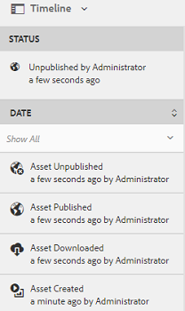

# Flusso di attività nella timeline {#activity-stream-in-timeline}

Questa funzione visualizza i registri attività per le risorse sulla timeline. Se in [!DNL Adobe Experience Manager Assets] si esegue una delle seguenti operazioni relative alle risorse, la funzione di flusso attività aggiorna la timeline in modo che rifletta l&#39;attività.

Nel flusso di attività vengono registrate le seguenti operazioni:

* Creare
* Eliminare
* Download (incluse le rappresentazioni)
* Pubblicazione
* Annulla pubblicazione
* Approvazione
* Rifiuta
* Spostare

I registri attività da visualizzare nella timeline vengono recuperati dalla posizione `/var/audit/com.day.cq.dam/content/dam` di CRX, dove vengono memorizzati i file di registro. Inoltre, l&#39;attività timeline viene registrata al caricamento di nuove risorse o quando le risorse esistenti vengono modificate e archiviate in [!DNL Experience Manager] tramite [Adobe Asset Link](https://helpx.adobe.com/enterprise/admin-guide.html/enterprise/using/manage-assets-using-adobe-asset-link.ug.html) o [l&#39;app desktop Experience Manager](https://experienceleague.adobe.com/docs/experience-manager-desktop-app/using/release-notes.html?lang=it).

>[!NOTE]
>
>I flussi di lavoro transitori non vengono visualizzati nella timeline perché per tali flussi di lavoro non vengono salvate informazioni sulla cronologia.

Per visualizzare il flusso di attività, esegui una o più operazioni sulla risorsa, seleziona la risorsa, quindi scegli **[!UICONTROL Timeline]** dall&#39;elenco GlobalNav.

La timeline mostra il flusso di attività per le operazioni eseguite sulle risorse.

>[!NOTE]
>
>La posizione predefinita dell’archivio del registro per le attività di tipo **[!UICONTROL Pubblica]** e **[!UICONTROL Annulla pubblicazione]** è `/var/audit/com.day.cq.replication/content`. Per le attività di tipo **[!UICONTROL Sposta]**, la posizione predefinita è `/var/audit/com.day.cq.wcm.core.page`.
