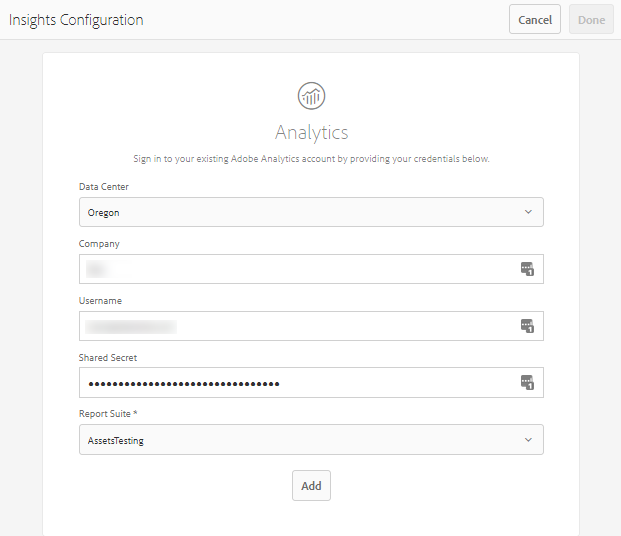

# Configurare Assets Insights {#configure-asset-insights}

[!DNL Adobe Experience Manager Assets] recupera i dati di utilizzo relativi alle risorse digitali utilizzate da siti Web di terze parti da [!DNL Adobe Analytics]. Per consentire ad Assets Insights di recuperare questi dati e generare approfondimenti, configura innanzitutto la funzione da integrare con [!DNL Adobe Analytics]. Per utilizzare questa funzionalità in un&#39;installazione locale, acquistare separatamente la licenza [!DNL Adobe Analytics]. I clienti su [!DNL Managed Services] ricevono [!DNL Analytics] licenza in bundle con [!DNL Experience Manager]. Vedi [descrizione del prodotto Managed Services](https://helpx.adobe.com/legal/product-descriptions/adobe-experience-manager-managed-services.html).

>[!NOTE]
>
>Gli approfondimenti sono supportati e forniti solo per le immagini.

1. In [!DNL Experience Manager], fai clic su **[!UICONTROL Strumenti]** > **[!UICONTROL Assets]**.

   

1. Fai clic sulla scheda **[!UICONTROL Configurazione approfondimenti]**.
1. Nella procedura guidata, seleziona un centro dati e fornisci le tue credenziali, tra cui il nome dell’organizzazione, il nome utente e il segreto condiviso.

   

   *Figura: configurare [!DNL Adobe Analytics] per Assets Insights in [!DNL Experience Manager].*

1. Fare clic su **[!UICONTROL Autentica]**.
1. Dopo che [!DNL Experience Manager] ha autenticato le credenziali, dall&#39;elenco **[!UICONTROL Suite di rapporti]**, scegli una suite di rapporti [!DNL Adobe Analytics] da cui desideri che Assets Insights recuperi i dati. Fai clic su **[!UICONTROL Aggiungi]**.
1. Dopo che [!DNL Experience Manager] ha configurato la tua suite di rapporti, fai clic su **[!UICONTROL Fine]**.

## Tracciamento pagina {#page-tracker}

Dopo aver configurato l&#39;account [!DNL Adobe Analytics], il codice di tracciamento pagina viene generato automaticamente. Per consentire ad Assets Insights di tenere traccia delle risorse [!DNL Experience Manager] utilizzate in siti Web di terze parti, includi il codice di tracciamento della pagina nel codice del sito Web. Utilizzare l&#39;utilità [!UICONTROL Page Tracker] in [!DNL Experience Manager Assets] per generare il codice di tracciamento della pagina. Per ulteriori informazioni su come includere il codice di tracciamento delle pagine in pagine Web di terze parti, vedere [Utilizzare il tracciamento delle pagine e incorporare il codice nelle pagine Web](/help/assets/use-page-tracker.md).

1. In [!DNL Experience Manager], fai clic su **[!UICONTROL Strumenti]** > **[!UICONTROL Assets]**.

   

1. Nella pagina **[!UICONTROL Navigazione]**, fai clic sulla scheda **[!UICONTROL Tracciamento pagina approfondimenti]**.
1. Fai clic su **[!UICONTROL Scarica]** per scaricare il codice di tracciamento della pagina.
