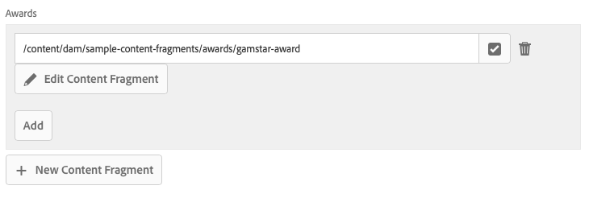
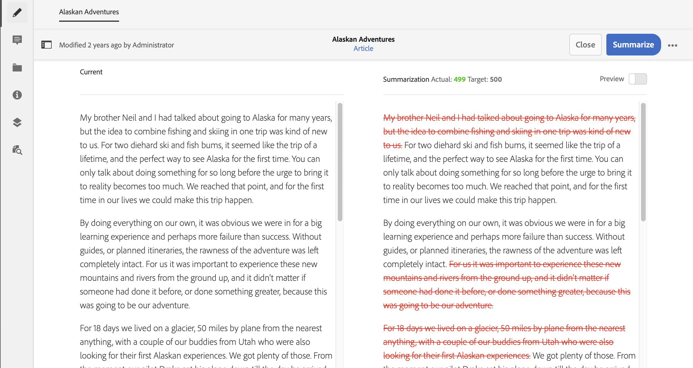
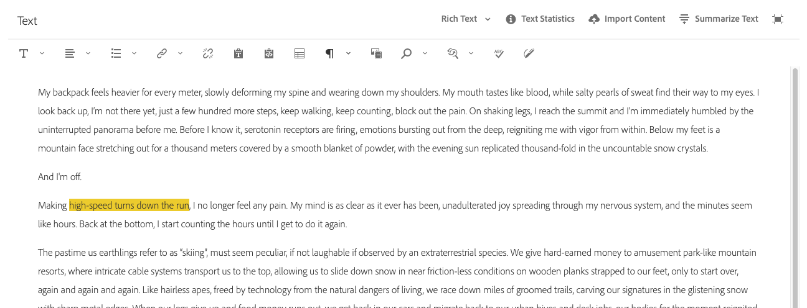

# Varianti - Authoring dei contenuti di frammenti{#variations-authoring-fragment-content}

[Le varianti](/help/assets/content-fragments/content-fragments.md#constituent-parts-of-a-content-fragment) sono una caratteristica importante dei frammenti di contenuto di AEM, in quanto consentono di creare e modificare copie del contenuto principale da utilizzare su canali e/o scenari specifici, rendendo la distribuzione di contenuti headless ancora più flessibile.

Dalla scheda **Varianti** puoi effettuare le seguenti operazioni:

* [Inserire il contenuto](#authoring-your-content) del frammento
* [Creare e gestire le varianti](#managing-variations) del contenuto **principale**

Puoi eseguire una serie di altre azioni a seconda del tipo di dati in corso di modifica, ad esempio:

* [Inserire risorse visive nel frammento](#inserting-assets-into-your-fragment) (immagini)

* Seleziona tra [Testo formattato](#rich-text), [Testo normale](#plain-text) e [Markdown](#markdown) per la modifica

* [Caricare contenuti](#uploading-content)

* [Visualizzare le statistiche chiave](#viewing-key-statistics) (informazioni sul testo su più righe)

* [Ottenere un riepilogo del testo](#summarizing-text)

* [Sincronizzare le varianti con il contenuto principale](#synchronizing-with-master)

>[!CAUTION]
>
>Dopo la pubblicazione e/o il riferimento a un frammento, AEM visualizza un avviso quando un autore riapre il frammento per la modifica. Questo messaggio notifica circa l’effetto delle modifiche apportate al frammento anche sulle pagine a cui si fa riferimento.

## Authoring dei contenuti {#authoring-your-content}

Quando apri il frammento di contenuto per la modifica, la scheda **Varianti** viene aperta per impostazione predefinita. Qui puoi creare il contenuto per l’elemento Principale o per una delle varianti disponibili. Il frammento strutturato contiene vari campi di vari tipi di dati definiti nel modello di contenuto.

Ad esempio:

Operazioni disponibili:

* Apporta modifiche al contenuto direttamente nella scheda **Varianti**; ogni tipo di dati fornisce diverse opzioni di modifica, ad esempio:

   * per i campi **Testo su più righe**, puoi anche aprire l&#39;[editor a schermo intero](#full-screen-editor) in:

      * Selezionare il [Formato](#formats)
      * Accedere a ulteriori opzioni di modifica (per il formato [Testo formattato](#rich-text))
      * Accedere a una serie di [azioni](#actions)

   * Per i campi **Riferimento frammento**, l&#39;opzione [Modifica frammento di contenuto](#fragment-references-edit-content-fragment) può essere disponibile, a seconda della definizione del modello.

* Assegna **Tag** alla variante corrente; i tag possono essere aggiunti, aggiornati e rimossi

   * [I tag](/help/sites-authoring/tags.md) sono utili per organizzare i frammenti in quanto possono essere utilizzati per la classificazione e la tassonomia dei contenuti. I tag possono essere utilizzati per trovare il contenuto (per tag) e applicare operazioni in blocco.

      * La ricerca di un tag restituisce il frammento, con la variante tag evidenziata.
      * I tag delle varianti possono essere utilizzati anche per raggruppare le varianti per un profilo Content Delivery Network (CDN) specifico (per la memorizzazione in cache di CDN), invece di utilizzare il nome della variante.

     Ad esempio, puoi assegnare ai frammenti rilevanti il tag “Lancio di Natale” in modo da poter visualizzare solo tale sottoinsieme di frammenti, oppure per copiarli in una nuova cartella e utilizzarli per un altro lancio futuro.

  >[!NOTE]
  >
  >I **Tag** possono essere aggiunti (alla variante **Principale**) come parte dei [Metadati](/help/assets/content-fragments/content-fragments-metadata.md)

* [Creare e gestire le varianti](#managing-variations) del contenuto **principale**.

### Editor a schermo intero {#full-screen-editor}

Quando modifichi un campo di testo su più righe puoi aprire l’editor a schermo intero; fai clic all’interno del testo effettivo, quindi seleziona la seguente icona di azione:

Viene aperto l’editor di testo a schermo intero:

L’editor di testo a schermo intero fornisce:

* accesso a varie [azioni](#actions);
* a seconda del [formato](#formats), opzioni di formattazione aggiuntive ([Testo formattato](#rich-text))

### Azioni {#actions}

Quando l’editor a schermo intero (ovvero testo su più righe) è aperto, sono disponibili anche le seguenti azioni (per tutti i [formati](#formats)):

* Selezionare il [formato](#formats) ([Testo formattato](#rich-text), [Testo normale,](#plain-text) [Markdown](#markdown))

* [Caricare contenuti](#uploading-content)

* [Mostrare statistiche sul testo](#viewing-key-statistics)

* [Sincronizzare con il contenuto principale](#synchronizing-with-master) (se si modifica una variante)

* [Ottenere un riepilogo del testo](#summarizing-text)

### Formati {#formats}

Le opzioni per la modifica del testo su più righe dipendono dal formato selezionato:

* [Testo formattato](#rich-text)
* [Testo normale](#plain-text)
* [Markdown](#markdown)

Il formato può essere selezionato quando si utilizza l’editor a schermo intero.

### Testo formattato {#rich-text}

La modifica in formato RTF consente di formattare:

* Grassetto
* Corsivo
* Sottolineato
* Allineamento: sinistra, centro, destra
* Elenco puntato
* Elenco numerato
* Rientro: aumento, riduzione
* Creare/interrompere collegamenti ipertestuali
* Incolla testo/da Word
* Inserisci tabella
* Stile paragrafo: Paragrafo, Titolo 1/2/3
* [Inserisci risorsa](#inserting-assets-into-your-fragment)
* Aprire l’editor a schermo intero, in cui sono disponibili le seguenti opzioni di formattazione:
   * Ricerca
   * Trova/Sostituisci
   * Controllo ortografia
   * [Annotazioni](/help/assets/content-fragments/content-fragments-variations.md#annotating-a-content-fragment)
* [Inserisci frammento di contenuto](#inserting-content-fragment-into-your-fragment); disponibile quando il campo **Testo su più righe** è configurato con **Consenti riferimento frammento**.

Dall’editor a schermo intero sono accessibili anche le [azioni](#actions).

### Testo normale {#plain-text}

Testo normale consente di inserire rapidamente contenuti senza formattazione o informazioni di markdown. Puoi anche aprire l’editor a schermo intero per ulteriori [azioni](#actions).

>[!CAUTION]
>
>Se selezioni **Testo normale**, potresti perdere la formattazione, il markdown e/o le risorse inserite in **Rich Text** o **Markdown**.

### Markdown {#markdown}

>[!NOTE]
>
>Per informazioni complete, consulta la documentazione di [Markdown](/help/assets/content-fragments/content-fragments-markdown.md).

Questo consente di formattare il testo utilizzando il markdown. Puoi definire:

* Titoli
* Paragrafi e interruzioni di riga
* Collegamenti
* Immagini
* Citazioni
* Elenchi
* Enfasi
* Blocchi di codice
* Escape barra rovesciata

Puoi anche aprire l’editor a schermo intero per ulteriori [azioni](#actions).

>[!CAUTION]
>
>Se passi da **Testo formattatot** a **Markdown**, potresti riscontrare effetti imprevisti con Citazioni e Blocchi di codice, in quanto questi due formati possono presentare differenze nelle modalità di gestione.

### Riferimenti frammento {#fragment-references}

Se il modello per frammenti di contenuto contiene riferimenti frammento, gli autori dei frammenti potrebbero disporre di opzioni aggiuntive:

* [Modifica frammento di contenuto](#fragment-references-edit-content-fragment)
* [Nuovo frammento di contenuto](#fragment-references-new-content-fragment)

#### Modifica frammento di contenuto {#fragment-references-edit-content-fragment}

L&#39;opzione **Modifica frammento di contenuto** apre il frammento in una nuova scheda della finestra.

<!--
The option **Edit Content Fragment** opens that fragment in a new editor tab (within the same browser tab).

Selecting the original tab again (for example, **Little Pony Inc.**), will close this secondary tab (in this case, **Adam Smith**).

-->

#### Nuovo frammento di contenuto {#fragment-references-new-content-fragment}

L&#39;opzione **Nuovo frammento di contenuto** consente di creare un frammento. A questo scopo, nell’editor viene visualizzata una variante della procedura guidata per creare un frammento di contenuto.

Per creare un frammento, segui questi passaggi:

1. Individua e seleziona la cartella desiderata.
1. Seleziona **Avanti**.
1. Specifica le proprietà; ad esempio, **Titolo**.
1. Seleziona **Crea**.
1. Infine:
   1. **Fine** restituisce (al frammento originale) e fa riferimento al nuovo frammento.
   1. **Apri** fa riferimento al nuovo frammento e apre il nuovo frammento per la modifica in una nuova scheda del browser.

### Visualizzazione delle statistiche chiave {#viewing-key-statistics}

Quando l&#39;editor a schermo intero è aperto, l&#39;azione **Statistiche testo** visualizza una serie di informazioni sul testo.

Esempio:

### Caricamento del contenuto {#uploading-content}

Per semplificare il processo di creazione dei frammenti di contenuto, puoi caricare il testo, prepararlo in un editor esterno e aggiungerlo direttamente al frammento.

### Ottenere un riepilogo del testo {#summarizing-text}

La funzione di riepilogo del testo è progettata per aiutare gli utenti a ridurre la lunghezza del testo a un numero predefinito di parole, mantenendo i punti chiave e il significato generale.

>[!NOTE]
>
>A livello più tecnico, il sistema mantiene le frasi che ritiene fornire il *miglior rapporto tra densità e unicità delle informazioni* in base a specifici algoritmi.

>[!CAUTION]
>
>Il frammento di contenuto deve avere come predecessore una cartella di lingua valida (codice ISO), che viene utilizzata per determinare il modello della lingua.
>
>Ad esempio: `en/` nel seguente percorso:
>
>  `/content/dam/my-brand/en/path-down/my-content-fragment`

>[!CAUTION]
>
>L’inglese è disponibile in modo predefinito.
>
>Altre lingue sono disponibili come pacchetti modello di lingua da Condivisione pacchetti:
>
>* [Francese (fr)](https://experience.adobe.com/#/downloads/content/software-distribution/en/aem.html?package=/content/software-distribution/en/details.html/content/dam/aem/public/adobe/packages/cq630/product/smartcontent-model-fr)
>* [Tedesco (de)](https://experience.adobe.com/#/downloads/content/software-distribution/en/aem.html?package=/content/software-distribution/en/details.html/content/dam/aem/public/adobe/packages/cq630/product/smartcontent-model-de)
>* [Italiano (it)](https://experience.adobe.com/#/downloads/content/software-distribution/en/aem.html?package=/content/software-distribution/en/details.html/content/dam/aem/public/adobe/packages/cq630/product/smartcontent-model-it)
>* [Spagnolo (es)](https://experience.adobe.com/#/downloads/content/software-distribution/en/aem.html?package=/content/software-distribution/en/details.html/content/dam/aem/public/adobe/packages/cq630/product/smartcontent-model-es)
>

1. Seleziona **Principale** o la variante richiesta.
1. Apri l’editor a schermo intero.

1. Seleziona **Riepiloga testo** nella barra degli strumenti.

   

1. Specifica il numero di parole desiderato e seleziona **Inizia**:
1. Il testo originale viene visualizzato affiancato al riepilogo proposto:

   * Tutte le frasi da eliminare sono evidenziate in rosso e barrate.
   * Fai clic su una frase evidenziata se desideri mantenerla nel contenuto del riepilogo.
   * Fare clic su una frase non evidenziata se si desidera eliminarla.

1. Seleziona **Riepiloga** per confermare le modifiche.

1. Il testo originale viene visualizzato affiancato al riepilogo proposto:

   * Tutte le frasi da eliminare sono evidenziate in rosso e barrate.
   * Fai clic su una frase evidenziata se desideri mantenerla nel contenuto del riepilogo.
   * Fare clic su una frase non evidenziata se si desidera eliminarla.
   * Vengono visualizzate le statistiche di riepilogo: **Effettivo** e **Destinazione**
   * È possibile **visualizzare in nteprima** le modifiche.

   

### Annotazione di un frammento di contenuto {#annotating-a-content-fragment}

Per annotare un frammento:

1. Seleziona **Principale** o la variante richiesta.

1. Apri l’editor a schermo intero.

1. L’icona **Annota** è disponibile nella barra degli strumenti superiore. Se necessario, puoi selezionare del testo.

   

1. Viene visualizzata una finestra di dialogo. Consente di inserire l’annotazione.

   

1. Selezionare **Applica** nella finestra di dialogo.

   

   Se l’annotazione è stata applicata al testo selezionato, il testo rimane evidenziato.

   

1. Se chiudi l’editor a schermo intero, le annotazioni restano evidenziate. Se selezionata, viene visualizzata una finestra di dialogo che consente di modificare ulteriormente l’annotazione.

1. Seleziona **Salva**.

1. Se chiudi l’editor a schermo intero, le annotazioni restano evidenziate. Se selezionata, viene visualizzata una finestra di dialogo che consente di modificare ulteriormente l’annotazione.

   

### Visualizzazione, modifica ed eliminazione delle annotazioni {#viewing-editing-deleting-annotations}

Caratteristiche delle annotazioni:

* Sono evidenziate nel testo, sia nella modalità a schermo intero che nella modalità normale dell’editor. Per visualizzare, modificare e/o eliminare tutti i dettagli di un’annotazione, fai clic sul testo evidenziato per riaprire la finestra di dialogo.

  >[!NOTE]
  >
  >Se a un testo sono state applicate più annotazioni, viene fornito un selettore a discesa.

* Quando si elimina l’intero testo a cui è stata applicata l’annotazione, viene eliminata anche l’annotazione.

* Può essere elencata ed eliminata selezionando dalla scheda **Annotazioni** nell’editor frammenti.

  

* Può essere visualizzato ed eliminato nella [Timeline](/help/assets/content-fragments/content-fragments-managing.md#timeline-for-content-fragments) per il frammento selezionato.

### Inserimento di risorse nel frammento {#inserting-assets-into-your-fragment}

Per semplificare il processo di creazione dei frammenti di contenuto, puoi aggiungere [Assets](/help/assets/manage-assets.md) (immagini) direttamente al frammento.

Vengono aggiunte alla sequenza di paragrafi del frammento senza formattazione; la formattazione può essere impostata quando il [frammento viene utilizzato o inserito come riferimento in una pagina](/help/sites-authoring/content-fragments.md).

>[!CAUTION]
>
>Non è possibile spostare o eliminare le risorse in una pagina di riferimento; tali azioni devono essere eseguite nell’editor frammenti.
>
>La formattazione della risorsa (ad esempio, dimensione) deve invece essere eseguita nell’[editor pagina](/help/sites-authoring/content-fragments.md). La rappresentazione della risorsa nell’editor frammenti è puramente a scopo di creazione del flusso di contenuto.

>[!NOTE]
>
>Esistono diversi metodi per aggiungere [immagini](/help/assets/content-fragments/content-fragments.md#fragments-with-visual-assets) al frammento e/o alla pagina.

1. Posizionare il cursore nel punto in cui si desidera aggiungere l&#39;immagine.
1. Per aprire la finestra di dialogo di ricerca, utilizza l’icona **Inserisci risorsa**.

   

1. Nella finestra di dialogo puoi effettuare le seguenti operazioni:

   * Passare alla risorsa richiesta in DAM
   * cercare la risorsa in DAM

   Una volta individuata la risorsa desiderata, fai clic sulla miniatura.

1. Utilizza **Seleziona** per aggiungere la risorsa al sistema paragrafo del frammento di contenuto nella posizione corrente.

   >[!CAUTION]
   >
   >Se modifichi il formato dopo aver aggiunto come risorsa a:
   >
   >* **Testo normale**: la risorsa è stata persa dal frammento.
   >* **Markdown**: la risorsa non è visibile, ma è ancora qui quando torni a **Rich Text**.

### Inserimento di un frammento di contenuto nel frammento {#inserting-content-fragment-into-your-fragment}

Per semplificare il processo di creazione dei frammenti di contenuto, puoi anche aggiungere al frammento un altro frammento di contenuto.

Sono aggiunti come riferimento, nella posizione corrente all’interno del frammento.

>[!NOTE]
>
>Questa opzione è disponibile quando **Testo su più righe** è configurato con **Consenti riferimento frammento**.

>[!CAUTION]
>
>Non è possibile spostare o eliminare le risorse in una pagina di riferimento; tali azioni devono essere eseguite nell’editor frammenti.
>
>La formattazione della risorsa (ad esempio, dimensione) deve invece essere eseguita nell’[editor pagina](/help/sites-authoring/content-fragments.md). La rappresentazione della risorsa nell’editor frammenti è puramente a scopo di creazione del flusso di contenuto.

>[!NOTE]
>
>Esistono diversi metodi per aggiungere [immagini](/help/assets/content-fragments/content-fragments.md#fragments-with-visual-assets) al frammento e/o alla pagina.

1. Posiziona il cursore nel punto in cui desideri aggiungere il frammento.
1. Per aprire la finestra di dialogo di ricerca, utilizza l’icona **Inserisci frammento di contenuto**.

   

1. Nella finestra di dialogo, puoi effettuare le seguenti operazioni:

   * Passare al frammento richiesto nella cartella delle risorse
   * Cercare il frammento

   Una volta individuato, seleziona il frammento desiderato facendo clic sulla miniatura.

1. Utilizza **Seleziona** per aggiungere al frammento corrente (nella posizione corrente) un riferimento al frammento di contenuto selezionato.

   >[!CAUTION]
   >
   >Se modifichi il formato, dopo aver aggiunto un riferimento a un altro frammento, in:
   >
   >* **Testo normale**: il riferimento è stato perso dal frammento.
   >* **Markdown**: il riferimento rimane.

## Gestione delle varianti {#managing-variations}

### Creazione di una variante {#creating-a-variation}

Le varianti consentono di utilizzare il contenuto **Master** e modificarlo in base allo scopo (se necessario).

Per creare una variante:

1. Apri il frammento e accertati che il pannello laterale sia visibile.
1. Seleziona **Varianti** dalla barra delle icone nel pannello laterale.
1. Seleziona **Crea variante**.
1. Viene visualizzata una finestra di dialogo in cui specificare **Titolo** e **Descrizione** per la nuova variante.
1. Seleziona **Aggiungi**, il frammento **Principale** viene copiato nella nuova variante, che è ora aperta per la [modifica](#editing-a-variation).

   >[!NOTE]
   >
   >Durante la creazione di una variante, viene sempre copiato il **Master**, non la variante aperta.

   >[!NOTE]
   >
   >Quando crei una variante, tutti i **tag** attualmente assegnati alla variante **Master** vengono copiati nella nuova variante.

### Modifica di una variante {#editing-a-variation}

Modifica il contenuto della variante dopo:

* la [creazione della variante](#creating-a-variation);
* l’apertura di un frammento esistente e la selezione della variante desiderata dal pannello laterale.

### Modifica del nome di una variante {#renaming-a-variation}

Per modificare il nome di una variante esistente:

1. Apri il frammento e seleziona **Varianti** nel pannello laterale.
1. Seleziona la variante desiderata.
1. Seleziona **Rinomina** dal menu a discesa **Azioni**.

1. Nella finestra di dialogo che si apre, immetti il nuovo **Titolo** e/o la nuova **Descrizione**.

1. Conferma l’azione **Rinomina**.

>[!NOTE]
>
>Questo influisce solo sul **Titolo** della variante.

### Eliminazione di una variante {#deleting-a-variation}

Per eliminare una variante esistente:

1. Apri il frammento e seleziona **Varianti** nel pannello laterale.
1. Seleziona la variante desiderata.
1. Seleziona **Elimina** dal menu a discesa **Azioni**.

1. Nella finestra di dialogo che si apre, conferma l’azione **Elimina**.

>[!NOTE]
>
>Non è possibile eliminare l’elemento **Principale**.

### Sincronizzazione con l’elemento Principale {#synchronizing-with-master}

**Master** fa parte di un frammento di contenuto e, per definizione, contiene la copia master del contenuto, mentre le varianti contengono le singole versioni aggiornate e personalizzate del contenuto. Quando l’elemento Principale viene aggiornato, è possibile che queste modifiche siano rilevanti anche per le varianti e, pertanto, devono essere propagate ad esse.

Quando modifichi una variante, hai accesso all’azione per sincronizzare l’elemento corrente della variante con l’elemento Principale. Questo consente di copiare automaticamente le modifiche apportate all’elemento Principale nella variante richiesta.

>[!CAUTION]
>
>La sincronizzazione è disponibile solo per copiare le modifiche *dall’elemento **Principale** alla variante*.
>
>Viene sincronizzato solo l’elemento corrente della variante.
>
>La sincronizzazione funziona solo sul tipo di dati **Testo su più righe**.
>
>Il trasferimento delle modifiche *da una variante all’elemento **Principale*** non è disponibile come opzione.

<!-- needs new screenshot for synchronize effect -->

1. Apri il frammento di contenuto nell’editor frammenti. Assicurati che l’elemento **Principale** sia stato modificato.

1. Seleziona una variante specifica, quindi seleziona l’azione di sincronizzazione appropriata da una delle seguenti aree:

   * Selettore a discesa **Azioni**: **sincronizza l’elemento corrente con l’elemento principale**

     

   * Barra degli strumenti dell’editor a schermo intero: **Sincronizza con elemento principale**

     

1. L’elemento Principale e la variante vengono visualizzati affiancati:

   * Il contenuto aggiunto alla variante è indicato in verde
   * II contenuto rimosso dalla variante è indicato in rosso
   * Il testo sostituito è indicato in blu.

   

1. Seleziona **Sincronizza**, la variante viene aggiornata e visualizzata.
