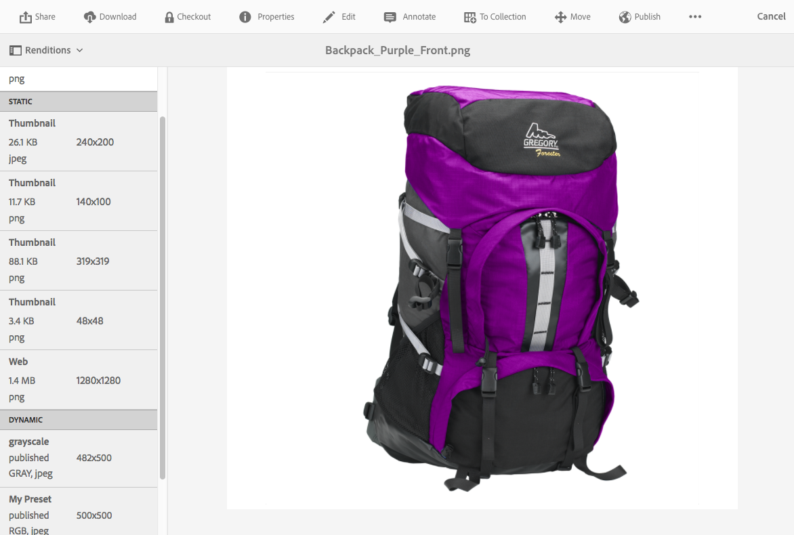

# Utilizzare Dynamic Media {#working-with-dynamic-media}

[Dynamic Media](https://business.adobe.com/products/experience-manager/assets/dynamic-media.html) consente di fornire risorse di marketing e merchandising visive avanzate su richiesta, scalabili automaticamente per l&#39;utilizzo su siti Web, mobili e social. Grazie a un insieme di risorse di origine primaria, il software genera e distribuisce in tempo reale più varianti di rich content attraverso una rete globale, scalabile e ottimizzata per le prestazioni.

Il software fornisce esperienze di visualizzazione interattive, tra cui zoom, 360 gradi rotazione e video. Integra in modo univoco i flussi di lavoro della soluzione Adobe Experience Manager di gestione delle risorse digitali (Assets) per semplificare e semplificare il processo di gestione delle campagne digitali.

<!-- >ARTICLE IS MISSING. GIVES 404 [!NOTE]
>
>A Community article is available on [Working with Adobe Experience Manager and Dynamic Media](https://helpx.adobe.com/experience-manager/using/aem_dynamic_media.html). -->

## Operazioni possibili con il software {#what-you-can-do-with-dynamic-media}

Il software consente di gestire le risorse prima di pubblicarle. Le modalità di utilizzo delle risorse in generale sono descritte in dettaglio in [Operazioni con le risorse digitali](manage-assets.md). Gli argomenti generali includono il caricamento, il download, la modifica e la pubblicazione delle risorse, la visualizzazione e la modifica delle proprietà e la ricerca delle risorse.

Le funzioni disponibili solo in Dynamic Media sono le seguenti:

* [Banner a carosello](carousel-banners.md)
* [Set di immagini](image-sets.md)
* [Immagini interattive](interactive-images.md)
* [Video interattivi](interactive-videos.md)
* [Set di file multimediali diversi](mixed-media-sets.md)
* [Immagini panoramiche](panoramic-images.md)

* [Set 360 gradi](spin-sets.md)
* [Video](video.md)
* [Distribuire risorse Dynamic Media](delivering-dynamic-media-assets.md)
* [Gestire le risorse](managing-assets.md)
* [Creare pop-up personalizzati utilizzando Quickview](custom-pop-ups.md)

Vedi anche [Configurare Dynamic Media](administering-dynamic-media.md).

>[!NOTE]
>
>Per comprendere le differenze tra l&#39;utilizzo di Dynamic Media e l&#39;integrazione di Dynamic Media Classic con Adobe Experience Manager, vedere [Integrazione di Dynamic Media Classic rispetto a Dynamic Media](/help/sites-administering/scene7.md#aem-scene-integration-versus-dynamic-media).

## Dynamic Media abilitato e Dynamic Media disabilitato {#dynamic-media-on-versus-dynamic-media-off}

È possibile stabilire se il software è abilitato (acceso) in base alle seguenti caratteristiche:

* Le rappresentazioni dinamiche sono disponibili quando si scaricano o si visualizzano in anteprima le risorse.
* Sono disponibili set di immagini, set 360 gradi, set di file multimediali diversi.
* Vengono creati rendering PTIFF.

Quando selezioni una risorsa immagine, la visualizzazione della risorsa è diversa se il software [è abilitato](config-dynamic.md#enabling-dynamic-media). Utilizza i visualizzatori HTML5 on-demand.

### Rappresentazioni dinamiche {#dynamic-renditions}

Le rappresentazioni dinamiche, come i predefiniti immagine e visualizzatore (in **[!UICONTROL Dinamico]**), sono disponibili quando il software è abilitato.

### Set di immagini, set 360 gradi, set di file multimediali diversi {#image-sets-spins-sets-mixed-media-sets}

Se il software è abilitato, sono disponibili set di immagini, set 360 gradi e set di file multimediali diversi.

### Rappresentazioni PTIFF {#ptiff-renditions}

Le risorse abilitate per Dynamic Media includono `pyramid.tiffs`.

### Modifica visualizzazioni risorse {#asset-views-change}

Se il software è abilitato, è possibile ingrandire e ridurre facendo clic sui pulsanti `+` e `-`. Puoi anche fare clic su per eseguire lo zoom in un’area specifica. Ripristina consente di tornare alla versione originale e di visualizzare l&#39;immagine a schermo intero facendo clic sulle frecce diagonali. Con il software abilitato, si presenta così:

Con il software disattivato, è possibile ingrandire e ridurre e ripristinare le dimensioni originali:

