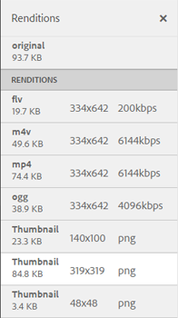

# Rappresentazioni video {#video-renditions}

Adobe Experience Manager Assets genera rappresentazioni video per risorse video di vari formati, tra cui OGG, FLV e così via.

Experience Manager Assets supporta le rappresentazioni statiche e dinamiche (rappresentazioni con codifica DM) per le risorse multimediali.

Le rappresentazioni statiche vengono generate in modo nativo utilizzando FFMPEG (installato e disponibile nel percorso del sistema) e memorizzate nell’archivio dei contenuti.

Le rappresentazioni con codifica DM vengono memorizzate nel server proxy e distribuite in fase di esecuzione.

Experience Manager Assets fornisce il supporto per la riproduzione di queste rappresentazioni sul lato client.

Per visualizzare le rappresentazioni di una particolare risorsa video, apri la pagina della risorsa e seleziona l’icona Navigazione globale. Scegliere quindi **[!UICONTROL Rappresentazioni]** dall&#39;elenco.

L&#39;elenco delle rappresentazioni video viene visualizzato nel pannello **[!UICONTROL Rappresentazioni]**.

Per configurare il server proxy per le rappresentazioni con codifica DM, [configurare i servizi cloud per elementi multimediali dinamici](config-dynamic.md).

Per generare le rappresentazioni video con i parametri desiderati, [crea un profilo video corrispondente](video-profiles.md).

Dopo aver configurato il server proxy e creato i profili video, puoi includere questo predefinito video in un profilo di elaborazione e applicare il profilo di elaborazione a una cartella.

>[!NOTE]
>
>La riproduzione audio non funziona per i file OGG e WAV su Microsoft® Internet Explorer 11. Nella pagina dei dettagli delle risorse con estensione OGG o WAV viene visualizzato l&#39;errore `Invalid Source`.
>
>In MS® Edge e iPad, i file OGG non vengono riprodotti e viene generato un errore di formato non supportato.
