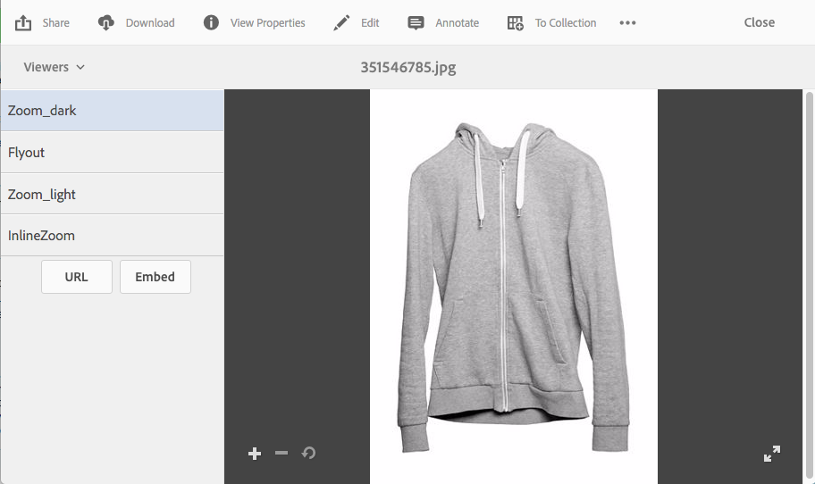

# Applicare i predefiniti visualizzatore Dynamic Media {#applying-viewer-presets}

Un predefinito visualizzatore è una raccolta di impostazioni che determinano il modo in cui gli utenti visualizzano le risorse rich media sugli schermi dei loro computer e sui loro dispositivi mobili. Puoi applicare a una risorsa qualsiasi predefinito visualizzatore creato dall’amministratore.

Se sei un amministratore e devi gestire, creare, ordinare ed eliminare i predefiniti visualizzatore, consulta [Gestione predefiniti visualizzatore](managing-viewer-presets.md).

Vedi anche [Predefiniti visualizzatore pubblicazione](managing-viewer-presets.md#publishing-viewer-presets).

Non è necessario pubblicare i predefiniti visualizzatore a seconda della modalità di pubblicazione in uso.
In caso di problemi con i predefiniti visualizzatore, vedi [Risoluzione dei problemi di Dynamic Media - Scene7](troubleshoot-dms7.md#viewers).

## Applicare un predefinito visualizzatore Dynamic Media a una risorsa {#applying-a-viewer-preset-to-an-asset}

1. Apri la risorsa e seleziona **[!UICONTROL Visualizzatori]** nella barra a sinistra.

   

   * Dopo aver selezionato un predefinito visualizzatore, vengono visualizzati i pulsanti **[!UICONTROL URL]** e **[!UICONTROL Incorpora]**.
   * Quando selezioni Visualizzatori in **[!UICONTROL Vista dettaglio]** di una risorsa, il sistema mostra numerosi predefiniti visualizzatore. Puoi aumentare il numero di predefiniti visualizzati. Vedere [Aumentare il numero di predefiniti visualizzatore visualizzati](managing-viewer-presets.md).

1. Seleziona un visualizzatore dal riquadro a sinistra, in modo da applicarlo alla risorsa come visualizzato nel riquadro a destra. Puoi anche [copiare l&#39;URL per condividere](linking-urls-to-yourwebapplication.md) con altri utenti.

## Ottieni URL predefiniti visualizzatore {#obtaining-viewer-preset-urls}

Per ottenere gli URL per i predefiniti visualizzatore, consulta [Collegare gli URL all&#39;applicazione Web](linking-urls-to-yourwebapplication.md).
