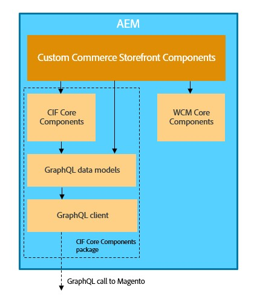

# Integrazione tra AEM e Adobe Commerce (Magento) tramite Commerce integration framework {#aem-commerce-framework}

Experience Manager e Adobe Commerce sono integrati direttamente tramite Commerce integration framework (CIF). CIF consente ad AEM di accedere e comunicare direttamente con l&#39;istanza di Commerce utilizzando le [API GraphQL](https://devdocs.magento.com/guides/v2.4/graphql/) di Adobe Commerce.

>[!NOTE]
>
>La versione minima supportata dell’API GraphQL è la 2.3.5. Alcune funzioni sono supportate solo nelle versioni più recenti o solo nell’edizione Adobe Commerce.

## Panoramica dell’architettura {#overview}

L’architettura generale è la seguente:

In CIF sono supportati modelli di comunicazione lato server e lato client.
Le chiamate API lato server vengono implementate utilizzando il [client GraphQL](https://github.com/adobe/commerce-cif-graphql-client) integrato e generico in combinazione con un [set di modelli di dati generati](https://github.com/adobe/commerce-cif-magento-graphql) per lo schema commerce GraphQL. Inoltre, è possibile utilizzare qualsiasi query GraphQL o mutazione in formato GQL.

Per i componenti lato client, creati con [React](https://reactjs.org/), viene utilizzato il [client Apollo](https://www.apollographql.com/docs/react/).

## Architettura dei componenti core di AEM CIF {#cif-core-components}

I [componenti core CIF di AEM](https://github.com/adobe/aem-core-cif-components) seguono modelli di progettazione e best practice molto simili a quelli dei [componenti core WCM di AEM](https://github.com/adobe/aem-core-wcm-components).

La logica di business e la comunicazione back-end con Adobe Commerce per i componenti core di AEM CIF sono implementate in modelli Sling. Nel caso sia necessario personalizzare questa logica per soddisfare i requisiti specifici del progetto, è possibile utilizzare il Pattern di delega per modelli Sling.

>[!TIP]
>
>La pagina [Personalizzazione dei componenti core CIF di AEM ](../customizing/customize-cif-components.md) offre un esempio dettagliato e best practice per personalizzare i componenti core CIF.

All’interno dei progetti, i componenti core CIF di AEM e i componenti di progetto personalizzati possono facilmente recuperare il client configurato per uno store di Adobe Commerce associato a una pagina AEM tramite la configurazione Sling Context-Aware.
