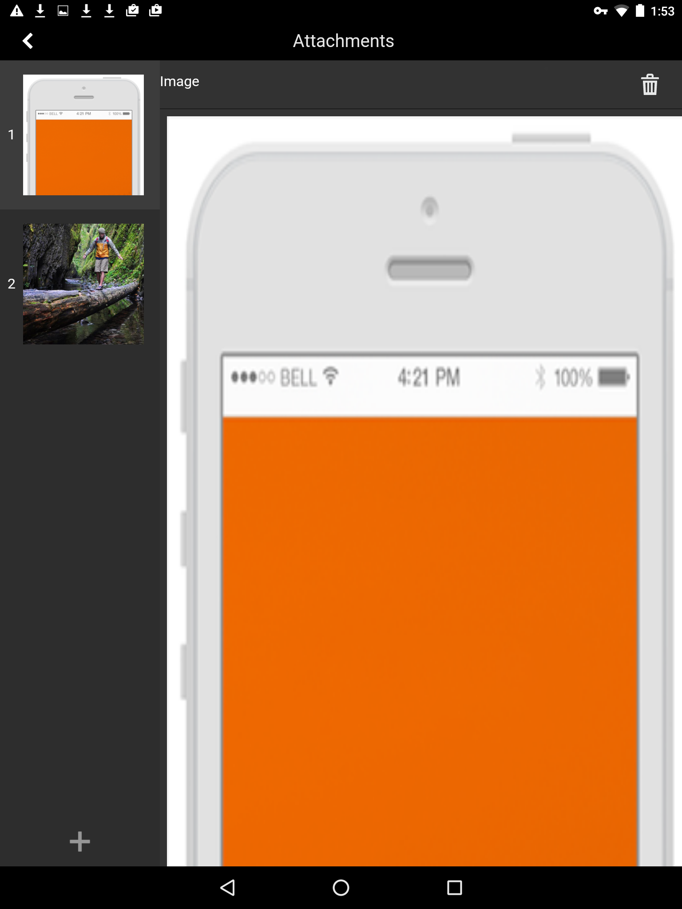
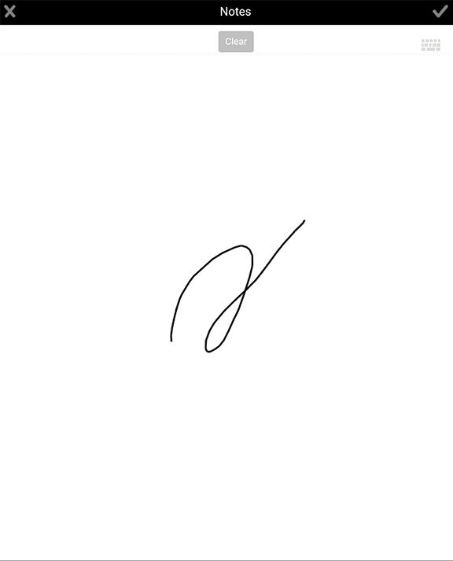
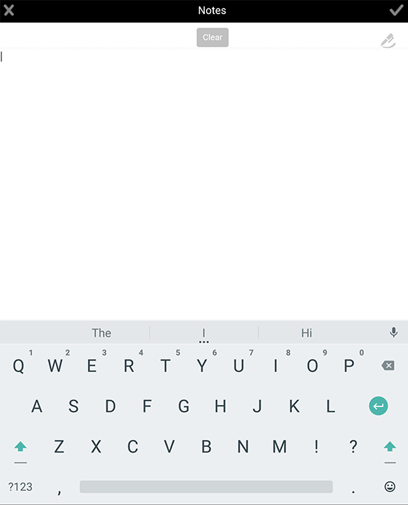

# Aggiunta di allegati{#adding-attachments}

>[!NOTE]
>
>Le versioni Android e iOS dell’app AEM Forms sono state dismesse. La pubblicazione dell’app Android in Google Play è stata annullata a settembre 2026 e l’app iOS è stata rimossa dall’App Store di Apple.
>Queste app non sono più disponibili per l&#39;installazione. Per assistenza sull&#39;app Android, contatta [aemformsapp-android@adobe.com](mailto:aemformsapp-android@adobe.com).

## Aggiunta di allegati nei moduli sincronizzati con il server flusso di lavoro di AEM Forms (AEM Forms su JEE) {#adding-annotations}

L’app AEM Forms consente di allegare immagini, note scarabocchiate e note di testo al modulo sincronizzato con il server AEM Forms JEE. Se il modulo viene caricato da un server di AEM Forms Workflow, gli allegati vengono aggiunti al modulo. È possibile selezionare il pulsante di allegato  per visualizzare tutti gli allegati di un modulo. La notifica rossa specifica il numero di allegati nel modulo. Se nel modulo non sono presenti allegati, il pulsante di notifica rosso non è visibile. Se nel modulo non è presente alcun allegato, quando si seleziona il pulsante degli allegati , vengono visualizzate le opzioni per allegare foto o scarabocchi.

Le opzioni disponibili sono:

* **Raccolta**: consente di aggiungere un&#39;immagine dalle immagini salvate nel dispositivo.

* **Fotocamera**: consente di scattare una foto e aggiungerla al modulo.

* **Note**: consente di aggiungere uno scarabocchio o una nota di testo. Utilizza  per aggiungere uno scarabocchio e  per aggiungere una nota di testo.

>[!NOTE]
>
>Gli allegati aggiunti da un utente sono visibili agli altri utenti dell’app AEM Forms. Gli altri utenti non possono eliminare gli allegati aggiunti da un utente.
>

### Schermata Allegato {#the-attachments-screen}

Per visualizzare tutti gli allegati in un luogo, selezionare . È possibile aggiungere, rinominare ed eliminare allegati qui.

È possibile utilizzare il pulsante **+** nella schermata Allegati per allegare un&#39;altra immagine, scarabocchio o testo.

### Aggiunta di una fotografia {#adding-a-photograph}

È possibile utilizzare la fotocamera del dispositivo mobile o le immagini salvate nel dispositivo per allegare un&#39;immagine nel modulo.

1. Selezionare il pulsante allegato  nella parte inferiore della finestra.
1. Selezionare **Galleria** o **Fotocamera** nel popup visualizzato.
1. In base all’opzione selezionata, effettua le seguenti operazioni:

   1. Se si seleziona **Fotocamera**.

      Fai una fotografia. Quindi seleziona il pulsante **Usa** .

      In alternativa, selezionare il pulsante **Riprendi**  per riprendere la fotografia.

   1. Se selezioni **Galleria**.

      Viene visualizzato il browser immagini del dispositivo. Nel browser immagini del dispositivo, selezionare l&#39;immagine che si desidera collegare.

### Aggiunta di una nota {#adding-a-note}

L&#39;opzione **Note** consente di aggiungere scarabocchi a mano libera e allegati di testo nel modulo.

1. Selezionare il pulsante allegato  nella parte inferiore della finestra.
1. Seleziona **Note** nel pop-up visualizzato.
1. Nell’interfaccia utente Notes avviata, acquisisci uno scarabocchio a mano libera.

   

   A mano

   Nell’interfaccia a mano puoi utilizzare le seguenti opzioni:

   * **Cancella**: cancella la schermata.
   * **Pulsante Fine**: allega lo scarabocchio corrente.
   * **Pulsante Annulla**: ignora lo scarabocchio corrente ed esce dall&#39;interfaccia utente scarabocchio.
   * : cancella lo scarabocchio e consente di aggiungere una nota di testo.

   

## Allegati nei moduli sincronizzati con i server AEM Forms senza flusso di lavoro AEM Forms (AEM Forms su OSGi) {#attachments-in-forms-synced-with-the-aem-forms-servers-without-aem-forms-workflow-aem-forms-on-osgi}

Gli allegati per i moduli mobili sincronizzati con i server AEM Forms OSGi funzionano in modo simile ai server AEM Forms JEE.

Gli allegati a livello di modulo non sono supportati per i moduli adattivi caricati nell’app da un server OSGi di AEM Forms. Per allegare immagini o note di testo, attivare gli allegati a livello di campo nel modulo quando lo si crea. Trascina il componente allegato dal browser Componenti sul campo.

Se sono presenti moduli adattivi, puoi visualizzare i file allegati nel documento record (DoR). Vedi [Genera documento di record per i moduli adattivi non XFA](../../forms/using/generate-document-of-record-for-non-xfa-based-adaptive-forms.md).
