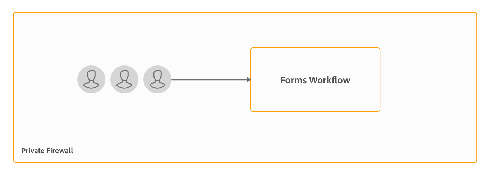

# Architettura e topologie di implementazione per AEM Forms {#architecture-and-deployment-topologies-for-aem-forms}

| Versione | Collegamento articolo |
| -------- | ---------------------------- |
| AEM as a Cloud Service | [Fai clic qui](https://experienceleague.adobe.com/docs/experience-manager-cloud-service/content/forms/forms-overview/aem-forms-cloud-service-architecture.html) |
| AEM 6.5 | Questo articolo |

## Architettura {#architecture}

AEM Forms è un’applicazione implementata in AEM come pacchetto AEM. Il pacchetto è noto come pacchetto del componente aggiuntivo AEM Forms. Il pacchetto del componente aggiuntivo AEM Forms contiene sia servizi (provider API) distribuiti nel contenitore OSGi di AEM che servlet o JSP (che forniscono funzionalità API front-end e REST) gestiti dal framework Sling di AEM. Il diagramma seguente illustra questa configurazione:

L’architettura di AEM Forms include i seguenti componenti:

* **Servizi AEM di base:** Servizi di base forniti da AEM a un&#39;applicazione distribuita. Questi servizi includono un archivio di contenuti conforme a JCR, un contenitore di servizi OSGI, un motore di flusso di lavoro, un archivio fonti attendibili, un archivio chiavi e così via. Questi servizi sono disponibili per l’applicazione AEM Forms ma non sono forniti dai pacchetti AEM Forms. Questi servizi sono parte integrante dello stack globale di AEM e vari componenti di AEM Forms utilizzano tali servizi.
* **Servizi Forms:** fornisce funzionalità relative ai moduli, ad esempio la creazione, l&#39;assemblaggio, la distribuzione e l&#39;archiviazione di documenti PDF, l&#39;aggiunta di firme digitali per limitare l&#39;accesso ai documenti e la decodifica di moduli con codice a barre. Questi servizi sono pubblicamente disponibili per l’utilizzo da parte di codice personalizzato distribuito congiuntamente in AEM.
* **Livello Web:** JSP o servlet, generati su servizi comuni e forms, che forniscono le funzionalità seguenti:

   * **Creazione front-end**: interfaccia utente per la creazione e la gestione dei moduli.
   * **Front-end per rendering e invio moduli**: interfaccia rivolta all&#39;utente finale per l&#39;utilizzo da parte degli utenti finali di AEM Forms (ad esempio, i cittadini che accedono a un sito Web governativo). In questo modo è possibile visualizzare la copia trasformata di un modulo (in un browser Web) e le funzionalità di invio.
   * **API REST**: JSP e servlet esportano un sottoinsieme di servizi Forms per l&#39;utilizzo remoto da parte di client basati su HTTP, ad esempio Forms Mobile SDK.

**AEM Forms su OSGi:** Un ambiente AEM Forms su OSGi è un pacchetto standard AEM Author o AEM Publish con AEM Forms distribuito su di esso. Puoi eseguire AEM Forms su OSGi in un [ambiente server singolo, farm e configurazioni cluster](/help/sites-deploying/recommended-deploys.md). La configurazione del cluster è disponibile solo per le istanze di AEM Author.

<!--

**AEM Forms on JEE:** AEM Forms on JEE is AEM Forms server running on JEE stack. It has AEM Author with AEM Forms add-on packages and additional AEM Forms JEE capabilities co-deployed on a single JEE stack running on an application server. You can run AEM Forms on JEE in single-server and clustered setups. AEM Forms on JEE is required only to run document security, process management, and for LiveCycle customers upgrading to AEM Forms. Here are a few additional scenarios to use AEM Forms on JEE:

* **HTML workspace support (for customers using HTML workspace):** AEM Forms on JEE enables single sign-on with Processing instances, serves certain assets rendered on Processing instances, and handles submission of forms rendered within the HTML workspace.
* **Advanced additional form/interactive communication data processing**: AEM Forms on JEE can be utilized for additionally processing form/interactive communication data (and saving the results to a suitable data store) in complex use-cases where advanced process-management capabilities are required.

AEM Forms on JEE also includes provides following supporting services to the AEM components:

* **Integrated user management:** Allows users of AEM Forms on JEE to be recognized as AEM forms on OSGi users and helps enable SSO for both OSGi and JEE users. This is required for scenarios where single sign-on between AEM forms on OSGi and AEM Forms on JEE is required (for example, HTML workspace).
* **Asset hosting:** AEM Forms on JEE can serve assets (for example, HTML5 forms) rendered on AEM Forms on OSGi.

-->

L’interfaccia utente di authoring di AEM Forms non supporta la creazione di documenti di record (DOR), PDF forms e HTML5 Forms. Tali risorse sono progettate utilizzando l’applicazione autonoma Forms Designer e caricate singolarmente in AEM Forms Manager. <!--Alternatively, for AEM Forms on JEE, forms can be designed as application (in AEM Forms Workbench) assets and deployed into AEM Forms on JEE server.-->

AEM Forms su OSGi <!--and AEM Forms on JEE both--> dispone di funzionalità di flusso di lavoro. È possibile creare e distribuire rapidamente flussi di lavoro di base per varie attività in AEM Forms su OSGi.<!--, without having to install the full-fledged Process Management capability of AEM Forms on JEE. There is some difference in the [features of Form-centric workflow on AEM Forms on OSGi and Process Management capability of AEM Forms on JEE](capabilities-osgi-jee-workflows.md). The development and management of Form-centric workflows on AEM Forms on OSGi uses the familiar AEM Workflow and AEM Inbox capabilities.-->

## Terminologie {#terminologies}

L’immagine seguente mostra diverse configurazioni del server AEM Form e i relativi componenti utilizzati in una tipica distribuzione AEM Forms:

**Autore:** un&#39;istanza di authoring è un server AEM Forms in esecuzione nella modalità di esecuzione Autore standard. <!--It can be AEM Forms on JEE or AEM Forms on OSGi environment.--> È destinato agli utenti interni, ai progettisti di moduli e di comunicazioni interattive e agli sviluppatori. Abilita le seguenti funzionalità:

* **Authoring e gestione di moduli e comunicazioni interattive:** progettisti e sviluppatori possono creare e modificare moduli adattivi e comunicazioni interattive, caricare altri tipi di moduli creati esternamente, ad esempio moduli creati in Adobe Forms Designer, e gestire queste risorse tramite la console Forms Manager.
* **Pubblicazione di moduli e comunicazioni interattive:** Assets ospitato in un&#39;istanza di authoring può essere pubblicato in un&#39;istanza di pubblicazione per eseguire operazioni di runtime. La pubblicazione delle risorse utilizza le funzioni di replica di AEM. Adobe consiglia di configurare un agente di replica in tutte le istanze di authoring per inviare manualmente i moduli pubblicati alle istanze di elaborazione e di configurare un altro agente di replica per l&#39;elaborazione delle istanze con il trigger *Alla ricezione* abilitato per replicare automaticamente i moduli ricevuti nelle istanze di pubblicazione.

**Pubblicazione:** un&#39;istanza di pubblicazione è un server AEM Forms in esecuzione nella modalità di esecuzione di pubblicazione standard. Le istanze di pubblicazione sono destinate agli utenti finali di applicazioni basate su moduli, ad esempio gli utenti che accedono a un sito Web pubblico e inviano moduli. Abilita le seguenti funzionalità:

* Rendering e invio di Forms per gli utenti finali.
* Trasporto dei dati grezzi del modulo inviati alle istanze di elaborazione per ulteriore elaborazione e archiviazione nel sistema di registrazione finale. L’implementazione predefinita fornita in AEM Forms utilizza le funzionalità di replica inversa di AEM. È inoltre disponibile un’implementazione alternativa per inviare direttamente i dati del modulo ai server di elaborazione anziché salvarli prima in locale (quest’ultimo è un prerequisito per l’attivazione della replica inversa). I clienti che hanno dubbi sull&#39;archiviazione di dati potenzialmente sensibili nelle istanze di pubblicazione possono partecipare a questa [implementazione alternativa](/help/forms/using/configuring-draft-submission-storage.md), poiché le istanze di elaborazione si trovano in genere in un&#39;area più sicura.
* Rendering e invio di comunicazioni e lettere interattive: una comunicazione e una lettera interattive vengono sottoposte a rendering sulle istanze di pubblicazione e i dati corrispondenti vengono inviati alle istanze di elaborazione per l’archiviazione e la post-elaborazione. I dati possono essere salvati localmente in un’istanza di pubblicazione e replicati in modo inverso in un’istanza di elaborazione (opzione predefinita) in un secondo momento, oppure inviati direttamente all’istanza di elaborazione senza salvarli nell’istanza di pubblicazione. Quest’ultima implementazione è utile per i clienti attenti alla sicurezza.

**Elaborazione:** un&#39;istanza di AEM Forms in esecuzione in modalità di esecuzione Creazione senza utenti assegnati al gruppo Forms-Manager. È possibile distribuire <!--AEM Forms on JEE or--> AEM Forms su OSGi come istanza di elaborazione. Gli utenti non vengono assegnati per garantire che le attività di authoring e gestione dei moduli non vengano eseguite sull’istanza Elaborazione e si verifichino solo sull’istanza Autore. Un’istanza di elaborazione abilita le seguenti funzionalità:

* **Elaborazione dei dati del modulo non elaborati in arrivo da un&#39;istanza Publish:** L&#39;operazione viene eseguita principalmente su un&#39;istanza di elaborazione tramite flussi di lavoro AEM che vengono attivati all&#39;arrivo dei dati. I flussi di lavoro possono utilizzare il passaggio Modello dati modulo fornito come strumento pronto all’uso per archiviare i dati o il documento in un archivio dati appropriato.
* **Archiviazione sicura dei dati del modulo**: l&#39;elaborazione fornisce un archivio dietro il firewall per i dati del modulo non elaborati isolati dagli utenti. Né i progettisti di moduli nell’istanza Autore né gli utenti finali nell’istanza Pubblica possono accedere a questo archivio.

  >[!NOTE]
  >
  >Adobe consiglia di utilizzare un archivio dati di terze parti per salvare i dati elaborati finali invece di utilizzare l’archivio AEM.

* **Archiviazione e post-elaborazione dei dati di corrispondenza provenienti da un&#39;istanza Publish:** I flussi di lavoro AEM eseguono la post-elaborazione facoltativa delle definizioni di lettere corrispondenti. Questi flussi di lavoro possono salvare i dati elaborati finali in appositi archivi di dati esterni.

* **Hosting di HTML Workspace**: un&#39;istanza di elaborazione ospita il front-end per HTML Workspace. L’area di lavoro HTML fornisce l’interfaccia utente per l’assegnazione di attività/gruppi associata ai processi di revisione e approvazione.

Un’istanza di elaborazione è configurata per l’esecuzione in modalità di esecuzione Creazione perché:

* Consente la replica inversa dei dati del modulo non elaborati da un’istanza Publish. Il gestore di archiviazione dati predefinito richiede la funzionalità di replica inversa.
* Si consiglia di eseguire i flussi di lavoro di AEM, che sono il mezzo principale di elaborazione dei dati dei moduli non elaborati in arrivo da un’istanza Publish, su un sistema di tipo Author.

<!--

## Sample physical topologies for AEM Forms on JEE {#sample-physical-topologies-for-aem-forms-on-jee}

The AEM Forms on JEE topologies recommended below are mainly for customers upgrading from LiveCycle or a previous version of AEM Forms on JEE. Adobe recommends using AEM Forms on OSGi for fresh installations. A fresh installation of AEM Forms on JEE only recommended for using Document Security and Process Management capabilities.

### Topology for using document services or document security capabilities {#topology-for-using-document-services-or-document-security-capabilities}

AEM Forms customers planning to use only document services or document security capabilities can have a topology similar to the one displayed below. This topology recommends using a single instance of AEM Forms. You can also create a cluster or farm of AEM Forms servers, if necessary. This topology is recommended when most users programmatically access capabilities of AEM Forms server and intervention through the user interface is minimum. The topology is helpful in batch processing operations of document services. For example, using output service to create hundreds of non-editable PDF documents on daily basis.

Although, AEM Forms lets you set up and run all the functionalities from a single server, yet, you should do capacity planning, load balancing, and set up dedicated servers for specific capabilities in a production environment. For example, for an environment using the PDF Generator service to convert thousands of pages a day and add digital signatures to limit access to documents, set up separate AEM Forms servers for the PDF Generator service and digital signature capabilities. It helps provide optimum performance and scale the servers independent of each other.

### Topology for using AEM Forms process management {#topology-for-using-aem-forms-process-management}

AEM Forms customers planning to use AEM Forms process management features, for example, HTML Workspace can have a topology similar to the one displayed below. The AEM Forms on JEE server can be in a single server or cluster configuration.

If you are upgrading from LiveCycle ES4, this topology closely mirrors with what you already have in LiveCycle except for the addition of AEM Author built-in to AEM Forms on JEE. Moreover, there is no change in the clustering requirements for customers performing an upgrade. If you were using AEM Forms in a clustered environment, you can continue with same in AEM 6.5 Forms. For a fresh installation of AEM Forms of JEE for using HTML Workspace, running AEM author instance built-in to the JEE environment is an additional requirement.

Form data store is a third-party data store used for storing final processed data of forms and interactive communications. This is an optional element in the topology. You can also choose to set up a processing instance and use its repository as the final system-of-record system, if necessary.

The topology is recommended to the customers planning to use AEM Forms on JEE server for process management capabilities (HTML Workspace) without using any post-processing, adaptive forms, HTML5 forms, and interactive communication capabilities.

### Topology for using adaptive forms, HTML5 forms, interactive communication capabilities {#topology-for-using-adaptive-forms-html-forms-interactive-communication-capabilities}

AEM Forms customers planning to use AEM Forms data capture capabilities, for example, adaptive forms, HTML5 Forms, PDF Forms, can have a topology similar to the one displayed below. This topology is also recommended for using interactive communication capabilities of AEM Forms.

You can make the following changes/customizations to the above-suggested topology:

* Using HTML Workspace and AEM Forms app requires an AEM author or processing instance. You can use the AEM author instance built-in to AEM Forms on JEE server instead of setting up an additional external AEM author server.
* An AEM Author or Processing instance is required only for Forms-centric workflows on OSGi, adaptive forms, forms portal, and interactive communication.
* interactive communication Agent UI is generally run within the organization. So, you can keep a publish server for Agent UI within the private network.
* AEM forms on OSGi instance built-in to AEM Forms on JEE server can also run Forms-centric workflows on OSGi and Watched Folders.

-->

## Topologie fisiche di esempio per l’utilizzo di AEM Forms su OSGi {#sample-physical-topologies-for-using-aem-forms-on-osgi}

### Topologia per l’acquisizione dei dati, la comunicazione interattiva e il flusso di lavoro incentrato sui moduli sulle funzionalità OSGi {#topology-for-data-capture-interactive-communication-form-centric-workflow-on-osgi-capabilities}

I clienti di AEM Forms che intendono utilizzare le funzionalità di acquisizione dati di AEM Forms, ad esempio i moduli adattivi, HTML5 Forms e PDF forms, possono avere una topologia simile a quella visualizzata di seguito. Questa topologia è consigliata anche per l’utilizzo di comunicazioni interattive e flussi di lavoro incentrati su Forms sulle funzionalità OSGi, ad esempio per l’utilizzo della casella in entrata AEM e dell’app AEM Forms per i flussi di lavoro dei processi aziendali.

### Topologia per l’utilizzo delle funzionalità delle cartelle controllate per l’elaborazione batch offline {#topology-for-using-watched-folder-capabilities-for-offline-batch-processing}

I clienti di AEM Forms che intendono utilizzare le cartelle controllate per l’elaborazione in batch possono avere una topologia simile a quella visualizzata di seguito. Nella topologia viene visualizzato un ambiente cluster, ma si decide di utilizzare una singola istanza o una farm di server AEM Forms a seconda del carico. L’origine dati di terze parti è il tuo sistema di registrazione. Funge da origine di input per le cartelle controllate. La topologia visualizza anche l&#39;output sotto forma di file stampato. Puoi anche memorizzare il contenuto di output in un file system, inviarlo tramite e-mail e utilizzare altri metodi personalizzati per l’utilizzo dell’output.

### Topologia per l’utilizzo delle funzionalità dei servizi basati su documenti per l’elaborazione offline basata su API {#topology-for-using-document-services-capabilities-for-offline-api-based-processing}

I clienti AEM Forms che intendono utilizzare solo la funzionalità servizi documentali possono avere una topologia simile a quella visualizzata di seguito. Questa topologia consiglia di utilizzare un cluster di AEM Forms sui server OSGi. Questa topologia è consigliata quando la maggior parte degli utenti accede a livello di programmazione (utilizzando le API) al server AEM Forms e l’intervento tramite l’interfaccia utente è minimo. La topologia è molto utile in più scenari di client software. Ad esempio, più clienti che utilizzano il servizio PDF Generator per creare documenti PDF su richiesta.

Anche se AEM Forms consente di impostare ed eseguire tutte le funzionalità da un singolo server, è necessario eseguire la pianificazione della capacità, il bilanciamento del carico e la configurazione di server dedicati per funzionalità specifiche in un ambiente di produzione. Ad esempio, per un ambiente che utilizza il servizio PDF Generator per convertire migliaia di pagine al giorno e più moduli adattivi per l’acquisizione dei dati, configura server AEM Forms separati per il servizio PDF Generator e le funzionalità dei moduli adattivi. Consente di fornire prestazioni ottimali e scalare i server in modo indipendente l&#39;uno dall&#39;altro.

