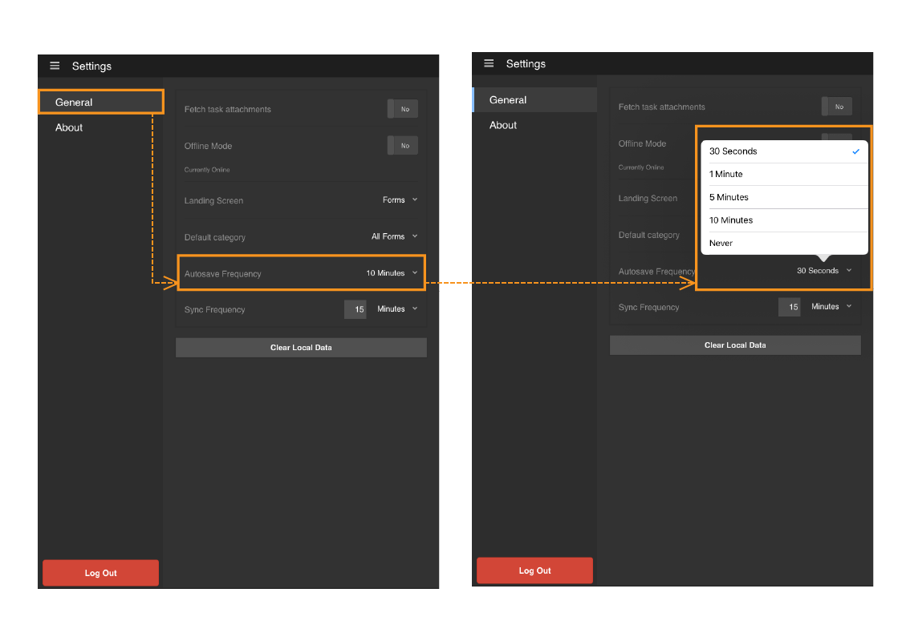

# Utilizzo del salvataggio automatico nell’app AEM Forms{#using-autosave-in-aem-forms-app}

>[!NOTE]
>
>Le versioni Android e iOS dell’app AEM Forms sono state dismesse. La pubblicazione dell’app Android in Google Play è stata annullata a settembre 2026 e l’app iOS è stata rimossa dall’App Store di Apple.
>Queste app non sono più disponibili per l&#39;installazione. Per assistenza sull&#39;app Android, contatta [aemformsapp-android@adobe.com](mailto:aemformsapp-android@adobe.com).

Quando un utente immette dati nell’app Adobe Experience Manager Forms, la funzione di salvataggio automatico li salva a intervalli regolari. La funzione di salvataggio automatico nell’app AEM Forms consente di evitare la perdita di dati in caso di chiusura accidentale dell’app.

L’app può chiudersi accidentalmente:

* Se il dispositivo si spegne a causa di batteria insufficiente
* Se l’utente uccide l’app
* Se si verifica un arresto anomalo imprevisto

Puoi specificare gli intervalli dopo i quali l’app salva i dati immessi.

>[!NOTE]
>
>Seleziona la frequenza di salvataggio automatico in modo giudizioso. Le operazioni di salvataggio automatico frequenti possono avere un impatto notevole sulle prestazioni del dispositivo.

Per utilizzare la funzione di salvataggio automatico nell’app AEM Forms, effettua le seguenti operazioni:

1. Accedi all&#39;app e passa a **Impostazioni > Generale**.
1. Nella schermata Generale, utilizza l&#39;opzione **Salvataggio automatico frequenza** per selezionare gli intervalli in cui desideri che l&#39;app salvi i dati immessi.
   

1. Quando riavvii l’app e accedi con lo stesso utente, ti viene richiesto di ripristinare l’attività tramite la finestra di dialogo Recupera attività non salvata. Fare clic su **OK** nella finestra di dialogo Recupera attività non salvata per riprendere a utilizzare l&#39;attività salvata. Puoi fare clic su **Annulla** per eliminare i dati salvati corrispondenti all&#39;ultimo salvataggio automatico attivato e iniziare a lavorare con una nuova attività.

   Quando fai clic su **OK**, l&#39;attività viene ripristinata con i dati corrispondenti all&#39;ultimo salvataggio automatico attivato prima dell&#39;arresto anomalo dell&#39;app. Include i dati del modulo e tutti gli allegati associati all&#39;attività.
   **A.** Un modulo in corso di lavorazione **B.** app è stato chiuso forzatamente **C.** app riavviata con la finestra di dialogo Recupera attività non salvata **D.** modulo ripristinato con i dati originali
