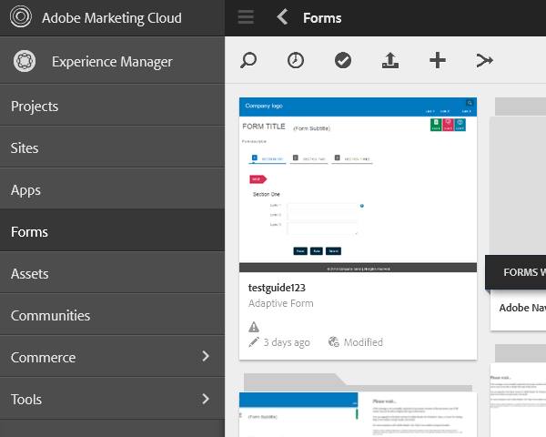

# Configurazione del modulo di pianificazione di sincronizzazione {#configuring-the-synchronization-scheduler}

Per impostazione predefinita, il modulo di pianificazione della sincronizzazione viene eseguito dopo ogni 3 minuti per sincronizzare tutte le risorse modificate e aggiornate nell’archivio tramite LiveCycle Workbench 11. Le applicazioni contenenti moduli e risorse sono visibili nell’interfaccia utente di AEM Forms al termine del processo di sincronizzazione.

## Intervallo di modifica dell&#39;utilità di pianificazione della sincronizzazione {#change-interval-of-the-synchronization-scheduler}

Per modificare l&#39;intervallo dell&#39;utilità di pianificazione della sincronizzazione, effettuare le operazioni riportate di seguito.

1. Accedi ad AEM Configuration Manager. URL di Configuration Manager: `https://'[server]:[port]'/lc/system/console/configMgr`

1. Individua e apri il bundle **FormsManagerConfiguration**.

1. Specificare un nuovo valore per l&#39;opzione **Frequenza utilità di pianificazione sincronizzazione**.

   L&#39;unità della frequenza è minuti. Ad esempio, per configurare la pianificazione in modo che venga eseguita dopo ogni 60 minuti, specificare 60.

## Sincronizzazione delle risorse {#synchronizing-assets}

È possibile utilizzare l&#39;opzione **Sincronizza Assets dall&#39;archivio** per sincronizzare manualmente le risorse. Per sincronizzare manualmente le risorse, effettua le seguenti operazioni:

1. Accedi ad AEM Forms. URL predefinito: `https://'[server]:[port]'/lc/aem/forms/`.

   

   **Figura:** *Interfaccia utente di AEM Forms*

1. Fai clic sull&#39;icona  nella barra degli strumenti. Se non disponi di alcuna risorsa nell’ultimo percorso configurato, seleziona la finestra di dialogo come mostrato di seguito. Fare clic su **Inizio** per avviare la sincronizzazione.

   

   **Figura:** *Finestra di dialogo di sincronizzazione*

## Risoluzione dei problemi di sincronizzazione {#troubleshooting-synchronization-error}

Puoi creare nuove applicazioni nel designer del flusso di lavoro (LiveCycle Workbench).

Se l&#39;applicazione appena creata e una cartella in /content/dam/formsanddocuments hanno lo stesso nome, si verifica l&#39;errore &quot;*Una risorsa con lo stesso nome di questa applicazione esiste già al livello principale.*&quot; è registrato.

Per risolvere il conflitto, rinomina l’applicazione e sincronizza manualmente le risorse.

**Figura:** *Conflitti nella finestra di dialogo di sincronizzazione risorse*
