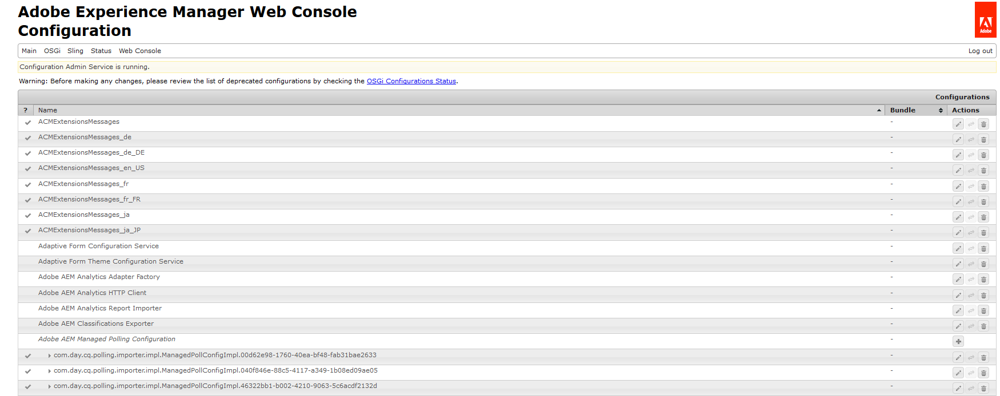

# Configurazione delle impostazioni di AEM DS{#configuring-aem-ds-settings}

In questo articolo viene descritto come configurare il **Servizio impostazioni di AEM DS**. Questa impostazione può essere utilizzata in più scenari, ad esempio:

* Nella gestione della corrispondenza

  * Per la configurazione di AEM Forms Workflow
  * Quando si utilizza il portale Forms per il salvataggio remoto di bozze/invii

* Nei moduli adattivi, nei casi in cui un modulo adattivo viene inviato dall’istanza di pubblicazione

Di seguito sono riportati i passaggi per configurare le **[!UICONTROL impostazioni di AEM DS]**:

1. Apri Configuration Manager nell’istanza di pubblicazione utilizzando l’URL:\
   *https://localhost:port/system/console/configMgr*.

   

1. Nella finestra **[!UICONTROL Configurazione console Web Adobe Experience Manager]**, individuare e fare clic sull&#39;opzione **[!UICONTROL Impostazioni DS AEM]**.

   

1. Nella finestra **[!UICONTROL Servizio impostazioni di AEM DS]** sono visualizzate le impostazioni di configurazione comuni per i componenti di AEM DS.

   

1. Aggiungi le seguenti informazioni nei rispettivi campi:

   **[!UICONTROL URL server di elaborazione]**: il server di elaborazione è il server in cui deve essere attivato il flusso di lavoro di Forms o AEM. Può essere uguale all&#39;URL dell&#39;istanza di authoring di AEM o all&#39;altro URL del server (ovvero https://localhost:port/).

   **[!UICONTROL Elaborazione nome utente server]**: nome utente dell&#39;utente del flusso di lavoro [in base all&#39;URL del server utilizzato]

   **[!UICONTROL Elaborazione password server]**: password utente flusso di lavoro

   >[!NOTE]
   >
   >
   >    
   >    
   >    * Quando si utilizzano flussi di lavoro Forms o AEM, prima di effettuare qualsiasi invio dal server di pubblicazione è necessario configurare il servizio delle impostazioni DS. In caso contrario, la presentazione del modulo non avrà esito positivo.
   >    
   >
