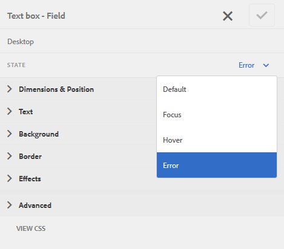

# Personalizzare il layout e il posizionamento dei messaggi di errore di un modulo adattivo{#customize-layout-and-positioning-of-error-messages-of-an-adaptive-form}

È possibile personalizzare il layout e il posizionamento dei messaggi di errore di un modulo adattivo. Puoi eseguire le seguenti personalizzazioni:

* Personalizza la posizione e il layout della didascalia di un campo senza modificare le proprietà CSS corrispondenti
* Personalizzare la posizione dei messaggi di errore in linea
* Personalizza il contenuto dell’indicatore della guida dinamica
* Personalizza la posizione dei componenti campo (sottotitoli, widget, descrizione breve, descrizione lunga e indicatori di aiuto) senza modificare le proprietà CSS corrispondenti

## Personalizzare il layout dei campi {#customize-layout-of-fields}

È possibile personalizzare il layout di un singolo campo o di tutti i campi per modificare la posizione della didascalia e dei messaggi di errore.

Per applicare un layout personalizzato a un campo, eseguire le operazioni seguenti:

### Personalizzare il layout di un singolo campo {#customize-layout-of-a-single-field}

1. Apri il modulo in modalità **Stile**. Per aprire il modulo in modalità stile, nella barra degli strumenti della pagina seleziona  > **Stile**.
1. Nella barra laterale, in **Oggetti modulo**, seleziona il campo e il pulsante di modifica .
1. Seleziona lo stato del campo da personalizzare e specifica lo stile per tale stato.

   

### Personalizzare il layout di tutti i campi di un modulo {#customize-layout-of-all-the-fields-of-a-form}

Con AEM Forms, ora puoi creare un tema e applicarlo al modulo. L’editor tema consente di specificare lo stile dei componenti modulo in un’unica posizione. Quando create un tema, specificate lo stile a livello di componente. Per ulteriori informazioni sui temi, vedere [Temi in AEM Forms](../../forms/using/themes.md).

Creare un tema utilizzando Editor tema per personalizzare il layout di tutti i campi del modulo. Dopo aver creato un tema, effettuare le seguenti operazioni per applicarlo a un modulo:

1. Apri il modulo in modalità di modifica.
1. In modalità di modifica, seleziona un componente, quindi seleziona  > **Contenitore modulo adattivo**, quindi seleziona .
1. Nella barra laterale, in Tema modulo adattivo, seleziona il tema creato utilizzando l’Editor tema.

## Creare un layout di campo personalizzato {#create-a-custom-field-layout}

1. Apri CRXDE Lite. L&#39;URL predefinito è https://&#39;[server]:[porta]&#39;/crx/de.
1. Copiare un layout di campo dal nodo /libs/fd/af/layouts/field (ad esempio, defaultFieldLayout) al nodo /apps (ad esempio, /apps/af-field-layout).
1. Rinomina il nodo copiato e il file defaultFieldLayout.jsp. Ad esempio, errorOnRight.jsp.

1. Modificare il valore delle proprietà qtip e jcr:description del nodo copiato. Ad esempio, modifica il valore delle proprietà in Errore a destra

1. Per aggiungere nuovi stili e comportamenti, crea una libreria client nel nodo /etc.

   Ad esempio, nella posizione /etc/af-field-layout-clientlib, crea la libreria client del nodo. Aggiungi la proprietà Categories con il valore af.field.errorOnRight e il file style.less con il seguente codice:

   ```css
   .widgetErrorWrapper {
   
    height: 38px;
    margin: 5px;
   
    .guideFieldWidget{
    width: 60%;
    float: left; 
    }
   
    .guideFieldError{
    overflow:hidden;
    width:40%; 
    }
   
   }
   ```

1. Per migliorare l’aspetto e il comportamento, includi la libreria client creata nel file di layout (errorOnRight.jsp).
1. Apri la finestra di dialogo di modifica del campo e seleziona la scheda **Stile**. Nella casella a discesa **Configura layout campo**, selezionare il layout appena creato e fare clic su **OK**.

Il pacchetto ErrorOnRight.zip contiene codice per visualizzare messaggi di errore sul lato destro dei campi.

[Ottieni il file](assets/erroronright.zip)
