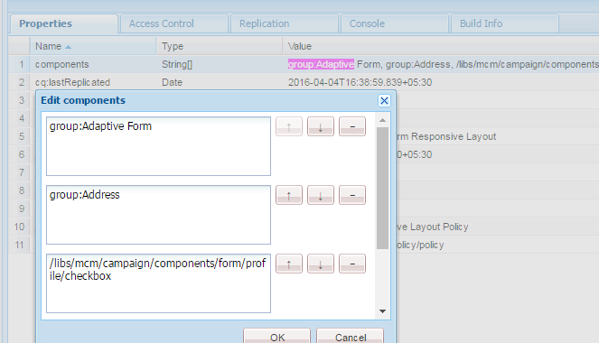
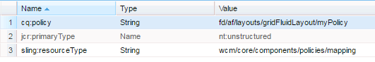

# Visualizzazione dei componenti in base al modello utilizzato{#displaying-components-based-on-the-template-used}

Quando un autore di moduli crea un modulo adattivo utilizzando un [modello](../../forms/using/template-editor.md), può visualizzare e utilizzare componenti specifici basati sui criteri dei modelli. È possibile specificare un criterio per il contenuto dei modelli che consenta di scegliere un gruppo di componenti visualizzato dall&#39;autore del modulo durante la creazione del modulo.

## Modifica del criterio del contenuto di un modello {#changing-the-content-policy-of-a-template}

Quando si crea un modello, questo viene creato in `/conf` nell&#39;archivio dei contenuti. In base alle cartelle create nella directory `/conf`, il percorso del modello è: `/conf/<your-folder>/settings/wcm/templates/<your-template>`.

Per visualizzare i componenti nella barra laterale in base al criterio del contenuto di un modello, effettua le seguenti operazioni:

1. Apri CRXDE lite.\
   URL: `https://<server>:<port>/crx/de/index.jsp`
1. In CRXDE, passa alla cartella in cui è stato creato il modello.

   Esempio: `/conf/<your-folder>/`

1. In CRXDE, passare a: `/conf/<your-folder>/settings/wcm/policies/fd/af/layouts/gridFluidLayout/`

   Per selezionare un gruppo di componenti, è necessario un nuovo criterio per i contenuti. Per creare un criterio, copia e incolla il criterio predefinito e rinominalo.

   Percorso del criterio del contenuto predefinito: `/conf/<your-folder>/settings/wcm/policies/fd/af/layouts/gridFluidLayout/default`

   Nella cartella `gridFluidLayout`, copiare e incollare il criterio predefinito e rinominarlo. Ad esempio, `myPolicy`.

   

1. Seleziona il nuovo criterio creato e la proprietà **components** nel pannello a destra con tipo `string[]`.

   Quando selezioni e apri la proprietà dei componenti, viene visualizzata la finestra di dialogo Modifica componenti. La finestra di dialogo Modifica componenti consente di aggiungere o rimuovere gruppi di componenti utilizzando i pulsanti **+** e **-**. È possibile aggiungere un gruppo di componenti che includa i componenti che si desidera vengano utilizzati dagli autori.

   

   Dopo aver aggiunto un gruppo di componenti, fai clic su **OK** per aggiornare l&#39;elenco, quindi fai clic su **Salva tutto** sopra la barra degli indirizzi CRXDE e aggiorna.

1. Nel modello, modifica il criterio del contenuto da predefinito al nuovo criterio creato. ( `myPolicy` in questo esempio.)

   Per modificare il criterio, in CRXDE, passa a `/conf/<your-folder>/settings/wcm/templates/<your-template>/policies/jcr:content/guideContainer/rootPanel/items`.

   Nella proprietà `cq:policy`, modificare `default` nel nuovo nome del criterio ( `myPolicy`).

   

   Quando crei un modulo utilizzando il modello, puoi visualizzare i componenti aggiunti nella barra laterale.
