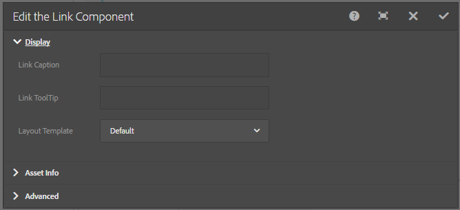

# Incorporazione del componente collegamento in una pagina{#embedding-link-component-in-a-page}

## Prerequisiti {#prerequisites}

Il componente Collegamento è un membro della categoria Servizi basati su documenti. Assicurati che la categoria Document Services sia visibile nel browser dei componenti di AEM. Se la categoria non è elencata, seguire i passaggi elencati in [Abilitazione dei componenti del portale Forms](/help/forms/using/enabling-forms-portal-components.md).

## Componente collegamento {#link-component}

Il componente Collegamento consente agli autori del portale dei moduli di creare un collegamento a un modulo adattivo da qualsiasi punto di una pagina. Il componente Collegamento è disponibile nella sezione Servizi documentali del browser componenti.

Per aggiungere un componente Collegamento alla pagina, effettua le seguenti operazioni:

1. Trascina il componente **Collegamento** nella pagina. Selezionare il componente e selezionare . Viene visualizzata la finestra di dialogo Modifica componente collegamento.

   

1. Nella scheda **Visualizzazione**, specificare quanto segue:

   * **Didascalia collegamento**: testo collegamento o didascalia collegamento.
   * **Descrizione**: descrizione del collegamento.
   * **Modello di layout**: modello per il layout del componente Collegamento.

1. Apri la scheda **Informazioni risorsa** e specifica il tipo di risorsa. Una risorsa può essere un **modulo**. A seconda del tipo di risorsa selezionato, vengono visualizzate le opzioni elencate di seguito:

   * **Percorso risorsa**: percorso dell&#39;archivio in cui è memorizzata la risorsa.

   * **Tipo di rendering**: il formato di rendering, ovvero PDF, HTML o Auto. Il tipo di rendering automatico rileva l’ambiente utente e, di conseguenza, esegue il rendering del modulo come HTML o PDF. Ad esempio, se il modulo è accessibile da un dispositivo mobile, il tipo di rendering automatico esegue il rendering del modulo in HTML.
   * **URL di invio:** URL al servlet in cui vengono inviati i dati del modulo.
   * **Profilo HTML**: profilo per il rendering del modulo come HTML.
   * **Profilo PDF**: profilo per il rendering del modulo come documento PDF.

1. Apri la scheda **Avanzate**. Potete specificare i parametri aggiuntivi nel formato coppia chiave-valore. Quando fai clic sul collegamento, questi parametri aggiuntivi vengono trasmessi insieme al modulo.

   Seleziona **Fine** per salvare la configurazione.

## Best practice per l’utilizzo del componente Collegamento {#best-practices-for-using-link-component-br}

* Accertati di selezionare PDF come tipo di rendering se il percorso specificato in Percorso modulo punta a un documento il cui formato di rendering è PDF.
* È possibile specificare l&#39;URL di invio per un modulo in più posizioni e il relativo ordine di precedenza è il seguente:

  1. L’URL di invio incorporato nel modulo (nel pulsante di invio) ha la priorità più alta.
  1. L’URL di invio menzionato in Forms Manager ha la priorità media.
  1. L’URL di invio menzionato nel portale dei moduli ha la priorità più bassa.
