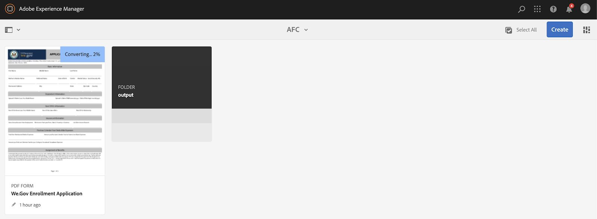

# Impostare e configurare il sito di riferimento We.Gov e We-Finance {#set-up-and-configure-we-gov-reference-site}

## Dettagli pacchetto demo {#demo-package-details}

### Prerequisiti per l’installazione {#installation-prerequisites}

Questo pacchetto è stato creato per **AEM Forms 6.4 OSGI Author**, è stato testato ed è pertanto supportato nelle seguenti versioni di piattaforma:

| VERSIONE AEM | VERSIONE PACCHETTO AEM FORMS | STATO |
|---|---|---|
| 6.4 | 5.0.86 | **Supportato** |
| 6,5 | 6.0.80 | **Supportato** |
| 6.5.3 | 6.0.122. | **Supportato** |

Questo pacchetto contiene una configurazione cloud che supporta le seguenti versioni della piattaforma:

| PROVIDER CLOUD | VERSIONE SERVIZIO | STATO |
|---|---|---|
| Adobe Sign | API v5 | **Supportato** |
| Microsoft® Dynamics 365 | 1710 (9,1.0.3020) | **Supportato** |
| Adobe Analytics | API Rest v1.4 | **Supportato** |

**Considerazioni sull&#39;installazione del pacchetto:**

* Installa il pacchetto su un server pulito, senza altri pacchetti demo o versioni di pacchetti demo precedenti.
* Installa il pacchetto su un server OSGI, in esecuzione in modalità Creazione.

### Cosa include questo pacchetto {#what-does-this-package-include}

Il [pacchetto demo We.Gov di AEM Forms](https://experience.adobe.com/#/downloads/content/software-distribution/en/aem.html?package=/content/software-distribution/en/details.html/content/dam/aem/public/adobe/packages/cq650/featurepack/we-gov-forms.pkg.all-2.0.2.zip) (**we-gov-forms.pkg.all-&lt;version>.zip**) viene fornito come pacchetto che include diversi altri pacchetti secondari e servizi. Il pacchetto include i seguenti moduli:

* **we-gov-forms.pkg.all-&lt;versione>.zip** - *Pacchetto demo completo*

   * **we-gov-forms.ui.apps-&lt;versione>.zip** *- Contiene tutti i componenti, le librerie client, gli utenti di esempio, i modelli di flusso di lavoro e così via.*

      * **we-gov-forms.core-&lt;versione>.jar** - *Contiene tutti i servizi OSGI, l&#39;implementazione personalizzata del passaggio del flusso di lavoro e così via.*

      * **we-gov-forms.derby&lt;versione>.jar** - *Contiene tutti i servizi OSGI, lo schema del database e così via.*

      * **core.wcm.components.all-2.0.4.zip** - *Raccolta di componenti WCM di esempio*

      * **grid-aem.ui.apps-1.0-SNAPSHOT.zip** - *Pacchetto di layout AEM Sites Grid per il controllo colonna pagina Sites*

   * **we-gov-forms.ui.content-&lt;versione>.zip** - *Contiene tutto il contenuto, pagine, immagini, moduli, risorse di comunicazione interattive e così via.*

   * **we-gov-forms.ui.analytics-&lt;versione>.zip** - *Contiene tutti i dati di Forms Analytics We.Gov da archiviare nell&#39;archivio.*

   * **we-gov-forms.config.public-&lt;versione>.zip** - *Contiene tutti i nodi di configurazione predefiniti, incluse le configurazioni cloud dei segnaposto, per evitare problemi di associazione a servizi e modelli dati di forms.*

Le risorse incluse in questo pacchetto includono:

* Pagine del sito AEM con modelli modificabili
* AEM Forms Adaptive Forms
* Comunicazioni interattive AEM Forms (stampa e canale web)
* Documento di record XDP di AEM Forms
* Modello dati AEM Forms MS® Dynamics Forms
* Integrazione di Adobe Sign
* Modello flusso di lavoro di AEM
* Immagini di esempio di AEM Assets
* Esempio (In Memoria) Di Database Derby Apache
* Apache Derby Data Source (per l’utilizzo con il modello dati del modulo)

## Installazione del pacchetto demo {#demo-package-installation}

Questa sezione contiene informazioni sull’installazione del pacchetto demo.

### Dalla distribuzione del software {#from-software-distribution}

1. Apri [Software Distribution](https://experience.adobe.com/downloads). Per accedere a Software Distribution è necessario disporre di un Adobe ID.
1. Seleziona **[!UICONTROL Adobe Experience Manager]** disponibile nel menu intestazione.
1. Nella sezione **[!UICONTROL Filtri]**:
   1. Selezionare **[!UICONTROL Forms]** dall&#39;elenco a discesa **[!UICONTROL Soluzione]**.
   2. Seleziona la versione e digita per il pacchetto. Puoi anche utilizzare l&#39;opzione **[!UICONTROL Cerca download]** per filtrare i risultati.
1. Seleziona il nome del pacchetto **we-gov-forms.pkg.all-&lt;versione>.zip**, seleziona **[!UICONTROL Accetta i termini EULA]**, quindi seleziona **[!UICONTROL Scarica]**.
1. Apri [Gestione pacchetti](/help/sites-administering/package-manager.md) e fai clic su **[!UICONTROL Carica pacchetto]** per caricare il pacchetto.
1. Selezionare il pacchetto e fare clic su **[!UICONTROL Installa]**.

   

1. Consenti il completamento del processo di installazione.
1. Passa a *https://&lt;aemserver>:&lt;port>/content/we-gov/home.html?wcmmode=disabled* per verificare che l&#39;installazione sia stata completata correttamente.

### Da un file ZIP locale {#from-a-local-zip-file}

1. Scarica e individua il file **we-gov-forms.pkg.all-&lt;versione>.zip**.
1. Passa a *https://&lt;aemserver>:&lt;porta>/crx/packmgr/index.jsp*.
1. Seleziona l’opzione &quot;Carica pacchetto&quot;.

   

1. Utilizza il browser dei file per passare al file ZIP scaricato e selezionarlo.
1. Fai clic su &quot;Apri&quot; per caricare.
1. Una volta caricato, seleziona l’opzione &quot;Installa&quot; per installare il pacchetto.

   

1. Consenti il completamento del processo di installazione.
1. Passa a *https://&lt;aemserver>:&lt;port>/content/we-gov/home.html?wcmmode=disabled* per verificare che l&#39;installazione sia stata completata correttamente.

### Installazione di nuove versioni del pacchetto {#installing-new-package-versions}

Per installare la nuova versione del pacchetto, segui i passaggi definiti nelle sezioni 4.1 e 4.2. È possibile installare una versione più recente del pacchetto anche se è già installata una versione precedente. Tuttavia, Adobe consiglia di disinstallare prima la versione precedente del pacchetto. A tale scopo, eseguire le operazioni seguenti:

1. Passa a *https://&lt;aemserver>:&lt;porta>/crx/packmgr/index.jsp*
1. Individua il file **we-gov-forms.pkg.all-&lt;versione>.zip** precedente.
1. Selezionare l&#39;opzione **Altro**.
1. Dall&#39;elenco a discesa, selezionare l&#39;opzione **Disinstalla**.

   

1. Al momento della conferma, selezionare nuovamente **Disinstalla** e consentire il completamento del processo di disinstallazione.

## Configurazione del pacchetto demo {#demo-package-configuration}

Questa sezione contiene dettagli e istruzioni sulla configurazione post-distribuzione del pacchetto demo prima della presentazione.

### Configurazione utente fittizia {#fictional-user-configuration}

1. Passa a *https://&lt;aemserver>:&lt;porta>/libs/granite/security/content/groupadmin.html*
1. Accedi come amministratore per eseguire le operazioni seguenti.
1. Scorri verso il basso fino alla fine della pagina per caricare tutti i gruppi di utenti.
1. Cerca **workflow**.
1. Seleziona il gruppo **utenti flusso di lavoro** e fai clic su **Proprietà**.
1. Passare alla scheda Membri.
1. Nel campo **Seleziona utente o gruppo** digitare `wegov`.
1. Seleziona dall&#39;elenco a discesa **Utenti Forms We.Gov**.

   

1. Fai clic su **Salva e chiudi** nella barra dei menu.
1. Ripeti i passaggi da 2 a 7 cercando **Analytics**, selezionando il gruppo **Amministratori di Analytics** e aggiungendo il gruppo **Utenti Forms We.Gov** come membro.
1. Ripeti i passaggi da 2 a 7 cercando **utenti Forms**, selezionando il gruppo **utenti Forms-power** e aggiungendo il gruppo **Utenti Forms We.Gov** come membro.
1. Ripeti i passaggi da 2 a 7 cercando **utenti-moduli**, selezionando il gruppo **utenti-moduli** e aggiungendo il gruppo **Utenti.Gov** come membro.

### Configurazione del server e-mail {#email-server-configuration}

1. Rivedi la documentazione di configurazione [Configurazione della notifica e-mail](/help/sites-administering/notification.md)
1. Accedi come amministratore per eseguire questa attività.
1. Passa a *https://&lt;aemserver>:&lt;porta>/system/console/configMgr*
1. Individua e fai clic sul servizio **Day CQ Mail Service** da configurare.

   

1. Configurare il servizio per la connessione al server SMTP desiderato:

   1. **Nome host del server SMTP**: ad esempio (smtp.gmail.com)
   1. **Porta server**: ad esempio (465) per gmail tramite SSL
   1. **Utente SMTP:** demo@ &lt;nome società> .com
   1. **Indirizzo Da**: aemformsdemo@adobe.com

   

1. Fai clic su **Salva** per salvare la configurazione.

### Configurazione SSL di AEM (facoltativo) {#aemsslconfig}

Questa sezione contiene informazioni dettagliate sulla configurazione di SSL nell’istanza AEM per poter configurare la configurazione Adobe Sign Cloud.

**Riferimenti:**

1. [SSL per impostazione predefinita](/help/sites-administering/ssl-by-default.md)

**Note:**

1. Passa a https://&lt;aemserver>:&lt;porta>/aem/inbox dove puoi completare il processo descritto nel collegamento alla documentazione di riferimento riportato sopra.
1. Il pacchetto `we-gov-forms.pkg.all-[version].zip` include una chiave SSL di esempio e un certificato a cui è possibile accedere estraendo la cartella `we-gov-forms.pkg.all-[version].zip/ssl` che fa parte del pacchetto.

1. Dettagli certificato SSL e chiave:

   1. rilasciato a &quot;CN=localhost&quot;
   1. validità di 10 anni
   1. valore password di &quot;password&quot;

1. La chiave privata è *localhostprivate.der*.
1. Il certificato è *localhost.crt*.
1. Fai clic su **Avanti**.
1. Imposta il nome host HTTPS su *localhost*.
1. Impostare Port su una porta esposta dal sistema.

### (Facoltativo) Configurazione cloud Adobe Sign {#adobe-sign-cloud-configuration}

Questa sezione contiene dettagli e istruzioni sulla configurazione di Adobe Sign Cloud.

**Riferimenti:**

1. [Integrare Adobe Acrobat Sign con AEM Forms](adobe-sign-integration-adaptive-forms.md)

#### Configurazione cloud {#cloud-configuration}

1. Esamina i prerequisiti. Consulta [Configurazione SSL di AEM](../../forms/using/forms-install-configure-gov-reference-site.md#aemsslconfig) per la configurazione SSL richiesta.
1. Accedi a:

   *https://&lt;aemserver>:&lt;porta>/libs/adobesign/cloudservices/adobesign.html/conf/we-gov*

   >[!NOTE]
   >
   >Per evitare problemi di configurazione, assicurati che l’URL utilizzato per accedere al server AEM corrisponda a quello configurato nell’URI di reindirizzamento OAuth di Adobe Sign.
   >Ad esempio, *https://&lt;aemserver>:&lt;porta>/mnt/overlay/adobesign/cloudservices/adobesign/properties.html*

1. Seleziona la configurazione **We.gov Adobe Sign**.
1. Fare clic su **Proprietà**.
1. Passare alla scheda Impostazioni.
1. Immetti l’URL OAuth. Ad esempio, `https://secure.na1.echosign.com/public/oauth` (solo a scopo illustrativo).
1. Specifica l’ID client e il segreto client configurati dall’istanza Adobe Sign configurata.
1. Fai clic su **Connetti ad Adobe Sign**.
1. Dopo aver stabilito la connessione, fai clic su **Salva e chiudi** per completare l&#39;integrazione.

### (Facoltativo) Configurazione cloud MS® Dynamics {#ms-dynamics-cloud-configuration}

Questa sezione contiene dettagli e istruzioni sulla configurazione di MS® Dynamics Cloud.

**Riferimenti:**

1. [Microsoft](/help/forms/using/ms-dynamics-odata-configuration.md)
1. [Configurazione di Microsoft® Dynamics per AEM Forms](https://experienceleague.adobe.com/en/docs/experience-manager-learn/forms/adaptive-forms/using-ms-dynamics-with-aem-forms#)

#### Servizio cloud MS® Dynamics OData {#ms-dynamics-odata-cloud-service}

1. Accedi a:

   https://&lt;aemserver>:&lt;porta>/libs/fd/fdm/gui/components/admin/fdmcloudservice/fdm.html/conf/we-gov

   1. Assicurati di accedere al server utilizzando lo stesso URL di reindirizzamento configurato nella registrazione dell’applicazione MS® Dynamics.

1. Selezionare la configurazione &quot;Microsoft® Dynamics OData Cloud Service&quot;.
1. Fare clic su **Proprietà**.

   

1. Passare alla scheda Impostazioni autenticazione.
1. Immetti i seguenti dettagli:

   1. **Radice servizio:** ad esempio, `https://msdynamicsserver.api.crm3.dynamics.com/api/data/v9.1/`
   1. **Tipo di autenticazione:** OAuth 2.0
   1. **Impostazioni autenticazione** (vedere [Impostazioni di configurazione cloud di MS® Dynamics](../../forms/using/forms-install-configure-gov-reference-site.md#dynamicsconfig) per raccogliere queste informazioni):

      1. ID client, detto anche ID applicazione
      1. Segreto client
      1. URL OAuth - ad esempio, [https://login.microsoftonline.com/common/oauth2/authorize](https://login.microsoftonline.com/common/oauth2/authorize)
      1. Aggiorna URL token: ad esempio, [https://login.windows.net/common/oauth2/token](https://login.windows.net/common/oauth2/token)
      1. URL token di accesso: ad esempio, [https://login.windows.net/common/oauth2/token](https://login.windows.net/common/oauth2/token)
      1. Ambito autorizzazione - **openid**
      1. Intestazione autenticazione - **Supporto autorizzazione**
      1. Risorsa, ad esempio `https://msdynamicsserver.api.crm3.dynamics.com`

   1. Fare clic su C **Connetti a OAuth**.

1. Dopo l&#39;autenticazione, fare clic su **Salva e chiudi** per completare l&#39;integrazione.

#### Impostazioni di configurazione cloud MS® Dynamics {#dynamicsconfig}

I passaggi descritti in questa sezione sono inclusi per individuare l’ID client, il segreto client e i dettagli dell’istanza di MS® Dynamics Cloud.

1. Passa a [https://portal.azure.com/](https://portal.azure.com/) e accedi.
1. Dal menu a sinistra, selezionare **Tutti i servizi**.
1. Cerca o passa a **Registrazione app**.
1. Crea o seleziona una registrazione applicazione esistente.
1. Copia l&#39;**ID applicazione** da utilizzare come OAuth **ID client** nella configurazione cloud di AEM
1. Fai clic su **Impostazioni** o **Manifesto** per configurare gli **URL di risposta.**

   1. Questo URL deve corrispondere all&#39;URL utilizzato per accedere al server AEM durante la configurazione del servizio OData.

1. Nella vista Impostazioni, fai clic su **Chiavi** per visualizzare una nuova chiave (utilizzata come Segreto client in AEM ).

   1. Assicurati di conservare una copia della chiave; non sarà più possibile visualizzarla in un secondo momento in Azure o AEM.

1. Per individuare l’URL della risorsa o l’URL principale del servizio, passa al dashboard dell’istanza di MS® Dynamics.
1. Nella barra di navigazione superiore, fai clic su **Vendite** o sul tipo di istanza personale, quindi su **Seleziona impostazioni**.
1. Nella parte inferiore destra, fai clic su **Personalizzazioni** e **Risorse per sviluppatori**.
1. Trova l’URL principale del servizio. Ad esempio,

   `https://msdynamicsserver.api.crm3.dynamics.com/api/data/v9.1/`

1. I dettagli sull’URL del token di accesso e aggiornamento sono disponibili al seguente indirizzo:

   [https://learn.microsoft.com/en-us/rest/api/datacatalog/authenticate-a-client-app](https://learn.microsoft.com/en-us/rest/api/datacatalog/authenticate-a-client-app)

#### Test del modello dati di Forms (Dynamics) {#testing-the-form-data-model}

Una volta completata la configurazione cloud, potrebbe essere utile testare il modello dati del modulo.

1. Passa a

   *https://&lt;aemserver>:&lt;port>/aem/forms.html/content/dam/formsanddocuments-fdm/we-gov*

1. Selezionare **We.gov Microsoft® Dynamics CRM FDM** e selezionare **Proprietà**.

   

1. Passare alla scheda **Aggiorna Source**.
1. Verificare che la **configurazione in base al contesto** sia impostata su `/conf/we-gov` e che l&#39;origine dati configurata sia `ms-dynamics-odata-cloud-service`.

   

1. Modifica il modello dati del modulo.

1. Verificare che i servizi si connettano correttamente all&#39;origine dati configurata.

   >[!NOTE]
   >
   >Dopo aver eseguito il test dei servizi, fare clic su **Annulla** per assicurarsi che le modifiche involontarie non vengano propagate al modello dati del modulo.

   >[!NOTE]
   >
   >È stato segnalato che era necessario riavviare il server AEM per effettuare correttamente l&#39;associazione dell&#39;origine dati a FDM.

   >[!NOTE]
   >
   >Adobe consiglia di utilizzare il comando `Ctrl + C` per riavviare SDK. Riavvio di AEM SDK utilizzando metodi alternativi. L’arresto dei processi Java, ad esempio, può causare incoerenze nell’ambiente di sviluppo di AEM.

#### Test del modello dati Forms (Derby) {#test-fdm-derby}

Una volta completata la configurazione cloud, potrebbe essere utile testare il modello dati di Forms.

1. Passa a *https://&lt;aemserver>:&lt;port>/aem/forms.html/content/dam/formsanddocuments-fdm/we-gov*

1. Selezionare l&#39;FDM **di registrazione** We.gov e selezionare **Proprietà**.

   

1. Passare alla scheda **Aggiorna Source**.

1. Verificare che la **configurazione in base al contesto** sia impostata su `/conf/we-gov` e che l&#39;origine dati configurata sia **Servizi di dominio trusted We.Gov**.

   

1. Fai clic su **Salva e chiudi**.

1. [Verifica i servizi](work-with-form-data-model.md#test-data-model-objects-and-services) per assicurarti che si connettano correttamente al Data Source configurato

   * Per verificare la connessione, selezionare **HOMEMORTGAGEACCOUNT** e assegnargli un servizio GET. Eseguire il test del servizio e gli amministratori di sistema possono visualizzare i dati recuperati.

### Configurazione Adobe Analytics (opzionale) {#adobe-analytics-configuration}

Questa sezione contiene dettagli e istruzioni sulla configurazione di Adobe Analytics Cloud.

**Riferimenti:**

* [Integrazione con Adobe Analytics](../../sites-administering/adobeanalytics.md)

* [Connessione ad Adobe Analytics e creazione di framework](../../sites-administering/adobeanalytics-connect.md)

* [Visualizzazione dei dati analitici sulle pagine](../../sites-authoring/pa-using.md)

* [Configurazione di analisi e rapporti](configure-analytics-forms-documents.md)

* [Visualizzare e comprendere i rapporti di analisi di AEM Forms](view-understand-aem-forms-analytics-reports.md)

### Configurazione del servizio Adobe Analytics Cloud {#adobe-analytics-cloud-service-configuration}

Questo pacchetto è preconfigurato per la connessione ad Adobe Analytics. I passaggi seguenti sono forniti per consentire l’aggiornamento di questa configurazione.

1. Passa a *https://&lt;aemserver>:&lt;porta>/libs/cq/core/content/tools/cloudservices.html*
1. Individua la sezione Adobe Analytics e seleziona il collegamento &quot;Mostra configurazioni&quot;.
1. Seleziona la configurazione &quot;We.Gov Adobe Analytics (Analytics Configuration)&quot;.

   

1. Fai clic sul pulsante &quot;Modifica&quot; per aggiornare la configurazione di Adobe Analytics (devi fornire il segreto condiviso). Fai clic su &quot;Connetti ad Analytics&quot; per connetterti e su &quot;OK&quot; per completare.

   

1. Dalla stessa pagina, fai clic su &quot;We.Gov Adobe Analytics Framework (Analytics Framework)&quot; se desideri aggiornare le configurazioni del framework (consulta [Abilitare l&#39;authoring di AEM](../../forms/using/forms-install-configure-gov-reference-site.md#enableauthoring) per abilitare l&#39;authoring).

#### Adobe Analytics - Individuazione delle credenziali utente {#analytics-locating-user-credentials}

Individua le credenziali utente di un account Adobe Analytics che l’amministratore dell’account deve eseguire per eseguire le seguenti attività.

1. Passa al portale Adobe Experience Cloud.
Accedi con le credenziali di amministratore
1. Seleziona l’icona Adobe Analytics nel dashboard principale.
   
1. Passa alla scheda Amministratore e seleziona l’elemento Gestione utente (legacy).
   
1. Selezionare la scheda **Utenti**.
   
1. Seleziona l’utente desiderato dall’elenco degli utenti.
1. Scorri fino alla parte inferiore della pagina e le informazioni di autenticazione degli utenti vengono visualizzate nella parte inferiore della pagina.
   
1. Il nome utente e le informazioni sul segreto condiviso vengono visualizzati sul lato destro della casella delle autorizzazioni.
1. Il nome utente è composto da due punti. Tutte le informazioni a sinistra dei due punti sono il nome utente e tutte le informazioni a destra dei due punti sono il nome dell&#39;azienda, come nell&#39;esempio seguente:

   *nomeutente: nome società*

#### Configurare l’autenticazione utente in Adobe Analytics {#setup-user-authentication}

Gli amministratori possono fornire agli utenti le autorizzazioni di AEM Analytics eseguendo le azioni seguenti.

1. Passa a Adobe Admin Console.

1. Fai clic sull’istanza di Analytics esposta all’Admin Console.

   Si trova nella pagina principale della pagina di amministrazione.

1. Seleziona Accesso completo come amministratore di Analytics.

1. Aggiungi un utente al profilo.

   

1. Una volta mappato l’ID utente nel profilo, fai clic sulla scheda delle autorizzazioni.

1. Assicurati che tutte le autorizzazioni siano mappate sul profilo.

   

1. Una volta mappate le autorizzazioni, la possibilità per un utente di effettuare l’accesso potrebbe richiedere alcune ore.

### Reportistica di Adobe Analytics {#adobe-analytics-reporting}

#### Visualizza rapporti sui siti di Adobe Analytics {#view-adobe-analytics-sites-reporting}

>[!NOTE]
>
>Se installi il pacchetto `we-gov-forms.ui.analytics-<version>.zip`, i dati di AEM Forms Analytics sono disponibili offline o senza una configurazione di Adobe Analytics Cloud. I dati di AEM Sites richiedono una configurazione cloud attiva.

1. Passa a *https://&lt;aemserver>:&lt;porta>/sites.html/content*
1. Selezionare il **sito AEM Forms We.Gov** per visualizzare le pagine del sito.
1. Selezionare una delle pagine del sito (ad esempio Home) e scegliere **Analytics &amp; Recommendations**.

   

1. In questa pagina vengono visualizzate le informazioni recuperate da Adobe Analytics. Le informazioni si riferiscono alla pagina AEM Sites. Per progettazione, queste informazioni vengono periodicamente aggiornate da Adobe Analytics e non vengono visualizzate in tempo reale.

   

1. Tornando alla pagina di visualizzazione della pagina (a cui si accede al passaggio 3.), è inoltre possibile visualizzare le informazioni di visualizzazione della pagina modificando l&#39;impostazione di visualizzazione per visualizzare gli elementi nella **Vista a elenco**.
1. Individuare il menu a discesa &quot;Visualizza&quot; e selezionare **Vista elenco**.

   

1. Nello stesso menu, selezionare **Visualizza impostazione** e selezionare le colonne da visualizzare nella sezione **Analytics**.

   

1. Fai clic su **Aggiorna** per rendere disponibili le nuove colonne.

   

#### Visualizzare i rapporti di Adobe Analytics Forms {#view-adobe-analytics-forms-reporting}

>[!NOTE]
>
>I dati di AEM Forms Analytics sono disponibili offline o senza una configurazione Adobe Analytics Cloud. Questa capacità è vera se il pacchetto `we-gov-forms.ui.analytics-<version>.zip` è installato. Tuttavia, i dati di AEM Sites richiedono una configurazione cloud attiva.

1. Passa a

   *https://&lt;aemserver>:&lt;porta>/aem/forms.html/content/dam/formsanddocuments/adobe-gov-forms*

1. Seleziona il modulo adattivo &quot;Applicazione di iscrizione per benefici per la salute&quot; e seleziona l’opzione &quot;Rapporto di Analytics&quot;.

   

1. Attendi il caricamento della pagina e visualizza i dati del rapporto di Analytics.

   

### Abilitazione configurazione Adobe Automated Forms {#automated-forms-enablement}

Per installare e configurare AEM Forms con Adobe Forms, gli utenti dello strumento di conversione devono disporre dei seguenti elementi:

1. Accesso ad Adobe Developer.

1. Autorizzazione per creare un’integrazione con il servizio di conversione Forms di Adobe.

1. Service Pack più recente di Adobe AEM 6.5 eseguito come autore.

Prima di leggere ulteriori istruzioni, leggere quanto segue:

* [Configurazione del servizio di conversione automatica dei moduli](https://experienceleague.adobe.com/en/docs/aem-forms-automated-conversion-service/using/configure-service#)

#### Creare una configurazione IMS - Parte 1 {#creating-ims-config}

Configurare il servizio per comunicare correttamente con lo strumento di conversione moduli: gli utenti devono configurare il servizio Identity Management System (IMS) per potersi registrare su Adobe I/O.

1. Passa a https://&lt;aemserver>:&lt;porta> > Fai clic su Esperienza Adobe
Manager in alto a sinistra > Strumenti > Sicurezza > Configurazione Adobe IMS.

1. Fai clic su Crea.

1. Effettua le azioni riportate nell’immagine seguente.

   

1. Assicurati di scaricare il certificato.

1. Non procedere con il resto della configurazione - sezione di revisione [Creazione dell&#39;integrazione in Adobe I/O](#create-integration-adobeio)

>[!NOTE]
>
>Il certificato creato in questa sezione verrà utilizzato per creare il servizio di integrazione in Adobe I/O. Una volta creato il servizio di integrazione, gli utenti possono utilizzare tali informazioni da Adobe I/O per completare la configurazione.

#### Creare un’integrazione in Adobe I/O {#create-integration-adobeio}

Se non contatti l’amministratore di sistema, assicurati di avere la possibilità di creare un’integrazione all’interno del dominio Adobe.

1. Passa a [Adobe Developer Console](https://developer.adobe.com/console/).

1. Fai clic su **Create Integration** (Crea integrazione).

1. Selezionare **Accedi a un&#39;API**.

1. Assicurati di essere nel gruppo corretto (elenco a discesa in alto a destra).

1. Nella sezione Experience Cloud, seleziona lo strumento di conversione Forms.

1. Fai clic su **Continua**.

1. Immetti il nome e la descrizione dell’integrazione.

1. Utilizzando la chiave pubblica di cui alla sezione 2.1, inseriscila all’interno dell’integrazione della chiave.

1. Seleziona un profilo per la conversione automatica dei moduli.

   

#### Creazione della configurazione IMS - Parte 2 {#create-ims-config-part-next}

Ora che hai creato un’integrazione, completiamo l’installazione della configurazione IMS.

1. Fai clic sulla tua integrazione in Adobe I/O per esporre i dettagli della connessione.

1. Passa alla configurazione IMS in AEM (**Strumenti** > **Sicurezza** > **IMS**)

1. Fai clic su **Avanti** nella schermata di configurazione IMS.

1. Immetti il server di autorizzazione (il valore visualizzato nella schermata).

1. Immetti la chiave API.

1. Immetti il segreto client (fai clic su **Esponi** sull&#39;integrazione in Adobe I/O per visualizzarlo).

1. Fai clic sulla scheda JWT in Adobe I/O per ottenere il payload JWT e incollarlo nel payload della configurazione IMS.

   

1. Una volta creata, fai clic sulla configurazione IMS e seleziona Verifica stato, gli utenti dovrebbero visualizzare il seguente risultato.

   

#### Configurare la configurazione cloud (produzione AFC We.Gov) {#configure-cloud-configuration}

Una volta completata la configurazione IMS, puoi procedere con la revisione della configurazione cloud in AEM. Se la configurazione non esiste, procedi come segue per creare la configurazione cloud in AEM:

1. Apri il browser e passa all’URL di sistema https://&lt;nome_dominio>:&lt;porta_sistema>

1. Fai clic su Adobe Experience Manager nell’angolo in alto a sinistra della schermata > Strumenti > Cloud Services > Configurazione conversazione Forms automatizzata.

1. Seleziona la cartella di configurazione in cui desideri inserire la configurazione.

1. Fai clic su Crea.

1. Inserisci le informazioni nella schermata seguente.

   

1. Fornisci alla configurazione un Titolo e un Nome.

1. L&#39;URL del servizio per il sistema è impostato su `https://aemformsconversion.adobe.io/`.

1. URL modello */conf/we-gov/settings/wcm/templates/we-gov-flamingo-template*.

1. URL tema: */content/dam/formsanddocuments-theme/adobe-gov-forms-theme/we-gov-theme*

1. Fai clic su Avanti.

1. Per questa configurazione, i due valori della casella di controllo sono stati lasciati vuoti.

   Per ulteriori informazioni su queste opzioni, vedere [Configurare il servizio cloud](https://experienceleague.adobe.com/en/docs/aem-forms-automated-conversion-service/using/configure-service#configure-the-cloud-service).

#### Configura configurazione cloud (`We.Finance` produzione AFC) {#configure-cloud-configuration-wefinance}

Una volta completata la configurazione IMS, puoi procedere con la creazione della configurazione cloud in AEM.

1. Apri il browser e passa all’URL di sistema https://&lt;nome_dominio>:&lt;porta_sistema>

1. Fai clic su Adobe Experience Manager nell’angolo in alto a sinistra della schermata > Strumenti > Cloud Services > Configurazione conversazione Forms automatizzata.

1. Seleziona la cartella di configurazione in cui desideri inserire la configurazione.

1. Fai clic su **Crea**.

1. Inserisci le informazioni nella schermata seguente.

   

1. Fornisci alla configurazione un Titolo e un Nome.

1. L&#39;URL del servizio per il sistema è impostato su `https://aemformsconversion.adobe.io/`

1. URL modello: */conf/we-finance/settings/wcm/templates/we-finance-adaptive-form*

1. URL tema: */content/dam/formsanddocuments-theme/adobe-finance-forms-theme/we-finance-theme*

1. Fai clic su **Avanti**.

1. Per questa configurazione, i due valori della casella di controllo sono stati lasciati vuoti.

   * Per ulteriori informazioni su queste opzioni, vedere [Configurare il servizio cloud](https://experienceleague.adobe.com/en/docs/aem-forms-automated-conversion-service/using/configure-service#configure-the-cloud-service).

#### Verifica della conversione dei moduli (applicazione di iscrizione We.Gov) {#test-forms-conversion}

Una volta configurata la configurazione, gli utenti possono testarla caricando un documento PDF.

1. Passa al sistema AEM https://&lt;nome_dominio>:&lt;porta_sistema>

1. Fai clic su **Forms** > **Forms e documenti** > **AEM Forms We.gov Forms** > **AFC**.

1. Seleziona il PDF dell&#39;applicazione di registrazione We.Gov.

1. Fai clic su **Avvia conversione automatica** nell&#39;angolo in alto a destra.

1. Gli utenti possono visualizzare l’opzione come illustrato di seguito.

   

1. Una volta selezionato il pulsante, agli utenti vengono visualizzate le seguenti opzioni:

   * Assicurati che gli utenti selezionino la configurazione di *Produzione AFC We.Gov*

   

   

1. Seleziona avvia conversione dopo aver configurato tutte le opzioni che desideri utilizzare.

1. All’inizio del processo di conversione, gli utenti visualizzano quanto segue:

   

1. Al termine della conversione, gli utenti visualizzano quanto segue:

   

   Fai clic sulla cartella **Output** per visualizzare il modulo adattivo generato.

#### Problemi noti e note {#known-issues-notes}

Il servizio di conversione automatica dei moduli include [best practice, modelli complessi noti](https://experienceleague.adobe.com/en/docs/aem-forms-automated-conversion-service/using/styles-and-pattern-considerations-and-best-practices#) e [problemi noti](https://experienceleague.adobe.com/en/docs/aem-forms-automated-conversion-service/using/known-issues#). Leggi queste informazioni prima di iniziare a utilizzare il servizio di conversione automatica dei moduli di AEM Forms.

1. Crea il modulo con Genera moduli adattivi senza associazioni di dati abilitate, se desideri associare il modulo a un FDM dopo la conversione.

1. Assicurarsi che nella cartella dei modelli sia abilitata l&#39;autorizzazione `jcr:read` per tutti. Se l’autorizzazione non è impostata, l’utente del servizio non è in grado di leggere il modello dal repository e la conversione non riesce.

## Personalizzazioni dei pacchetti demo {#demo-package-customizations}

Questa sezione include istruzioni sulla personalizzazione della demo.

### Personalizzazione dei modelli {#templates-customization}

I modelli modificabili si trovano nella posizione seguente:

*https://&lt;aemserver>:&lt;porta>/libs/wcm/core/content/sites/templates.html/conf/we-gov*

Questi modelli includono Sito AEM, Modulo adattivo e Comunicazioni interattive, creati e assemblati con i componenti reperibili all’indirizzo:

*https://&lt;aemserver>:&lt;porta>/crx/de/index.jsp#/apps/we-gov/components*

#### Sistema di stili {#customizetemplates}

Questo sito include anche librerie client, una delle quali importa Bootstrap 4 ( [https://getbootstrap.com/](https://getbootstrap.com/) ). Questa libreria client è disponibile all&#39;indirizzo

*https://&lt;aemserver>:&lt;port>/crx/de/index.jsp#/apps/we-gov/clientlibs/clientlib-base/css/bootstrap*

I modelli modificabili inclusi in questo pacchetto sono anche preconfigurati con criteri di modello/pagina che utilizzano le classi CSS Bootstrap 4 per l’impaginazione, lo stile e così via. Non tutte le classi sono state aggiunte ai criteri dei modelli, ma tutte le classi supportate da Bootstrap 4 possono essere aggiunte ai criteri. Per un elenco delle classi disponibili, vedere:

[https://getbootstrap.com/docs/4.1/getting-started/introduction/](https://getbootstrap.com/docs/4.1/getting-started/introduction/)

I modelli inclusi in questo pacchetto supportano anche il sistema di stili:

[Sistema di stili](../../sites-authoring/style-system.md)

#### Logo dei modelli {#template-logos}

Project DAM Assets include anche loghi e immagini We.Gov. Queste risorse sono disponibili all’indirizzo:

*https://&lt;aemserver>:&lt;porta>/assets.html/content/dam/we-gov*

Quando si modificano i modelli di pagina e modulo, si può scegliere di aggiornare i loghi dei marchi modificando i componenti Navigazione e Piè di pagina. Questi componenti offrono una finestra di dialogo configurabile per marchio e logo da utilizzare per aggiornare i logo:

Per ulteriori informazioni, consulta Modifica del contenuto di una pagina:

[Modifica del contenuto di una pagina](../../sites-authoring/editing-content.md)

### Personalizzazione delle pagine dei siti {#sites-pages-customization}

Tutte le pagine del sito sono disponibili da: *https://&lt;aemserver>:&lt;port>/sites.html/content/we-gov*

Queste pagine del sito utilizzano anche il pacchetto Griglia di AEM per controllare il layout di alcuni componenti.

#### Sistema di stili {#style-system}

Le pagine incluse in questo pacchetto supportano anche il sistema di stili:

[Sistema di stili](../../sites-authoring/style-system.md)

Per informazioni sugli stili supportati, vedere anche [Sistema di stili di personalizzazione dei modelli](../../forms/using/forms-install-configure-gov-reference-site.md#customizetemplates).

### Personalizzazione dei moduli adattivi {#adaptive-forms-customization}

Tutti i moduli adattivi sono disponibili da:

*https://&lt;aemserver>:&lt;porta>/aem/forms.html/content/dam/formsanddocuments/adobe-gov-forms*

Puoi personalizzare questi moduli per adattarli a determinati casi d’uso. Non modificare alcuni campi e la logica di invio per garantire il corretto funzionamento del modulo, ad esempio:

**Domanda Di Iscrizione Per I Benefici Sanitari:**

* contact_id - Campo nascosto utilizzato per ricevere l’ID contatto di MS® Dynamics durante l’invio
* Invia: la logica del pulsante Invia richiede la personalizzazione per supportare i callback. La documentazione descrive la personalizzazione. È tuttavia necessario scrivere uno script di grandi dimensioni per inviare il modulo ed eseguire operazioni `POST` e `GET` a MS® Dynamics tramite il modello dati di Forms.
* Pannello principale - L’evento Initialize viene utilizzato per aggiungere un pulsante MS® Dynamics alla casella in entrata di AEM nel modo meno intrusivo possibile, poiché tutti i componenti dell’interfaccia utente AEM Inbox Granite non sono modificabili.

#### Stile modulo adattivo {#adaptive-form-styling}

Lo stile dei moduli adattivi può essere impostato anche tramite l’Editor di stile o l’Editor tema:

* [Stile in linea dei componenti dei moduli adattivi](inline-style-adaptive-forms.md)
* [Creazione e utilizzo di temi](themes.md)

### Personalizzazione del flusso di lavoro {#workflow-customization}

Il Forms adattivo di iscrizione viene inviato a un flusso di lavoro OSGI per l’elaborazione. Questo flusso di lavoro si trova in *https://&lt;aemserver>:&lt;porta>/conf/we-gov/settings/models/we-gov-process.html*.

A causa di alcune limitazioni, questo flusso di lavoro contiene diversi script e passaggi di processo del flusso di lavoro OSGI personalizzati. Questi passaggi del flusso di lavoro sono stati creati come passaggi generici e non sono stati creati con le finestre di dialogo di configurazione. Attualmente, la configurazione dei passaggi del flusso di lavoro si basa sugli argomenti del processo.

Tutto il codice Java™ del passaggio del flusso di lavoro è contenuto nel bundle **we-gov-forms.core-&lt;version>.jar**.

## Considerazioni sulla demo e problemi noti {#demo-considerations-and-known-issues}

Questa sezione contiene informazioni sulle funzioni demo e sulle decisioni di progettazione che possono richiedere considerazioni speciali durante il processo di dimostrazione.

### Considerazioni sulla demo {#demo-considerations}

* In base all’AGRS-159, accertati che il nome (primo, secondo e ultimo) del contatto utilizzato nel modulo adattivo di iscrizione sia univoco.
* Il modulo adattivo di iscrizione invia l’e-mail di Adobe Sign all’e-mail specificata nel campo e-mail del modulo. Tale indirizzo e-mail non può essere lo stesso indirizzo e-mail utilizzato per configurare la configurazione di Adobe Sign Cloud.

### Problemi noti {#known-issues}

* (AGRS-120) Al momento il componente Navigazione sito non supporta le pagine figlie nidificate con una profondità superiore a due livelli.
* (AGRS-159) L’FDM di MS® Dynamics corrente deve eseguire prima due operazioni: CONTABILIZZARE i dati del modulo adattivo di iscrizione in Dynamics e quindi recuperare il record utente per recuperare l’ID contatto. Nello stato corrente, il recupero dell’ID contatto non riesce se in Dynamics sono presenti più di due utenti con lo stesso nome, il che non consente l’invio del modulo adattivo di iscrizione.

## Configurazione del test di accessibilità {#configure-accessibility-testing}

### Abilitazione del test di accessibilità del componente aggiuntivo Chrome {#enable-chrome-add-on}

Per eseguire il test di accessibilità, installare il plug-in Chrome disponibile qui in `https://chrome.google.com/webstore/detail/accessibility-developer-t/fpkknkljclfencbdbgkenhalefipecmb?hl=en`. <!-- This URL is a 404. As such, fix and update this entire topic. We ought not to be writing about third-party software that we have no control over to avoid these 404s. Consider making this topic entirely generic and leaving it up to the user to choose their own Accessibility Testing add-on. -->

Dopo l’installazione, carica la pagina da testare nel browser Chrome. L’apertura di più schede può influire sul punteggio. Pertanto, è preferibile aprire una sola scheda. Una volta caricata la pagina, **fai clic con il pulsante destro del mouse** sulla pagina e seleziona la scheda **Audit**. In questo caso, gli sviluppatori selezionano il tipo di controllo eseguito dal plug-in Accesso facilitato. Dopo aver selezionato le opzioni desiderate, l&#39;utente fa clic su **Genera report** per creare un documento PDF. PDF mostra la valutazione complessiva dell’accessibilità e cosa può essere utilizzato per aumentarla complessivamente.

Dopo l’esecuzione del rapporto, gli utenti potranno visualizzare quanto segue:

Il numero visualizzato davanti agli utenti è la valutazione complessiva dell’accessibilità acquisita. È inoltre disponibile una descrizione del metodo di calcolo seguito al punteggio.

Se desideri esportare questi dati, fai clic sui tre pulsanti a destra dello schermo e seleziona tra le opzioni disponibili.

### Tema Ultramarine {#ultramarine-theme}

Il tema Ultramarine pubblicamente disponibile gestito da Adobe è integrato nel
`we-gov-forms.pkg.all-<version>.zip` file ZIP installabile. Questo pacchetto viene installato utilizzando CRX.

Gli utenti di Gestione pacchetti possono accedere al tema Ultramarine in AEM Forms passando a **Forms** > **Temi** > **Temi di riferimento** > **Accessibili da Ultramarine**.

## Opzioni di configurazione {#configuration-options}

Gli utenti possono configurare varie opzioni del servizio del flusso di lavoro, tra cui:

1. Voce Microsoft® Dynamics
1. Adobe Sign
1. Gestione personalizzata delle comunicazioni AEM
1. Adobe Analytics

Per configurarli in modo che siano abilitati all’interno del flusso di lavoro, gli utenti devono eseguire le seguenti attività.

1. Passa a https://&#39;[server]:[porta]&#39;/system/console/configMgr.

1. Individua le *configurazioni WeGov*.

1. Apri la definizione del servizio e abilita i servizi selezionati da richiamare all’interno del flusso di lavoro.

   >[!NOTE]
   >
   >Solo perché un utente abilita il servizio all’interno della pagina di Configuration Manager, gli utenti devono comunque impostare una configurazione del servizio per comunicare con i servizi esterni richiesti.

   

1. Al termine, fai clic su Salva per salvare le impostazioni.

## Passaggi successivi {#next-steps}

Ora puoi esplorare il sito di riferimento We.Gov. Per ulteriori informazioni sul flusso di lavoro e sui passaggi del sito di riferimento We.Gov, vedere [Procedura dettagliata sul sito di riferimento We.Gov](../../forms/using/forms-gov-reference-site-user-demo.md).
