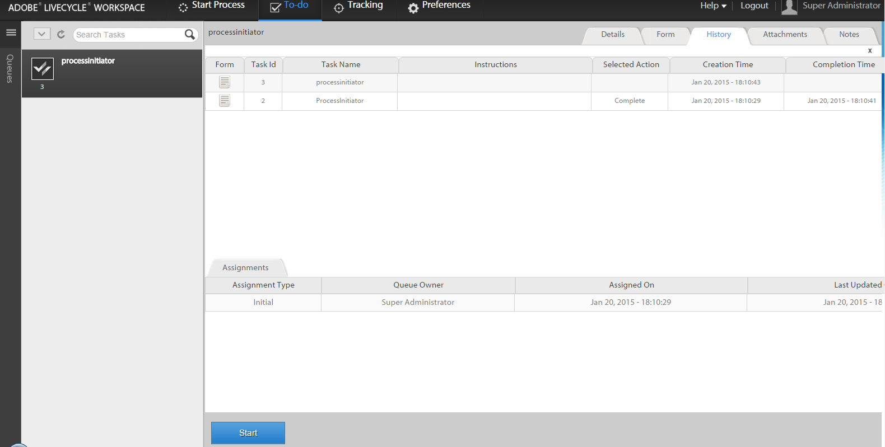

# Avvio di un nuovo processo con i dati di processo esistenti nell’area di lavoro di AEM Forms{#initiating-a-new-process-with-existing-process-data-in-aem-forms-workspace}

È possibile avviare un nuovo processo utilizzando i dati di un processo esistente. La necessità di avviare un nuovo processo a partire dai dati di processo esistenti sorge quando si deve utilizzare spesso lo stesso modulo con poche modifiche al contenuto, come quello dei moduli a pagamento. Questa funzione consente di risparmiare tempo e fatica agli utenti, in particolare quando il processo ha un lungo modulo da compilare.

Di seguito sono riportati i passaggi per avviare un nuovo processo dai dati di processo esistenti:

1. Eseguire una delle operazioni seguenti:

   * In Tracciamento fare clic sull&#39;istanza di processo di cui si desidera utilizzare i dati. Nella visualizzazione Cronologia processi del riquadro di destra fare clic sulla riga di attività corrispondente al punto iniziale.
   * In Tracciamento, selezionare un modello di ricerca per visualizzare un elenco di istanze di processo. Seleziona l’istanza di cui desideri utilizzare i dati.
   * Nella scheda **[!UICONTROL Da fare]**, seleziona l&#39;attività. Fare clic sulla scheda **[!UICONTROL Cronologia]** e selezionare l&#39;attività che ha avviato l&#39;istanza del processo.

    

1. Nella barra degli strumenti Azione attività fare clic su **[!UICONTROL Inizio]**. Viene visualizzato un modulo adattivo per la nuova istanza di processo con dati precompilati.

1. Aggiornare i dati in base alle esigenze e fare clic su **[!UICONTROL Completa]** o su un pulsante appropriato nel modulo.
