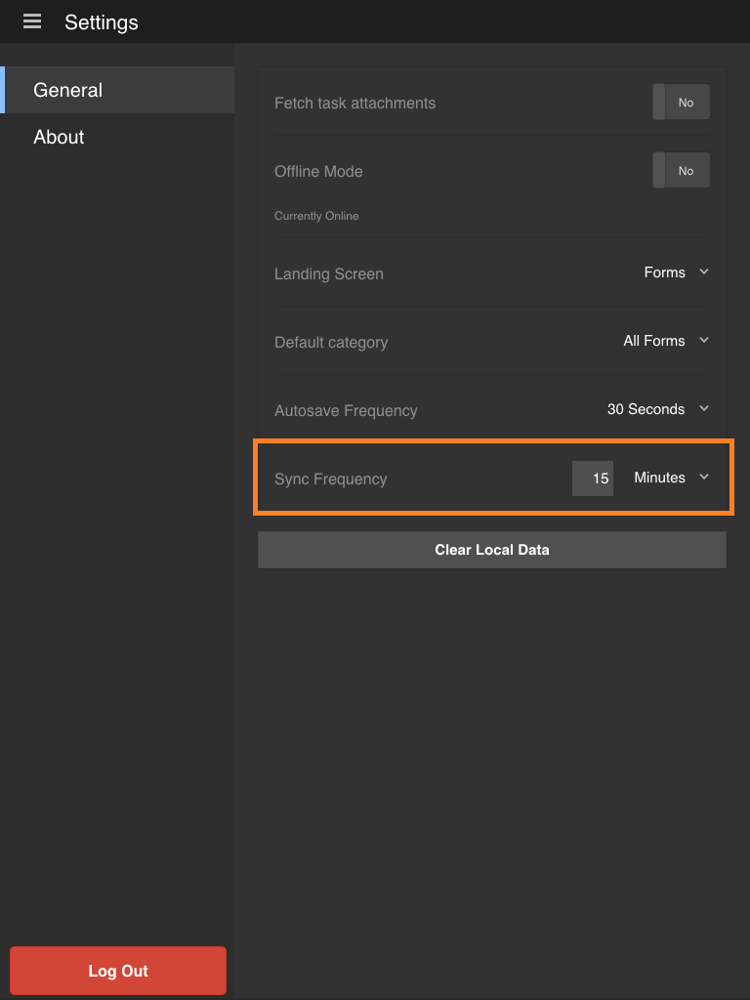

# Sincronizzazione dell’app{#synchronizing-the-app}

>[!NOTE]
>
>Le versioni Android e iOS dell’app AEM Forms sono state dismesse. La pubblicazione dell’app Android in Google Play è stata annullata a settembre 2026 e l’app iOS è stata rimossa dall’App Store di Apple.
>Queste app non sono più disponibili per l&#39;installazione. Per assistenza sull&#39;app Android, contatta [aemformsapp-android@adobe.com](mailto:aemformsapp-android@adobe.com).

## Sincronizzazione dell’app {#synchronizing-the-app-1}

I moduli nell’app vengono scaricati dal server AEM Forms. I moduli vengono scaricati nelle schede Attività e Forms. Le bozze create da moduli vengono scaricate nella scheda bozze e le bozze create da attività vengono scaricate nella scheda attività. Per un modulo indipendente sul server OSGi, i moduli e le bozze vengono scaricati rispettivamente nelle schede Forms e Bozza.

Quando completi e invii un modulo, questo viene caricato nuovamente sul server di AEM Forms immediatamente se l’app è online. I moduli vengono recuperati dal server quando l’app viene sincronizzata. Le bozze, tuttavia, vengono sincronizzate con il server immediatamente se l’app è online.

Quando sei online con il server AEM Forms, per impostazione predefinita, l’app viene sincronizzata ogni 15 minuti. Tuttavia, è possibile modificare la frequenza di sincronizzazione. In alternativa, puoi sincronizzare manualmente l’app in qualsiasi momento.

**Per sincronizzare l&#39;app manualmente**

Selezionare il pulsante Sincronizza  nell&#39;angolo inferiore destro della schermata iniziale.

**Per modificare la frequenza di sincronizzazione**

1. Per passare alla schermata Impostazioni, selezionare il pulsante del menu nell&#39;angolo superiore sinistro della schermata iniziale, quindi selezionare **Impostazioni**.
1. Nella schermata Settings, selezionare la scheda General.

   

1. Nell&#39;opzione Frequenza di sincronizzazione selezionare il valore a destra di Frequenza di sincronizzazione.
1. Nell&#39;elenco a discesa selezionare la nuova frequenza di sincronizzazione.

### Specifiche tecniche {#technical-specifications}

* La logica principale per l’invio dei dati dell’app offline al server AEM Forms è inclusa in runtime/offline/util/offline.js.
* In .js, la chiamata a processOfflineSubmittedSavedTasks(...) , invia le attività salvate/inviate al server. Gestisce inoltre eventuali errori o conflitti nel processo di sincronizzazione. Se l’invio di un’attività non riesce, l’attività nell’app viene contrassegnata come non riuscita. Inoltre, l’attività rimane nella cartella Posta in uscita.
* Le funzioni syncSubmittedTask() e syncSavedTask() eseguono operazioni su singole attività.
* La chiamata alla funzione processOfflineSubmittedSavedTasks() viene avviata dal componente Elenco attività dopo che un utente ha scelto di sincronizzare lo stato offline con il server o una sincronizzazione automatica da parte del thread in background.
