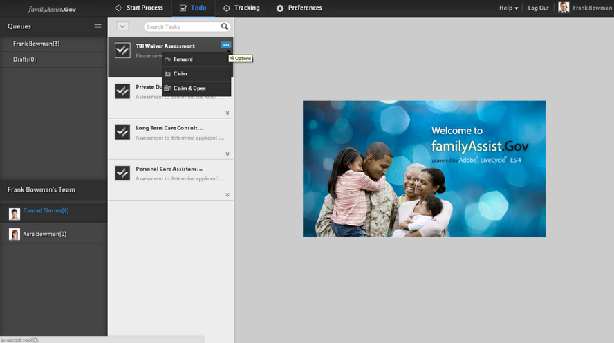

# Gestione delle attività in una gerarchia organizzativa tramite la vista Responsabile{#managing-tasks-in-an-organizational-hierarchy-using-manager-view}

Nell’area di lavoro di AEM Forms, i manager ora possono accedere alle attività assegnate a chiunque nella loro gerarchia (rapporti diretti o indiretti) ed eseguire varie azioni su di esse. Le attività sono disponibili nella scheda Da fare nell’area di lavoro di AEM Forms. Le azioni supportate sui compiti delle relazioni dirette sono:

**Inoltra** - Inoltra un&#39;attività da referente diretto a qualsiasi utente.

**Attestazione** - Attestazione di un&#39;attività di referente diretto.

**Attestazione e apertura** - Attestazione di un&#39;attività di un referente diretto e apertura automatica nell&#39;elenco Da fare del manager.

**Rifiuta** - Rifiuta un&#39;attività inoltrata a un referente diretto da un altro utente. Questa opzione è disponibile per le attività inoltrate da altri utenti a un referente diretto.

AEM Forms limita l’accesso degli utenti solo alle attività per le quali l’utente dispone di un controllo di accesso (ACL). Tale controllo garantisce che un utente possa recuperare solo le attività per le quali dispone di autorizzazioni di accesso. Utilizzando servizi web e implementazioni di terze parti per definire la gerarchia, un’organizzazione può personalizzare la definizione di manager e direct report in base alle proprie esigenze.

1. Creare un DSC. Per ulteriori informazioni, vedere l&#39;argomento &#39;Sviluppo di componenti per AEM Forms&#39; nella guida [Programmazione con AEM Forms](https://www.adobe.com/go/learn_aemforms_programming_63_it).
1. Nel DSC, definisci un nuovo SPI per la gestione della gerarchia per definire i rapporti diretti e la gerarchia all’interno degli utenti di AEM Forms. Di seguito è riportato un frammento di codice Java™ di esempio.

   ```java
   public class MyHierarchyMgmtService
   {
        /*
       Input : Principal Oid for a livecycle user
       Output : Returns true when the user is either the service invoker OR his direct/indirect report.
       */
       boolean isInHierarchy(String principalOid) {
   
       }
   
       /*
       Input : Principal Oid for a livecycle user
       Output : List of principal Oids for direct reports of the livecycle user
       A user may get direct reports only for himself OR his direct/indirect reports.
       So the API is functionally equivalent to -
       isInHierarchy(principalOid) ? <return direct reports> : <return empty list>
       */
       List<String> getDirectReports(String principalOid) {
   
       }
   
       /*
       Returns whether a livecycle user has direct reports or not.
       It is functionally equivalent to -
       getDirectReports(principalOid).size()>0
       */
       boolean isManager(String principalOid) {
   
       }
   }
   ```

1. Creare un file component.xml. Assicurarsi che spec-id corrisponda a quello mostrato nel frammento di codice seguente. Di seguito è riportato un frammento di codice di esempio che è possibile riutilizzare.

   ```xml
   <component xmlns="https://adobe.com/idp/dsc/component/document">
       <component-id>com.adobe.sample.SampleDSC</component-id>
       <version>1.1</version>
       <supports-export>false</supports-export>
         <descriptor-class>com.adobe.idp.dsc.component.impl.DefaultPOJODescriptorImpl</descriptor-class>
         <services>
           <service name="MyHierarchyMgmtService" title="My hierarchy management service" orchestrateable="false">
           <auto-deploy service-id="MyHierarchyMgmtService" category-id="Sample DSC" major-version="1" minor-version="0" />
           <description>Service for resolving hierarchy management.</description>
            <specifications>
            <specification spec-id="com.adobe.idp.taskmanager.dsc.enterprise.HierarchyManagementProvider"/>
            </specifications>
           <specification-version>1.0</specification-version>
           <implementation-class>com.adobe.sample.hierarchymanagement.MyHierarchyMgmtService</implementation-class>
           <request-processing-strategy>single_instance</request-processing-strategy>
           <supported-connectors>default</supported-connectors>
           <operation-config>
               <operation-name>*</operation-name>
               <transaction-type>Container</transaction-type>
               <transaction-propagation>supports</transaction-propagation>
               <!--transaction-timeout>3000</transaction-timeout-->
           </operation-config>
           <operations>
               <operation anonymous-access="true" name="isInHierarchy" method="isInHierarchy">
                   <input-parameter name="principalOid" type="java.lang.String" />
                   <output-parameter name="result" type="java.lang.Boolean"/>
               </operation>
               <operation anonymous-access="true" name="getDirectReports" method="getDirectReports">
                   <input-parameter name="principalOid" type="java.lang.String" />
                   <output-parameter name="result" type="java.util.List"/>
               </operation>
               <operation anonymous-access="true" name="isManager" method="isManager">
                   <input-parameter name="principalOid" type="java.lang.String" />
                   <output-parameter name="result" type="java.lang.Boolean"/>
               </operation>
               </operations>
               </service>
         </services>
   </component>
   ```

1. Distribuire DSC tramite Workbench. Riavviare il servizio `ProcessManagementTeamTasksService`.
1. Potrebbe essere necessario aggiornare il browser o disconnettersi/accedere di nuovo con l&#39;utente.

Nella schermata seguente viene illustrato l’accesso alle attività dei referenti diretti e alle azioni disponibili.



Accedere ai compiti dei referenti diretti e agire su di essi
