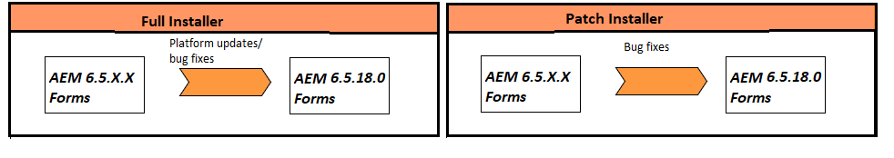

# Aggiornamento a AEM 6.5 Forms su JEE {#upgrade-to-aem-forms-jee}

AEM 6.5.18.0 Forms su JEE fornisce due tipi di programmi di installazione: Programma di installazione completo e Programma di installazione patch.

**Programma di installazione completo**: è possibile utilizzare [AEM 6.5.18.0 nel programma di installazione completo di JEE](https://experienceleague.adobe.com/docs/experience-manager-release-information/aem-release-updates/forms-updates/aem-forms-releases.html) per configurare nuove istanze di AEM Forms o eseguire aggiornamenti da AEM 6.5.x.x Forms su JEE ad AEM 6.5.18.0 Forms su JEE.

**Programma di installazione patch**: [AEM 6.5.18.0 nel programma di installazione patch JEE](https://experienceleague.adobe.com/docs/experience-manager-release-information/aem-release-updates/forms-updates/aem-forms-releases.html) è destinato ai clienti che utilizzano già le versioni di AEM 6.5.x.x. È possibile utilizzare il programma di installazione delle patch per eseguire l’aggiornamento alla versione più recente di AEM Forms.

Nella tabella seguente sono illustrati gli scenari per l&#39;utilizzo del programma di installazione completo e patch.

Eseguire la procedura seguente per utilizzare il programma di installazione completo per aggiornare AEM Forms 6.5.x.x esistente su JEE ad AEM 6.5.18.0 Forms su JEE:

1. Scarica il programma di installazione di AEM 6.5 Forms su JEE dalla [Distribuzione di software](https://experience.adobe.com/#/downloads/content/software-distribution/it/aem.html). Per utilizzare il programma di installazione è necessario un contratto di manutenzione e supporto valido.
1. Consulta [Elenco di controllo per l&#39;aggiornamento e pianificazione](https://www.adobe.com/go/learn_aemforms_upgrade_checklist_65) per informazioni sui controlli da eseguire per garantire un aggiornamento corretto.
1. Consulta [Preparare l&#39;aggiornamento ad AEM Forms](https://www.adobe.com/go/learn_aemforms_prepareupgrade_65) per apprendere ed eseguire le attività che garantiscono il corretto funzionamento dell&#39;aggiornamento con tempi di inattività minimi del server.
1. A seconda dell&#39;ambiente e del server applicazioni esistenti, scegliere uno dei seguenti documenti e seguire le istruzioni.

   * [Aggiornamento da AEM 6.3 o AEM 6.4 Forms a AEM 6.5 Forms per JBoss](https://www.adobe.com/go/learn_aemforms_upgradeJBoss_65)
   * [Aggiornamento da AEM 6.3 o AEM 6.4 Forms ad AEM 6.5 Forms per WebSphere](https://www.adobe.com/go/learn_aemforms_upgradeWebSphere_65)
   * [Aggiornamento da AEM 6.3 o AEM 6.4 Forms a AEM 6.5 Forms per JBoss Turnkey](https://www.adobe.com/go/learn_aemforms_upgradeTurnkey_65)

Non è disponibile l’aggiornamento diretto da LiveCycle ES2, LiveCycle ES3, AEM 6.0 Forms, AEM 6.1 Forms, AEM 6.2 Forms ad AEM 6.5 Forms. Puoi eseguire un aggiornamento intermedio a una o più versioni di LiveCycle o AEM Forms e quindi eseguire l’aggiornamento a AEM 6.5 Forms. Per l&#39;elenco delle versioni intermedie e le istruzioni di aggiornamento corrispondenti, vedere [Scegliere un percorso di aggiornamento](upgrade.md).
