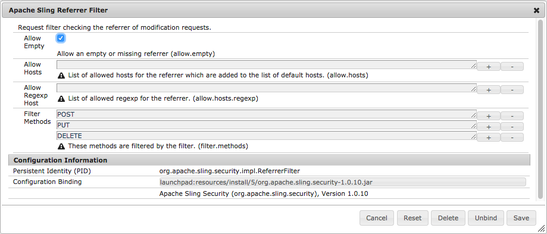

# Configurazione delle app AEM{#configuring-for-aem-apps}

Le app Adobe Experience Manager ti consentono di aggiornare il contenuto dell’OTA dell’applicazione (via etere). Il contenuto aggiornato viene archiviato nell’istanza di pubblicazione. Per consentire all’app sul dispositivo di connettersi all’istanza Publish e di verificare la disponibilità di aggiornamenti, l’istanza Publish deve essere configurata in modo da consentire l’utilizzo di un’intestazione referente vuota.

## Configurazione di un’intestazione di riferimento vuota {#configuring-empty-referrer-header}

Per configurare il servizio filtro referenti:

* Apri la console Apache Felix (**Configurazioni**) in:
* https://<server>:<numero_porta>/system/console/configMgr
* Accedi come amministratore.
* Nel menu **Configurazioni**, seleziona: *Filtro referrer Apache Sling*
* Seleziona il campo Consenti vuoto per consentire intestazioni referente vuote/mancanti.
* Fai clic su **Salva** per salvare le modifiche.

Per ulteriori dettagli, vedi [Impostazioni configurazione OSGI](/help/sites-deploying/osgi-configuration-settings.md) e [Elenco di controllo sicurezza - Problemi relativi a false richieste tra siti](/help/sites-administering/security-checklist.md#protect-against-cross-site-request-forgery).
