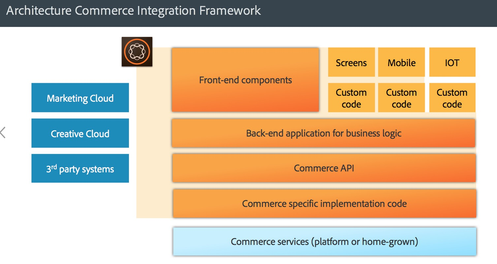

# AEM Commerce - Compatibilità GDPR{#aem-commerce-gdpr-readiness}

>[!IMPORTANT]
>
>Il RGPD è utilizzato come esempio nelle sezioni seguenti, ma i dettagli coperti sono applicabili a tutte le normative su privacy e protezione dei dati, come il RGPD e il CCPA.

Il Regolamento generale sulla protezione dei dati dell&#39;Unione Europea sui diritti relativi alla privacy dei dati entra in vigore a maggio 2018. Visita la pagina [RGPD all&#39;Adobe Privacy Center](https://business.adobe.com/it/privacy/general-data-protection-regulation.html).

>[!NOTE]
>
>Per ulteriori dettagli, consulta [Preparazione RGPD di AEM](/help/managing/data-protection-and-privacy.md).

Con le integrazioni Commerce predefinite di Adobe, AEM è il livello di esperienza, che utilizza servizi e invia dati alla piattaforma di customer commerce che viene eseguita in modalità headless.

Per alcune piattaforme commerce, Adobe memorizza le informazioni del profilo ( `/home/users`) e i token commerce (per accedere alla piattaforma commerce) in AEM. Per questi casi d&#39;uso, leggi [Gestione delle richieste RGPD per la piattaforma AEM](/help/sites-administering/handling-gdpr-requests-for-aem-platform.md).

## Gestione delle richieste RGPD per AEM Commerce {#handling-gdpr-requests-for-aem-commerce}

Per l’integrazione con Salesforce Commerce Cloud, AEM Commerce non memorizza alcuna informazione rilevante ai fini del RGPD. Inoltra la richiesta a [Salesforce Cloud](https://documentation.b2c.commercecloud.salesforce.com/DOC1/index.jsp).

Per le integrazioni Hybris e HCL WebSphere® Commerce, sono disponibili alcuni dati in AEM. Utilizza le [istruzioni RGPD per AEM Platform](/help/sites-administering/handling-gdpr-requests-for-aem-platform.md) e considera queste domande:

1. **Dove sono archiviati/utilizzati i dati?** Informazioni sul profilo utente memorizzate nella cache come nome, identificatore utente commerce, token, password e dati dell’indirizzo, come mostrato da AEM.
1. **Con chi condivido i dati coperti dal RGPD?** Qualsiasi aggiornamento dei dati relativi al RGPD in AEM Commerce non viene memorizzato (eccetto le informazioni del profilo rilevanti, come indicato sopra) ma viene inviato tramite proxy alla piattaforma commerce.
1. **Eliminare i dati utente**? Elimina il profilo utente in AEM e richiama l’eliminazione dell’utente sulla piattaforma commerce.

>[!NOTE]
>
>Dai un&#39;occhiata al [wiki hybris](https://wiki.hybris.com/) o alla [documentazione di Commerce WebSphere® HCL](https://help.hcltechsw.com/commerce/index.html), se necessario.
