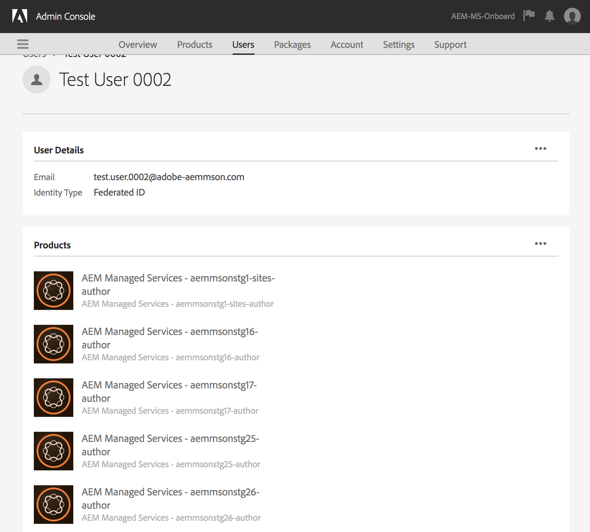

# Autenticazione Adobe IMS e supporto [!DNL Admin Console] per AEM Managed Services {#adobe-ims-authentication-and-admin-console-support-for-aem-managed-services}

>[!NOTE]
>
>Questa funzione è disponibile solo per i clienti di Adobe Managed Services.

## Introduzione {#introduction}

AEM 6.4.3.0 introduce il supporto di [!DNL Admin Console] per le istanze di AEM e l&#39;autenticazione basata su Adobe IMS (Identity Management System) per **clienti AEM Managed Services**.

L&#39;onboarding di AEM in [!DNL Admin Console] consentirà ai clienti AEM Managed Services di gestire tutti gli utenti Experience Cloud in un&#39;unica console. Gli utenti possono essere assegnati a profili di prodotto associati a istanze di AEM, per consentire loro di accedere a un’istanza specifica.

## Elementi di rilievo {#key-highlights}

* Il supporto per l’autenticazione IMS di AEM è destinato solo agli autori, agli amministratori o agli sviluppatori di AEM e non agli utenti finali esterni del sito del cliente, come i visitatori del sito
* [!DNL Admin Console] rappresenterà i clienti AEM Managed Services come organizzazioni IMS e le loro istanze come contesti di prodotto. Gli amministratori di prodotto e sistema del cliente potranno gestire l’accesso alle istanze
* AEM Managed Services sincronizzerà le topologie del cliente con [!DNL Admin Console]. Ci sarà un&#39;istanza di AEM Managed Services Product Context per istanza in [!DNL Admin Console].
* I profili di prodotto in [!DNL Admin Console] determineranno le istanze a cui un utente può accedere
* È supportata l’autenticazione federata tramite i provider di identità conformi a SAML 2 dei clienti
* Saranno supportati solo Enterprise ID e Federated ID (per il Single Sign-On del cliente), non gli Adobe ID personali.
* [!DNL User Management] (in Adobe [!DNL Admin Console]) continuerà a essere di proprietà degli amministratori dei clienti.

## Architettura {#architecture}

L’autenticazione IMS funziona utilizzando il protocollo OAuth tra AEM e l’endpoint IMS di Adobe. Dopo l’aggiunta a IMS, un utente con identità Adobe può accedere ad AEM Managed Services utilizzando le credenziali IMS.

Il flusso di accesso dell’utente è mostrato di seguito. L’utente verrà reindirizzato a IMS e, facoltativamente, all’IDP del cliente per la convalida SSO e quindi reindirizzato nuovamente ad AEM.

## Come Impostare {#how-to-set-up}

### Onboarding di organizzazioni in [!DNL Admin Console] {#onboarding-organizations-to-admin-console}

L&#39;onboarding del cliente in [!DNL Admin Console] è un prerequisito per l&#39;utilizzo di Adobe IMS per l&#39;autenticazione di AEM.

Come primo passaggio, per i clienti deve essere stato eseguito il provisioning di un’organizzazione in Adobe IMS. I clienti Adobe Enterprise sono rappresentati come organizzazioni IMS in [Adobe [!DNL Admin Console]](https://helpx.adobe.com/it/enterprise/using/admin-console.html).

Per i clienti AEM Managed Services deve già essere stato eseguito il provisioning di un&#39;organizzazione e, come parte del provisioning IMS, le istanze dei clienti saranno rese disponibili in [!DNL Admin Console] per la gestione delle adesioni utente e dell&#39;accesso.

Il passaggio a IMS per l’autenticazione degli utenti sarà uno sforzo congiunto tra AMS e i clienti, ciascuno con i propri flussi di lavoro da completare.

Una volta che un cliente esiste come organizzazione IMS e AMS ha completato il provisioning per IMS, si tratta del riepilogo dei flussi di lavoro di configurazione richiesti:

1. L&#39;amministratore di sistema designato riceve un invito ad accedere a [!DNL Admin Console]
1. L’amministratore di sistema richiede il dominio per confermare la proprietà del dominio (in questo esempio acme.com)
1. L’amministratore di sistema configura le directory utente
1. L&#39;amministratore di sistema configura il provider di identità (IDP) in [!DNL Admin Console] per la configurazione SSO.
1. L’amministratore di AEM gestisce i gruppi locali, le autorizzazioni e i privilegi come di consueto. Consulta User and Group Sync

>[!NOTE]
>
>Per ulteriori informazioni sulle nozioni di base di Adobe Identity Management, inclusa la configurazione IDP, vedere l&#39;articolo relativo a [Configurare identità e Single Sign-On](https://helpx.adobe.com/it/enterprise/using/set-up-identity.html).
>
>Per ulteriori informazioni su Enterprise Administration e [!DNL Admin Console], consulta la [Guida per l&#39;amministratore di Enterprise e Team](https://helpx.adobe.com/it/enterprise/managing/user-guide.html).

### Onboarding degli utenti in [!DNL Admin Console] {#onboarding-users-to-the-admin-console}

Sono disponibili tre modi per integrare gli utenti a seconda delle dimensioni del cliente e delle sue preferenze:

1. Crea manualmente utenti e gruppi in [!DNL Admin Console]
1. Carica un file CSV con gli utenti
1. Sincronizza utenti e gruppi con Active Directory aziendale del cliente.

#### Aggiunta manuale tramite interfaccia utente [!DNL Admin Console] {#manual-addition-through-admin-console-ui}

È possibile creare manualmente utenti e gruppi nell&#39;interfaccia utente [!DNL Admin Console]. Questo metodo può essere utilizzato se non hanno molti utenti da gestire. Ad esempio, meno di 50 utenti AEM.

Gli utenti possono anche essere creati manualmente se il cliente sta già utilizzando questo metodo per amministrare altri prodotti Adobe come le applicazioni Adobe Analytics, Adobe Target o Adobe Creative Cloud.

#### Caricamento di file nell&#39;interfaccia utente [!DNL Admin Console] {#file-upload-in-the-admin-console-ui}

Per facilitare la creazione di utenti, è possibile caricare un file CSV per aggiungere utenti in blocco:

#### Strumento User Sync {#user-sync-tool}

Lo strumento User Sync consente ai clienti aziendali di creare o gestire utenti Adobe che utilizzano Active Directory o altri servizi di directory OpenLDAP testati. Gli utenti target sono amministratori di identità IT (Enterprise Directory e amministratori di sistema) che saranno in grado di installare e configurare lo strumento. Lo strumento open-source è personalizzabile in modo che i clienti possano chiedere a uno sviluppatore di modificarlo in base alle proprie esigenze.

Durante l&#39;esecuzione di User Sync, viene recuperato un elenco di utenti da Active Directory dell&#39;organizzazione (o da qualsiasi altra origine dati compatibile) e viene confrontato con l&#39;elenco di utenti all&#39;interno di [!DNL Admin Console]. Chiama quindi l&#39;API di Adobe [!DNL User Management] in modo che [!DNL Admin Console] sia sincronizzato con la directory dell&#39;organizzazione. Il flusso di modifica è completamente unidirezionale. Eventuali modifiche apportate in [!DNL Admin Console] non vengono inviate alla directory.

Lo strumento consente all&#39;amministratore di sistema di mappare i gruppi di utenti nella directory del cliente con la configurazione del prodotto e i gruppi di utenti in [!DNL Admin Console]. La nuova versione di User Sync consente inoltre la creazione dinamica di gruppi di utenti in [!DNL Admin Console].

Per impostare User Sync, l&#39;organizzazione deve creare un set di credenziali nello stesso modo in cui utilizzerebbe l&#39;[[!DNL User Management] API](https://www.adobe.io/apis/cloudplatform/usermanagement/docs/setup.html).

La sincronizzazione degli utenti viene distribuita tramite l’archivio Github di Adobe nella posizione seguente:

[https://github.com/adobe-apiplatform/user-sync.py/releases/latest](https://github.com/adobe-apiplatform/user-sync.py/releases/latest)

È disponibile una versione non definitiva 2.4RC1 con supporto per la creazione di gruppi dinamici, disponibile qui: [https://github.com/adobe-apiplatform/user-sync.py/releases/tag/v2.4rc1](https://github.com/adobe-apiplatform/user-sync.py/releases/tag/v2.4rc1)

Le funzionalità principali di questa versione sono la possibilità di mappare dinamicamente nuovi gruppi LDAP per l&#39;iscrizione degli utenti in [!DNL Admin Console] e la creazione dinamica di gruppi di utenti.

Ulteriori informazioni sulle nuove funzioni per i gruppi sono disponibili qui:

[https://adobe-apiplatform.github.io/user-sync.py/en/user-manual/advanced_configuration.html#additional-group-options](https://adobe-apiplatform.github.io/user-sync.py/fr/user-manual/advanced_configuration.html#additional-group-options)

>[!NOTE]
>
>Per ulteriori dettagli, consulta:
>
>* [Strumento User Sync - Adobe User Sync](https://adobe-apiplatform.github.io/user-sync.py/it/)
>
>* Lo strumento User Sync deve essere registrato come client UMAPI di Adobe I/O utilizzando la procedura descritta in [Autenticazione per l&#39;accesso API](https://adobe-apiplatform.github.io/umapi-documentation/en/UM_Authentication.html)
>
>* la [documentazione di Adobe Developer Console](https://developer.adobe.com/developer-console/docs/guides/).
>
>* la [documentazione API User Management](https://adobe-apiplatform.github.io/umapi-documentation/en/).
>

>[!NOTE]
>
>La configurazione di AEM IMS verrà gestita dal team di Adobe Managed Services. Tuttavia, l’amministratore del cliente può modificarla in base alle proprie esigenze (ad esempio, Iscrizione automatica al gruppo o Mappatura del gruppo). Anche il client IMS verrà registrato dal team Managed Services.

## Guida all’uso {#how-to-use}

### Gestione di prodotti e accesso utente in [!DNL Admin Console] {#managing-products-and-user-access-in-admin-console}

Quando l&#39;amministratore di prodotto del cliente accede a [!DNL Admin Console], vedrà più istanze del contesto di prodotto di AEM Managed Services come mostrato di seguito:

In questo esempio, l&#39;organizzazione *AEM-MS-Onboard* dispone di 32 istanze distribuite in topologie e ambienti diversi come Stage, Prod e così via.

I dettagli dell’istanza possono essere controllati per identificarla:

In ogni istanza del contesto di prodotto sarà presente un profilo di prodotto associato. Questo profilo di prodotto viene utilizzato per assegnare l’accesso agli utenti.

Tutti gli utenti aggiunti in questo profilo di prodotto potranno accedere a tale istanza come mostrato nell’esempio seguente:

### Accesso ad AEM {#logging-into-aem}

#### Accesso amministratore locale {#local-admin-login}

AEM può continuare a supportare gli accessi locali per gli utenti Admin, in quanto la schermata di accesso dispone di un’opzione per accedere localmente:

#### Accesso basato su IMS {#ims-based-login}

Per altri utenti, è possibile utilizzare l’accesso basato su IMS dopo che IMS è stato configurato per l’istanza. L&#39;utente fa clic su **Accedi con Adobe** come illustrato di seguito:

Vengono quindi reindirizzati alla schermata di accesso di IMS e immettono le relative credenziali:

Se durante la configurazione iniziale di [!DNL Admin Console] viene configurato un IDP federato, l&#39;utente verrà reindirizzato all&#39;IDP del cliente per l&#39;accesso SSO.

L’IDP è Okta nell’esempio seguente:

Una volta completata l’autenticazione, l’utente verrà reindirizzato ad AEM per eseguire l’accesso:

### Migrazione degli utenti esistenti {#migrating-existing-users}

Per le istanze AEM esistenti che utilizzano un altro metodo di autenticazione e ora stanno eseguendo la migrazione a IMS, è necessario un passaggio di migrazione.

Gli utenti esistenti nell’archivio di AEM (originato localmente, tramite LDAP o SAML) possono essere migrati per indicare IMS come IDP utilizzando l’utility di migrazione utenti.

Questa utility verrà eseguita dal team AMS come parte del provisioning IMS.

### Gestione di autorizzazioni e ACL in AEM {#managing-permissions-and-acls-in-aem}

Il controllo degli accessi e le autorizzazioni continueranno a essere gestiti in AEM. A questo scopo è possibile separare i gruppi di utenti provenienti da IMS (ad esempio, AEM-GRP-008 nell’esempio seguente) e dai gruppi locali in cui sono definite le autorizzazioni e il controllo degli accessi. I gruppi di utenti sincronizzati da IMS possono essere assegnati a gruppi locali ed ereditare le autorizzazioni.

Nell’esempio seguente, ad esempio, i gruppi sincronizzati vengono aggiunti al gruppo *Dam_Users* locale.

In questo caso, un utente è stato anche assegnato ad alcuni gruppi in [!DNL Admin Console]. Gli utenti e i gruppi possono essere sincronizzati da LDAP utilizzando lo strumento User Sync o creati localmente. Consulta **Onboarding degli utenti in[!DNL Admin Console]** in precedenza).

>[!NOTE]
>
>I gruppi di utenti vengono sincronizzati solo quando gli utenti accedono all’istanza.

L’utente fa parte dei seguenti gruppi in IMS:

Quando l’utente esegue l’accesso, le iscrizioni ai gruppi vengono sincronizzate, come illustrato di seguito:

In AEM, i gruppi di utenti sincronizzati da IMS possono essere aggiunti come membri ai gruppi locali esistenti, ad esempio DAM Users.

Come mostrato di seguito, il gruppo *AEM-GRP_008* eredita le autorizzazioni e i privilegi degli utenti DAM. Si tratta di un modo efficace per gestire le autorizzazioni per i gruppi sincronizzati ed è comunemente utilizzato anche nei metodi di autenticazione basati su LDAP.

