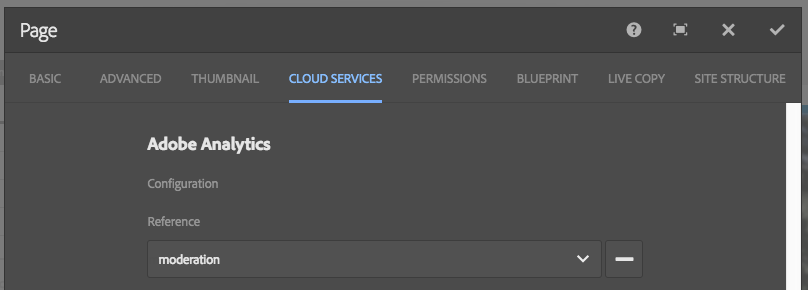

# Integrazione delle pagine di destinazione con Adobe Analytics{#integrating-landing-pages-with-adobe-analytics}

AEM ha integrato la soluzione per pagine di destinazione con [Adobe Analytics](https://www.omniture.com/en/products/analytics/sitecatalyst) utilizzando i seguenti componenti di call-to-action (CTA):

1. Componente Click-through
1. Componente collegamento grafico

Questi componenti espongono alcuni attributi che possono essere mappati tramite variabili di Adobe Analytics (Traffico, Variabili di conversione) ed eventi di successo per inviare informazioni ad Adobe Analytics.

## Prerequisiti {#prerequisites}

Adobe consiglia di esaminare l&#39;[integrazione AEM-Adobe Analytics esistente](/help/sites-administering/adobeanalytics.md) per capire come funziona questa integrazione.

## Componenti disponibili per la mappatura {#components-available-for-mapping}

In AEM, i componenti **Call to action** - **ClickThroughLink** e **GraphicalLink** - visualizzati qui nella barra laterale, possono essere mappati alle variabili Adobe Analytics.

### Mappatura dei componenti della pagina di destinazione su Adobe Analytics {#mapping-landing-page-components-to-adobe-analytics}

Per mappare i componenti della pagina di destinazione su Adobe Analytics:

1. Dopo aver creato la configurazione di Adobe Analytics e aver creato un framework, seleziona la suite di rapporti appropriata dal menu a discesa. Questo comporta il recupero delle variabili di Adobe Analytics e la loro visualizzazione nel Content Finder.
1. Trascina i componenti Call to action (CTA) dalla barra laterale all’area di mappatura al centro della pagina, a seconda delle necessità.

<table>
 <tbody>
  <tr>
   <td><strong>Nome componente</strong></td>
   <td><strong>Attributi esposti</strong></td>
   <td><strong>Significato dell’attributo</strong></td>
  </tr>
  <tr>
   <td><strong>Collegamento Click-through CTA</strong></td>
   <td><i>eventdata.clickthroughLinkLabel</i>   </td>
   <td>Etichetta sul collegamento o testo del collegamento </td>
  </tr>
  <tr>
   <td>  </td>
   <td><i>eventdata.clickthroughLinkTarget</i>   </td>
   <td>La destinazione in cui si è presi quando si fa clic sul collegamento </td>
  </tr>
  <tr>
   <td>  </td>
   <td><i>eventdata.events.clickthroughLinkClick</i>   </td>
   <td>L’evento clic </td>
  </tr>
  <tr>
   <td><strong>Collegamento grafico CTA</strong></td>
   <td><i>eventdata.clicktroughImageLabel</i>   </td>
   <td>Titolo dell'immagine CTA </td>
  </tr>
  <tr>
   <td>  </td>
   <td><i>eventdata.clicktroughImageTarget</i>   </td>
   <td>La destinazione in cui si viene presi quando si fa clic sull'immagine che contiene un collegamento</td>
  </tr>
  <tr>
   <td>  </td>
   <td><i>eventdata.clicktroughImageAsset</i>   </td>
   <td>Percorso della risorsa immagine nell’archivio </td>
  </tr>
  <tr>
   <td>  </td>
   <td><i>eventdata.events.clicktroughImageClick</i>   </td>
   <td>L’evento clic</td>
  </tr>
 </tbody>
</table>

1. Mappa questi attributi esposti con qualsiasi variabile di Adobe Analytics da Content Finder. Il framework è ora pronto per l’uso.
1. Ora puoi creare una pagina di destinazione o aprire una pagina di destinazione esistente con componenti CTA esistenti e fare clic sulla scheda **Servizi cloud** in **Proprietà pagina** dalla barra laterale (nell&#39;interfaccia utente ottimizzata per il tocco, seleziona **Apri proprietà** e fai clic su **Servizi cloud**) e configurare il framework da utilizzare con la pagina di destinazione. Selezionare il framework dall&#39;elenco a discesa.

   

1. Dopo aver configurato il framework con la pagina di destinazione, ora puoi utilizzare i componenti instrumentati ed eventuali clic su CTA vengono registrati in Adobe Analytics.
