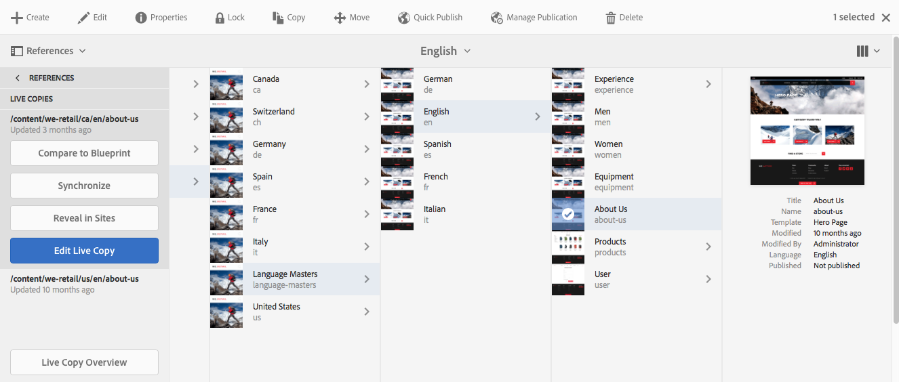
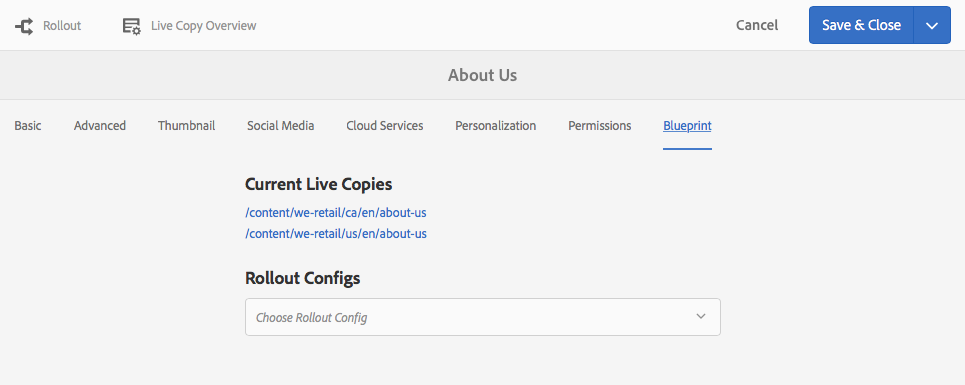
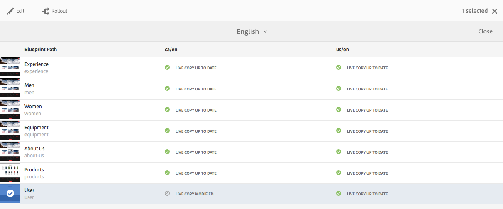
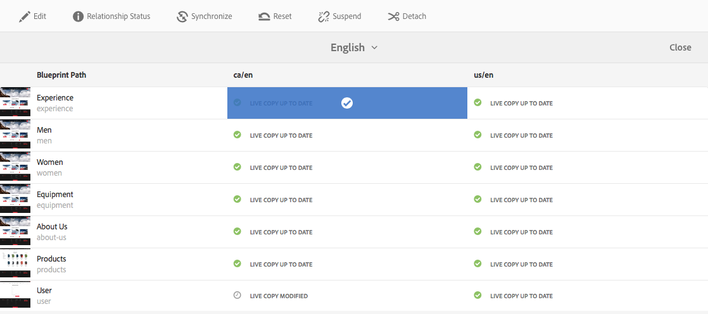
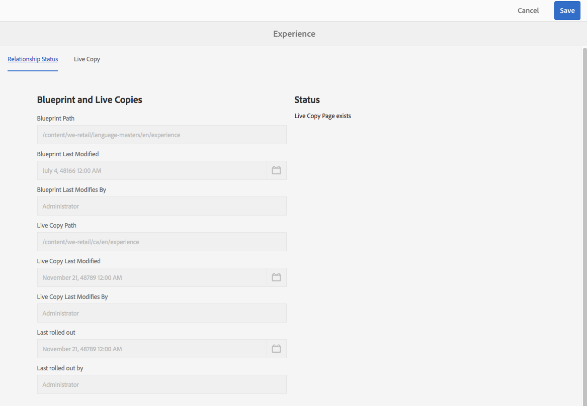
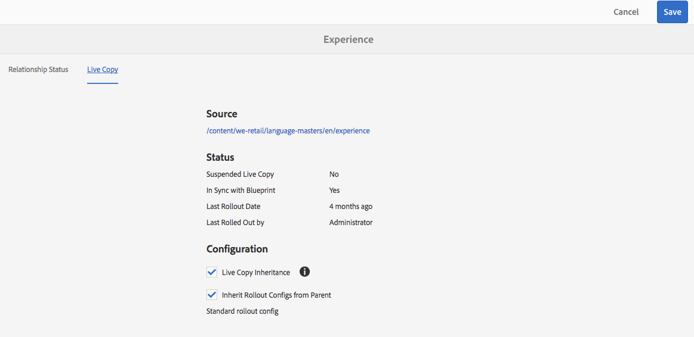

# Panoramica sulla console Live Copy{#live-copy-overview-console}

La **Panoramica Live Copy** consente di:

* Visualizzare/gestire l’ereditarietà in un sito:

  * Visualizzare la struttura della blueprint e della Live Copy corrispondente, insieme al relativo stato di ereditarietà
  * Modifica lo stato di ereditarietà; ad esempio, sospendi, riprendi
  * Visualizzare le proprietà di blueprint e Live Copy

* Eseguire azioni di rollout

## Apertura della Panoramica Live Copy {#opening-the-live-copy-overview}

Puoi aprire la Panoramica Live Copy da:

* [Pannello laterale Riferimenti di una pagina blueprint (console Sites)](#opening-live-copy-overview-references-for-a-blueprint-page)
* [Proprietà di una pagina blueprint](#opening-live-copy-overview-properties-of-a-blueprint-page)

### Apertura della panoramica di Live Copy - Riferimenti per una pagina blueprint {#opening-live-copy-overview-references-for-a-blueprint-page}

La **Panoramica Live Copy** può essere aperto dal pannello laterale **Riferimenti** nella console **Sites**:

1. Nella console **Sites**, [passa alla pagina blueprint e selezionala](/help/sites-authoring/basic-handling.md#viewing-and-selecting-resources).
1. Apri il pannello **[Riferimenti](/help/sites-authoring/basic-handling.md#references)** e seleziona **Live Copy**.

   

   >[!NOTE]
   >
   >Puoi anche aprire prima i Riferimenti e quindi selezionare la blueprint.

1. Seleziona **Panoramica Live Copy** per mostrare e utilizzare la panoramica di tutte le Live Copy relative alla blueprint selezionata.
1. Utilizza **Chiudi** per uscire e tornare alla console **Sites**.

### Apertura della panoramica di Live Copy: proprietà di una pagina blueprint {#opening-live-copy-overview-properties-of-a-blueprint-page}

La **Panoramica Live Copy** può essere aperta quando si visualizzano le proprietà di una pagina blueprint:

1. Apri **Proprietà** per la pagina blueprint appropriata.
1. Apri la scheda **Blueprint**: l’opzione **Panoramica Live Copy** viene visualizzata nella barra degli strumenti superiore:

   

1. Seleziona **Panoramica Live Copy** per mostrare e utilizzare la panoramica di tutte le Live Copy relative alla blueprint corrente.

1. Utilizza **Chiudi** per uscire e tornare alla console **Sites**.

## Utilizzo della Panoramica Live Copy {#using-the-live-copy-overview}

La **Panoramica Live Copy** può essere utilizzata anche per eseguire azioni sulla Live Copy:

1. Apri **Panoramica Live Copy**.
1. Seleziona la pagina blueprint o Live Copy richiesta: la barra degli strumenti verrà aggiornata per mostrare le azioni disponibili. Le [azioni](/help/sites-administering/msm.md#terms-used) disponibili dipendono dalla selezione di una [pagina blueprint](#actions-for-a-blueprint-page) o [Live Copy](#actions-for-a-live-copy-page):

### Azioni per una pagina blueprint {#actions-for-a-blueprint-page}

Quando selezioni una pagina blueprint, sono disponibili le seguenti azioni:

* Modifica

  * Apri la pagina blueprint per la modifica.

* [Rollout](/help/sites-administering/msm.md#rollout-and-synchronize)

  * Esegui un rollout per inviare le modifiche dalla sorgente alla Live Copy.

### Azioni per una pagina Live Copy {#actions-for-a-live-copy-page}

Quando selezioni una pagina Live Copy, sono disponibili le seguenti azioni:

* Modifica

  * Apri la pagina Live Copy per la modifica.

* [Stato di relazione](#relationship-status)

  * Visualizza informazioni sullo stato e sull’ereditarietà.

* [Sincronizza](/help/sites-administering/msm.md#rollout-and-synchronize)

  * Sincronizza una Live Copy per richiamare le modifiche dall’origine alla Live Copy.

* [Ripristina](/help/sites-administering/msm-livecopy.md#resetting-a-live-copy-page)

  * Reimposta una pagina Live Copy per rimuovere tutte le cancellazioni di ereditarietà e ripristinare la pagina allo stesso stato della pagina sorgente.

* [Sospendi](/help/sites-administering/msm.md#suspending-and-cancelling-inheritance-and-synchronization)

  * Disattiva temporaneamente la relazione live tra una Live Copy e la relativa pagina blueprint.

* [Riprendi](/help/sites-administering/msm-livecopy.md#resuming-inheritance-for-a-page)

  * Riprendi consente di ripristinare una relazione sospesa.

* [Stacca](/help/sites-administering/msm.md#detaching-a-live-copy)

  * Rimuove definitivamente la relazione live tra una Live Copy e la relativa pagina blueprint.

## Stato di relazione {#relationship-status}

La console **Stato relazione** dispone di due schede che forniscono una serie di funzionalità:

* [Informazioni sullo stato della relazione](#relationship-status-information)
* [Informazioni Live Copy](#live-copy-information)

### Informazioni sullo stato della relazione {#relationship-status-information}

Questa scheda fornisce informazioni dettagliate sullo stato della relazione tra blueprint e Live Copy:

### Informazioni Live Copy {#live-copy-information}

Questa scheda ti consente di visualizzare e modificare la configurazione della Live Copy:

