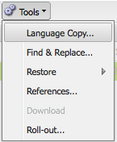
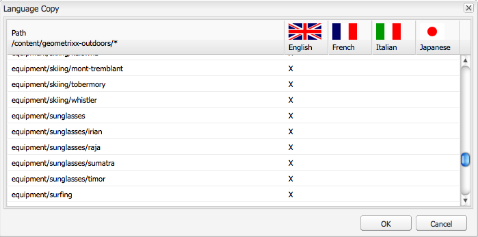

# Creazione di una directory principale della lingua tramite interfaccia classica{#creating-a-language-root-using-the-classic-ui}

La procedura seguente utilizza l’interfaccia utente classica per creare una directory principale della lingua di un sito. Per ulteriori informazioni, vedere [Creazione di una directory principale della lingua](/help/sites-administering/tc-prep.md#creating-a-language-root).

1. Nella struttura Siti Web della console Siti Web selezionare la pagina principale del sito. ([http://localhost:4502/siteadmin#](http://localhost:4502/siteadmin#))
1. Aggiungi una nuova pagina figlio che rappresenta la versione lingua del sito:

   1. Fai clic su Nuovo > Nuova pagina.
   1. Nella finestra di dialogo, specifica il Titolo e il Nome. Il nome deve essere nel formato di `<language-code>` o `<language-code>_<country-code>`, ad esempio en, en_US, en_us, en_GB, en_gb.

      * Il codice della lingua supportato è un codice a due lettere minuscole, come definito dallo standard ISO-639-1
      * Il codice del paese supportato è in lettere minuscole o maiuscole, come definito dallo standard ISO 3166

   1. Seleziona il Modello e fai clic su Crea.

   

1. Nella struttura Siti Web della console Siti Web selezionare la pagina principale del sito.
1. Nel menu Strumenti, seleziona Copia in lingua.

   

   La finestra di dialogo Copia in lingua visualizza una matrice delle versioni e delle pagine web disponibili per la lingua. Una x nella colonna di una lingua indica che la pagina è disponibile in tale lingua.

   

1. Per copiare una pagina o una struttura di pagine esistente in una versione per lingua, selezionare la cella relativa a tale pagina nella colonna relativa alla lingua. Fare clic sulla freccia e selezionare il tipo di copia da creare.

   Nell&#39;esempio seguente, la pagina apparecchiature/occhiali da sole/irian viene copiata nella versione in lingua francese.

   

   | Tipo di copia per lingua | Descrizione |
   |---|---|
   | auto | Utilizza il comportamento delle pagine padre |
   | ignora | Non crea una copia di questa pagina e dei relativi elementi figlio |
   | `<language>+` (ad esempio, francese+) | Copia la pagina e tutti i relativi elementi figlio da tale lingua |
   | `<language>` (ad esempio francese) | Copia solo la pagina da tale lingua |

1. Fare clic su OK per chiudere la finestra di dialogo.
1. Nella finestra di dialogo successiva, fai clic su Sì per confermare la copia.
