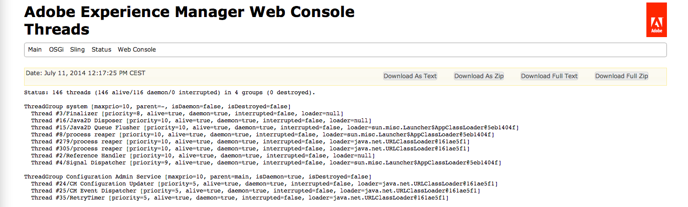

# Risoluzione dei problemi di Adobe Experience Manager {#troubleshooting-aem}

Nella sezione seguente vengono descritti alcuni problemi che possono verificarsi durante l’utilizzo di AEM (Adobe Experience Manager) e vengono proposte possibili soluzioni.

>[!NOTE]
>
>Se stai risolvendo problemi di authoring in AEM, consulta [Risoluzione dei problemi per gli autori.](/help/sites-authoring/troubleshooting.md)

>[!NOTE]
>
>In caso di problemi, vale la pena controllare anche l&#39;elenco di [problemi noti](/help/release-notes/release-notes.md) per la tua istanza (pacchetti di versioni e service pack).

## Risoluzione dei problemi relativi agli amministratori {#troubleshooting-scenarios-for-administrators}

La tabella seguente fornisce una panoramica dei problemi che gli amministratori possono risolvere:

<table>
 <tbody>
  <tr>
   <td><strong>Ruolo</strong></td>
   <td><strong>Problema </strong></td>
  </tr>
  <tr>
   <td>Amministratore di sistema</td>
   <td>
Se si fa doppio clic sul file jar Quickstart, questo non ha alcun effetto o il file jar viene aperto con un altro programma (ad esempio, Archive Manager)
 </td>
  </tr>
  <tr>
   <td>
Amministratore di sistema
 </td>
   <td>
La mia applicazione in esecuzione su CRX genera errori di memoria insufficiente
 </td>
  </tr>
  <tr>
   <td>
Amministratore di sistema
 </td>
   <td>
La schermata iniziale di AEM non viene visualizzata nel browser dopo aver fatto doppio clic su AEM CM Quickstart
 </td>
  </tr>
  <tr>
   <td>
Amministratore di sistema
 
utente amministratore
 </td>
   <td>
Creazione di un'immagine thread
 </td>
  </tr>
  <tr>
   <td>
Amministratore di sistema
 
utente amministratore
 </td>
   <td>
Verifica di sessioni JCR non chiuse
 </td>
  </tr>
 </tbody>
</table>

## Metodi per la risoluzione dei problemi di analisi {#methods-for-troubleshooting-analysis}

### Creazione di un&#39;immagine thread {#making-a-thread-dump}

L’immagine thread è un elenco di tutti i thread Java™ attualmente attivi. Se AEM non risponde correttamente, l’immagine thread può aiutarti a identificare deadlock o altri problemi.

### Utilizzo di Sling Thread Dumper {#using-sling-thread-dumper}

1. Apri la **console Web AEM**, ad esempio in `https://localhost:4502/system/console/`.
1. Selezionare la scheda **Threads** in **Stato**.

### Utilizzo di jstack (riga di comando) {#using-jstack-command-line}

1. Trova il PID (ID processo) dell’istanza Java™ di AEM.

   È possibile, ad esempio, utilizzare `ps -ef` o `jps`.

1. Esegui:

   `jstack <pid>`

1. Mostra l’immagine thread.

>[!NOTE]
>
>È possibile aggiungere le immagini thread a un file di registro utilizzando il reindirizzamento di output `>>`:
>
>`jstack <pid> >> /path/to/logfile.log`

Per ulteriori informazioni, consulta la [documentazione su come estrarre immagini thread da una JVM](https://experienceleague.adobe.com/docs/experience-cloud-kcs/kbarticles/KA-17452.html)

### Verifica di sessioni JCR non chiuse {#checking-for-unclosed-jcr-sessions}

Quando viene sviluppata la funzionalità per AEM WCM, è possibile aprire le sessioni JCR (operazione paragonabile all’apertura di una connessione a un database). Se le sessioni aperte non vengono mai chiuse, il sistema potrebbe presentare i seguenti sintomi:

* Il sistema diventa più lento.
* È possibile visualizzare gran parte di CacheManager: resizeAll voci nel file di log; il seguente numero (dimensione=&lt;x>) shows the number of caches, each session opens several caches.
* Di tanto in tanto il sistema esaurisce la memoria (dopo alcune ore, giorni o settimane, a seconda della gravità).

Per avviare l&#39;analisi delle sessioni non chiuse, vedere l&#39;articolo della Knowledge Base [Risolutore risorse non chiuso](https://experienceleague.adobe.com/en/docs/experience-cloud-kcs/kbarticles/ka-23761).

### Utilizzo della console Web di Adobe Experience Manager {#using-the-adobe-experience-manager-web-console}

Lo stato dei bundle OSGi può anche fornire un’indicazione anticipata di possibili problemi.

1. Apri la **console Web AEM**, ad esempio in `https://localhost:4502/system/console/`.
1. Seleziona **Bundle** nella scheda **OSGI**.
1. Seleziona:

   * lo stato dei bundle. In caso contrario, prova ad arrestare e riavviare il bundle. Se il problema persiste, approfondisci ulteriormente utilizzando altri metodi.
   * se uno dei bundle presenta dipendenze mancanti. Per visualizzare tali dettagli, fai clic sul nome del singolo bundle, che è un collegamento (il seguente esempio non presenta alcun problema):

