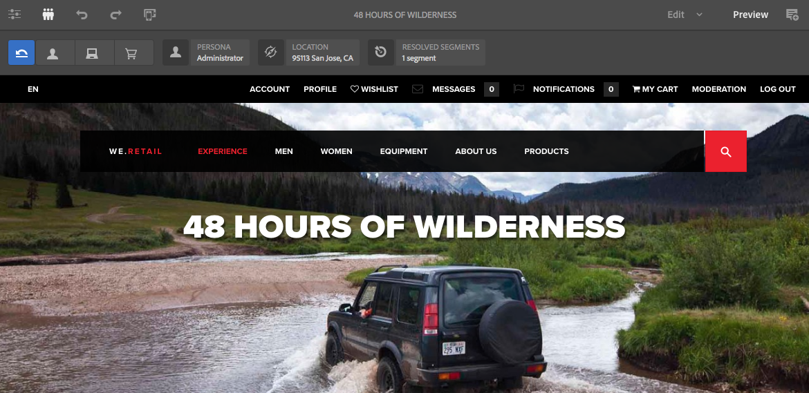
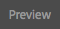
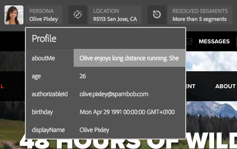

# Visualizzare l’anteprima delle pagine utilizzando i dati di ContextHub{#previewing-pages-using-contexthub-data}

La barra degli strumenti [ContextHub](/help/sites-developing/contexthub.md) visualizza i dati dagli archivi ContextHub e consente di modificare i dati dell&#39;archivio. La barra degli strumenti di ContextHub è utile per visualizzare in anteprima il contenuto determinato dai dati in un archivio ContextHub.

La barra degli strumenti è costituita da una serie di modalità di interfaccia utente che contengono uno o più moduli di interfaccia utente.

* Le modalità dell’interfaccia utente sono icone visualizzate sul lato sinistro della barra degli strumenti. Quando fai clic su un’icona, la barra degli strumenti mostra i moduli dell’interfaccia utente in essa contenuti.
* I moduli di interfaccia utente visualizzano i dati da uno o più archivi ContextHub. Alcuni moduli di interfaccia utente consentono inoltre di manipolare i dati dell’archivio.

ContextHub installa diverse modalità e moduli di interfaccia utente. L&#39;amministratore potrebbe avere [configurato ContextHub](/help/sites-developing/ch-configuring.md) per visualizzarne altri.

## Visualizzazione della barra degli strumenti di ContextHub {#revealing-the-contexthub-toolbar}

La barra degli strumenti di ContextHub è disponibile in modalità Anteprima. La barra degli strumenti è disponibile solo nelle istanze di authoring e solo se l’amministratore l’ha abilitata.

1. Con la pagina aperta per la modifica, sulla barra degli strumenti fai clic su Anteprima.

   

1. Per visualizzare la barra degli strumenti, fai clic sull’icona di ContextHub.

   

## Funzioni del modulo interfaccia utente {#ui-module-features}

Ogni modulo di interfaccia utente fornisce un diverso set di funzioni, ma i seguenti tipi di funzioni sono comuni. Poiché i moduli di interfaccia utente sono estensibili, lo sviluppatore può implementare altre funzioni in base alle esigenze.

### Contenuto barra degli strumenti {#toolbar-content}

I moduli di interfaccia utente possono visualizzare dati da uno o più archivi di ContextHub nella barra degli strumenti. I moduli di interfaccia utente utilizzano un’icona e un titolo per identificarsi.

### Contenuto a comparsa {#popup-content}

Alcuni moduli di interfaccia utente visualizzano una finestra a comparsa quando si fa clic su di essi o li si tocca. In genere, la finestra a comparsa contiene informazioni aggiuntive rispetto a quelle visualizzate nella barra degli strumenti.

### Popup Forms {#popup-forms}

La sovrapposizione a comparsa di un modulo può includere elementi modulo che consentono di modificare i dati nell’archivio ContextHub. Se il contenuto della pagina è determinato dai dati del negozio, puoi utilizzare il modulo e osservare le modifiche apportate al contenuto della pagina.

### Modalità schermo intero {#fullscreen-mode}

Le sovrapposizioni a comparsa possono includere un&#39;icona su cui si fa clic per espandere il contenuto a comparsa in modo da coprire l&#39;intera finestra o schermata del browser.

