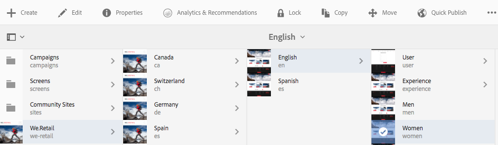
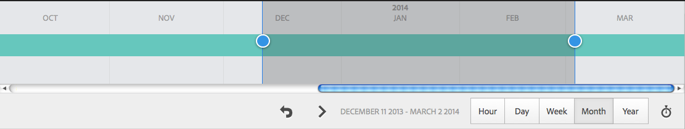
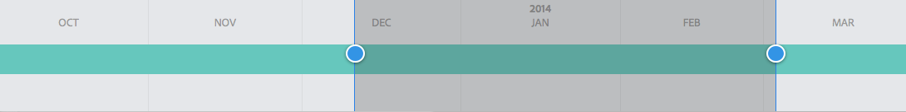
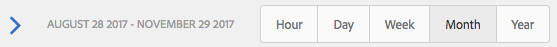
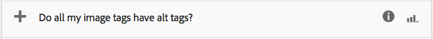
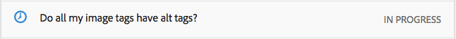
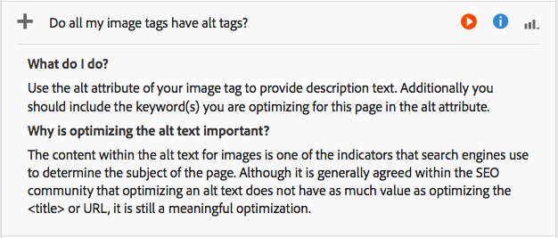

# Analisi delle prestazioni della pagina{#analyzing-page-performance}

Apri la pagina [Contenuto Insight](/help/sites-authoring/content-insights.md) per analizzare le prestazioni della pagina che stai creando. Configura il periodo di reporting per concentrare l’analisi.

## Apertura di Analytics e Recommendations per una pagina {#opening-analytics-and-recommendations-for-a-page}

Utilizza la procedura seguente per visualizzare le analisi e i consigli per una pagina:

1. Passare alla pagina che si desidera analizzare.
1. Nella barra degli strumenti, fai clic su **Analytics e Recommendations**.

   >[!NOTE]
   >
   >Le analisi e i consigli per una pagina vengono visualizzati solo se AEM è stato configurato per l&#39;integrazione con Adobe Analytics](/help/sites-administering/adobeanalytics-connect.md).[

   

### Modifica del periodo di reporting {#changing-the-reporting-period}

Modifica i seguenti aspetti relativi al tempo nei rapporti di analisi:

* Periodo di tempo in cui generare il rapporto.
* Granularità dei dati.

Gli strumenti per modificare gli aspetti temporali dei rapporti vengono visualizzati nella parte superiore della pagina Insight dei contenuti. 

#### Modifica del periodo di reporting {#changing-the-reporting-period-1}

Modifica il periodo di reporting della pagina Insight dei contenuti per concentrare l’analisi dell’attività della pagina su un periodo di tempo specifico. Quando si modifica il periodo di reporting, i rapporti vengono aggiornati automaticamente. L’area ombreggiata nell’arco temporale rappresenta il periodo di reporting. Le date nell’arco temporale aumentano da sinistra a destra.

Per modificare il periodo di reporting di una pagina di Content Insight:

1. Se l’intervallo temporale non viene visualizzato nella parte superiore della pagina, fai clic sull’icona Attiva/Disattiva intervallo temporale.

   

1. Per modificare la data di inizio del periodo di reporting, trascinare il cerchio visualizzato sul lato sinistro dell&#39;area ombreggiata sulla data di inizio desiderata.

   Se il lato sinistro dell&#39;area ombreggiata non è visibile, utilizzare la barra di scorrimento per visualizzarla.

1. Per modificare la data di fine del periodo di reporting, trascinare il cerchio visualizzato sul lato destro dell&#39;area ombreggiata fino alla data di fine desiderata.

#### Modifica della granularità del periodo di reporting {#changing-the-granularity-of-the-reporting-period}

Modifica la quantità di tempo trascorsa da ogni punto dati in un rapporto. Ad esempio, quando è selezionata la granularità Settimana, ogni punto dati nel rapporto Visualizzazioni rappresenta il numero di visualizzazioni per una settimana.

La granularità influisce sui rapporti che tracciano i dati in base al tempo, ad esempio i rapporti Visualizzazioni e Media dei minuti coinvolti nella pagina. La granularità influisce anche sulla scala dell’arco temporale.

1. Se il controllo di granularità non viene visualizzato, fai clic sull’icona Attiva/Disattiva granularità.

   

1. Fai clic sulla granularità desiderata. Una volta selezionato, il rapporto viene aggiornato automaticamente per riflettere la granularità.

### Assegnazione di attività per i consigli SEO (Search Engine Optimization) {#assigning-tasks-for-seo-recommendations}

Utilizza il rapporto SEO Recommendations (Consigli SEO) per creare attività per migliorare la visibilità delle pagine nei motori di ricerca. Per ogni consiglio del report che non ha un segno di spunta, puoi creare un&#39;attività da assegnare a un utente per eseguire il lavoro richiesto.

Lo stato del consiglio SEO indica quando l’attività viene creata ma non ancora completata.

Una volta creata, l’attività viene visualizzata nell’elenco Attività dell’utente. Per informazioni sulle attività, vedere [Utilizzo delle attività](/help/sites-authoring/task-content.md).

Per creare un&#39;attività per un consiglio SEO, attenersi alla procedura descritta di seguito.

1. Fai clic sull’icona delle informazioni per il consiglio SEO (Search Engine Optimization).

   

1. Fare clic sull&#39;icona del triangolo racchiuso accanto all&#39;icona delle informazioni.

   

1. Compila i campi modulo visualizzati, quindi seleziona Crea:

   * Progetto: selezionare il progetto in cui creare l&#39;attività.
   * Nome: il nome che identifica l&#39;attività. Il nome predefinito è il titolo del consiglio SEO (Search Engine Optimization).
   * Assegna a: selezionare l&#39;utente a cui assegnare l&#39;attività. Inizia a digitare il nome dell’utente per filtrare l’elenco.
   * Descrizione: una descrizione dell&#39;attività necessaria per completare l&#39;attività. La descrizione predefinita è quella che accompagna il consiglio SEO (Search Engine Optimization).
   * Priorità attività: la priorità dell&#39;attività.
   * Data scadenza: la data entro la quale l&#39;attività deve essere completata.

   **Nota:** l&#39;attività creata include anche il percorso della pagina a cui si applica il consiglio SEO.

1. Fai clic su Fine per chiudere il messaggio Attività creata.
