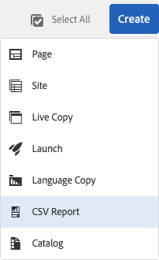
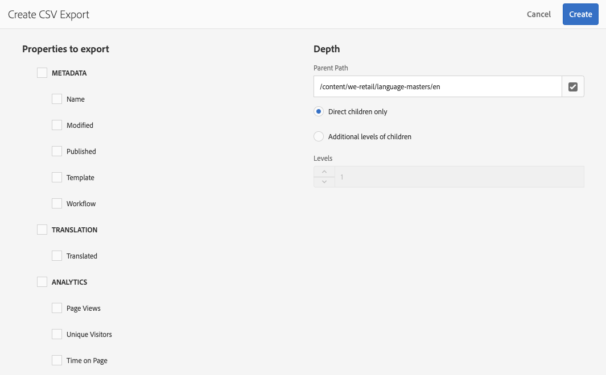

# Esportazione in formato CSV{#export-to-csv}

**Crea rapporto CSV** consente di esportare le informazioni contenute nelle pagine in un file CSV nel sistema locale.

* Il nome del file scaricato è `export.csv`
* Il contenuto dipende dalle proprietà selezionate.
* Puoi definire il percorso e il livello di profondità dell’esportazione.

>[!NOTE]
>
>Vengono utilizzate la funzione di download e la destinazione predefinita del browser in uso.

La procedura guidata **Crea esportazione CSV** consente di selezionare:

* Proprietà da esportare
  * Metadati
    * Nome
    * Modificato
    * Pubblicato
    * Modello
    * Flusso di lavoro
  * Traduzione
    * Tradotto
  * Analytics
    * Visualizzazioni pagina
    * Visitatori univoci
    * Tempo sulla pagina
* Profondità
  * Percorso principale
  * Solo elementi secondari diretti
  * Livelli aggiuntivi di elementi secondari
  * Livelli

Il file `export.csv` risultante può essere aperto in Excel o in un’altra applicazione compatibile.

L&#39;opzione crea **rapporto CSV** è disponibile nella visualizzazione a elenco della console **Sites**: è un&#39;opzione del menu a discesa **Crea**:

Per creare un’esportazione CSV:

1. Apri la console **Sites** e passa alla posizione desiderata, se necessario.
1. Dalla barra degli strumenti, seleziona **Crea**, quindi **Rapporto CSV** per aprire la procedura guidata:

   

1. Seleziona le proprietà richieste da esportare.
1. Seleziona **Crea**.
