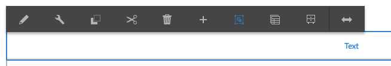
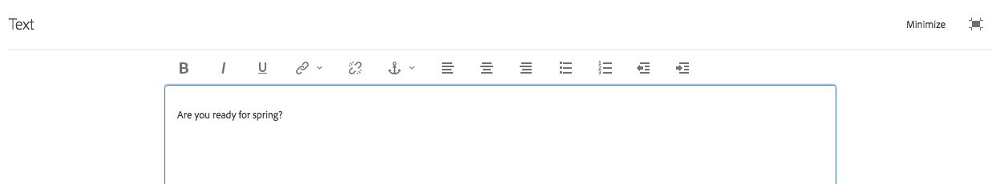

# Utilizzo dell’editor Rich Text per l’authoring dei contenuti {#use-rich-text-editor-to-author-content}

L’Editor Rich Text è un componente essenziale per l’inserimento di contenuti di testo in AEM. Costituisce la base di varie componenti, tra cui:

* [Testo](https://experienceleague.adobe.com/en/docs/experience-manager-core-components/using/wcm-components/text)
* [Tabella](https://experienceleague.adobe.com/en/docs/experience-manager-core-components/using/wcm-components/text#table)

## Modifica diretta {#in-place-editing}

Se si seleziona un componente basato su testo con un solo clic, verrà visualizzata la barra degli strumenti del componente  come per qualsiasi componente.

Toccando/facendo nuovamente clic o selezionando inizialmente il componente con un doppio clic lento, si apre la modifica diretta, che dispone di una propria barra degli strumenti. Qui puoi modificare il contenuto e apportare semplici modifiche di formattazione.

Questa barra degli strumenti contiene le opzioni seguenti:

* **Formato**: consente di impostare i formati Grassetto, Corsivo e Sottolineato.
* **Elenchi**: consente di creare elenchi puntati o numerati o di impostare i rientri.
* **Collegamento ipertestuale**
* **Scollega**
* **Schermo intero**
* **Chiudi**
* **Salva**

## Modifica a tutto schermo {#full-screen-editing}

Per i componenti basati su testo, tocca la modalità a tutto schermo nella barra degli strumenti  per aprire l&#39;editor Rich Text e nascondere il resto del contenuto della pagina.

In modalità a schermo intero vengono visualizzate tutte le opzioni configurate utilizzabili per l’authoring. La disponibilità dipende dalle opzioni [dalla configurazione](/help/sites-administering/rich-text-editor.md).

Altre opzioni dell’Editor Rich Text comprendono:

* **Ancoraggio**: consente di creare un ancoraggio nel testo, da utilizzare in seguito in un riferimento o un collegamento.
* **Allinea testo a sinistra**
* **Testo centrato**
* **Allinea testo a destra**

Per chiudere la modalità a schermo intero, fai clic sull’icona Riduci a icona.

>[!NOTE]
>
>Copiare gli elenchi nidificati da Microsoft Word nell’editor Rich Text può dare risultati incoerenti e richiedere una regolazione manuale dopo aver incollato il testo nell’editor Rich Text.
