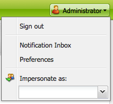

# Configurazione dell’ambiente dell’account{#configuring-your-account-environment}

Adobe Experience Manager (AEM) consente di configurare l’account e alcuni aspetti dell’ambiente di authoring.

Utilizzando le [impostazioni account](#account-settings) e le [preferenze utente](#user-preferences) è possibile definire le opzioni e le preferenze seguenti:

* **Barra degli strumenti di modifica**
Specificare se si desidera disporre della barra degli strumenti di modifica globale. Questa barra degli strumenti, visualizzata nella parte superiore della finestra del browser, fornisce i pulsanti **Copia**, **Taglia**, **Incolla**, **Elimina** da utilizzare con i componenti paragrafo della pagina:

   * Mostra se necessario (predefinito)
   * Mostra sempre
   * Mantieni nascosto

* **Impersona**
La funzionalità di [Impersona](/help/sites-administering/security.md#impersonating-another-user) consente a un utente di lavorare per conto di un altro utente.

* **Lingua**
Lingua da utilizzare per l’interfaccia utente dell’ambiente di authoring. Seleziona la lingua desiderata dall’elenco disponibile.

* **Gestione finestre**
Seleziona una delle seguenti opzioni:

   * Finestre multiple (impostazione predefinita)
Le pagine vengono aperte in una nuova finestra.
   * Finestra singola
Le pagine vengono aperte nella finestra corrente.

## Impostazioni account {#account-settings}

L’icona utente ti permette di accedere alle seguenti opzioni:

* Esci
* [Impersona](/help/sites-administering/security.md#impersonating-another-user)
* [Preferenze utente](#user-preferences)
* [Casella in entrata notifica](/help/sites-classic-ui-authoring/author-env-inbox.md)

### Preferenze utente {#user-preferences}

Ogni utente può impostare autonomamente determinate proprietà. È disponibile nella finestra di dialogo **Preferenze** nell&#39;angolo superiore destro delle console.

La finestra di dialogo offre le seguenti opzioni:

