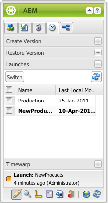

# Modifica dei lanci{#editing-launches}

## Modifica delle pagine di lancio {#editing-launch-pages}

Quando è stato creato un lancio per una pagina (o un set di pagine) puoi modificare il contenuto nella copia di lancio delle pagine.

1. Apri la pagina per la modifica.
1. In Sidekick, seleziona la scheda **Controllo versioni**, quindi espandi il gruppo **Lanci**. Il titolo del lancio attualmente in fase di modifica utilizza un font in grassetto.

   

1. Selezionare il lancio su cui si desidera lavorare e quindi fare clic su **Switch**.
1. Inizia a modificare.

   >[!NOTE]
   >
   >Puoi utilizzare la scheda **Pagina** della barra laterale per eseguire azioni quali **Crea pagina figlia**, tra le altre.

## Modifica di una configurazione di lancio {#editing-a-launch-configuration}

Dopo aver creato un lancio, puoi modificare il nome del lancio e la data del lancio. Puoi anche specificare un’immagine da associare al lancio.

1. Aprire la pagina Amministrazione lanci ([http://localhost:4502/libs/launches/content/admin.html](http://localhost:4502/libs/launches/content/admin.html)).

1. Seleziona il lancio richiesto e fai clic su **Modifica** per aprire la finestra di dialogo:

   * Nella scheda **Generale** è possibile modificare:

     * **Titolo**
     * **Data attivazione**: equivalente alla data di lancio
     * **Pronto per la produzione**

     Per informazioni sullo scopo e sull&#39;interazione di questi campi, vedere [Lanci - Ordine degli eventi](/help/sites-authoring/launches.md#launches-the-order-of-events).

   * Nella scheda **Immagine** puoi caricare un file di immagine.

1. Fai clic su **Salva**.

## Esplorazione dello stato di avvio di una pagina {#discovering-the-launch-status-of-a-page}

Quando modifichi un lancio di una pagina, le informazioni su tale lancio vengono visualizzate nella parte inferiore della scheda **Controllo delle versioni** di Sidekick:

* Nome del lancio.
* L’ora dall’ultima modifica.
* Utente che ha eseguito l&#39;ultima modifica.
* Stato del flag **Production Ready** (arancione=non impostato; verde=impostato).

