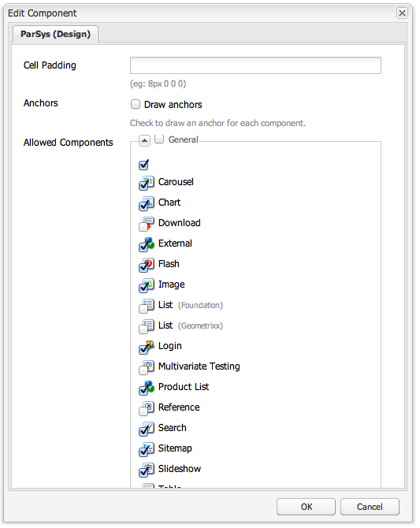

# Configurazione dei componenti in modalità Progettazione{#configuring-components-in-design-mode}

Quando l’istanza AEM è installata come predefinita, nella barra laterale è immediatamente disponibile una selezione di componenti.

Oltre a questi, sono disponibili vari altri componenti. È possibile utilizzare la modalità Progettazione per [abilitare/disabilitare tali componenti](#enabledisablecomponentsusingdesignmode). Se attivato e si trova nella pagina, è possibile utilizzare la modalità Progettazione per [configurare gli aspetti della progettazione del componente](#configuringcomponentsusingdesignmode) modificando i parametri dell&#39;attributo.

>[!NOTE]
>
>Presta attenzione quando modifichi questi componenti. Le impostazioni di progettazione sono spesso parte integrante della progettazione dell’intero sito web, pertanto devono essere modificate solo da utenti con i privilegi (e l’esperienza) appropriati, spesso amministratori o sviluppatori. Per ulteriori informazioni, vedere [Sviluppo di componenti](/help/sites-developing/components.md).

Ciò comporta effettivamente l’aggiunta o la rimozione dei componenti consentiti nel sistema paragrafo per la pagina. Il sistema paragrafo ( `parsys`) è un componente composto che contiene tutti gli altri componenti paragrafo. Il sistema paragrafo consente agli autori di aggiungere a una pagina componenti di tipi diversi, in quanto contiene tutti gli altri componenti paragrafo. Ogni tipo di paragrafo è rappresentato come componente.

Ad esempio, il contenuto di una pagina di prodotto può contenere un sistema paragrafo con i seguenti elementi:

* Immagine del prodotto (sotto forma di immagine o paragrafo textimage)
* Descrizione del prodotto (come paragrafo di testo)
* Tabella con dati tecnici (come paragrafo di tabella)
* Compilazione di un modulo da parte degli utenti (come inizio del modulo, elemento del modulo e paragrafo finale del modulo)

>[!NOTE]
>
>Per ulteriori informazioni su `parsys`, vedere [Sviluppo di componenti](/help/sites-developing/components.md#paragraphsystem) e [Linee guida per l&#39;utilizzo di modelli e componenti](/help/sites-developing/dev-guidelines-bestpractices.md#guidelines-for-using-templates-and-components).

## Abilita/Disabilita componenti {#enable-disable-components}

In modalità Progettazione, la barra laterale viene ridotta a icona e puoi configurare i componenti accessibili per l’authoring:

1. Per accedere alla modalità Progettazione, apri una pagina per la modifica e utilizza l’icona Sidekick:

   

1. Fai clic su **Modifica** nel sistema Paragrafo (**Progettazione del par**).

   

1. Viene aperta una finestra di dialogo in cui sono elencati i gruppi di componenti visualizzati in Sidekick e i singoli componenti in essi contenuti.

   Seleziona questa opzione per aggiungere o rimuovere i componenti da rendere disponibili nella barra laterale.

   

1. Sidekick riduce a icona in modalità Progettazione. Facendo clic sulla freccia è possibile ingrandire il Sidekick e tornare alla modalità di modifica:

   

## Configurazione della progettazione di un componente {#configuring-the-design-of-a-component}

In modalità Progettazione è inoltre possibile configurare gli attributi per i singoli componenti. Ogni componente ha i propri parametri. Nell&#39;esempio seguente viene illustrato il componente **Immagine**:

1. Per accedere alla modalità Progettazione, apri una pagina per la modifica e utilizza l’icona Sidekick:

   

1. Puoi configurare la progettazione dei componenti.

   Ad esempio, se fai clic su **Modifica** sul componente Immagine (**Progettazione dell&#39;immagine**) puoi configurare i parametri specifici del componente:

   

1. Fai clic su **OK** per salvare le modifiche.

1. Sidekick riduce a icona in modalità Progettazione. Facendo clic sulla freccia è possibile ingrandire il Sidekick e tornare alla modalità di modifica:

   
