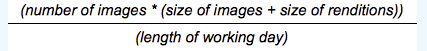

# Ottimizzazione delle prestazioni {#performance-optimization}

>[!NOTE]
>
>Per ulteriori informazioni sulla risoluzione dei problemi e sulla risoluzione dei problemi relativi alle prestazioni, vedere anche la [Struttura delle prestazioni](/help/sites-deploying/performance-tree.md).
>
>È inoltre possibile esaminare un articolo della Knowledge Base su [Suggerimenti per l&#39;ottimizzazione delle prestazioni](https://experienceleague.adobe.com/en/docs/experience-cloud-kcs/kbarticles/ka-17466).

Un problema chiave è il tempo impiegato dal sito web per rispondere alle richieste dei visitatori. Anche se questo valore varia per ogni richiesta, è possibile definire un valore target medio. Una volta dimostrato che questo valore è sia realizzabile che gestibile, può essere utilizzato per monitorare le prestazioni del sito web e indicare lo sviluppo di potenziali problemi.

I tempi di risposta desiderati sono diversi per gli ambienti di authoring e di pubblicazione, rispecchiando le diverse caratteristiche del pubblico di destinazione:

## Ambiente di authoring {#author-environment}

Questo ambiente viene utilizzato dagli autori che immettono e aggiornano il contenuto. Deve soddisfare alcuni utenti che generano un numero elevato di richieste di prestazioni intensive durante l’aggiornamento delle pagine di contenuto e dei singoli elementi in tali pagine.

## Ambiente di pubblicazione {#publish-environment}

Questo ambiente contiene contenuti che rendi disponibili agli utenti. Qui il numero di richieste è ancora maggiore e la velocità è altrettanto vitale. Tuttavia, poiché la natura delle richieste è meno dinamica, è possibile applicare meccanismi aggiuntivi di miglioramento delle prestazioni, come la memorizzazione nella cache del contenuto o il bilanciamento del carico.

>[!NOTE]
>
>* Dopo la configurazione per l&#39;ottimizzazione delle prestazioni, seguire le procedure in [Giorno difficile](/help/sites-developing/tough-day.md) per testare l&#39;ambiente con un carico elevato.
>* Vedi anche [Suggerimenti per l&#39;ottimizzazione delle prestazioni.](https://experienceleague.adobe.com/en/docs/experience-cloud-kcs/kbarticles/ka-17466)

## Metodologia di ottimizzazione delle prestazioni {#performance-optimization-methodology}

Una metodologia di ottimizzazione delle prestazioni per i progetti AEM può essere riassunta in cinque semplici regole che possono essere seguite per evitare problemi di prestazioni fin dall’inizio:

1. [Pianificazione per l&#39;ottimizzazione](#planning-for-optimization)
1. [Simula realtà](#simulate-reality)
1. [Stabilire obiettivi solidi](#establish-solid-goals)
1. [Resta rilevante](#stay-relevant)
1. [Cicli di iterazione Agile](#agile-iteration-cycles)

Queste regole si applicano ai progetti web in generale e sono rilevanti per i project manager e gli amministratori di sistema per garantire che i loro progetti non affrontino problemi di prestazioni quando arriva il momento del lancio.

### Pianificazione per l&#39;ottimizzazione {#planning-for-optimization}


Pianifica circa il 10% dello sforzo di progetto per la fase di ottimizzazione delle prestazioni. I requisiti effettivi di ottimizzazione delle prestazioni dipendono dal livello di complessità di un progetto e dall’esperienza del team di sviluppo. Anche se il progetto potrebbe non richiedere il tempo assegnato, è buona prassi pianificare sempre l’ottimizzazione delle prestazioni nell’area suggerita.

Quando possibile, un progetto deve prima essere avviato in modo morbido a un pubblico limitato per raccogliere esperienze reali ed eseguire ulteriori ottimizzazioni, senza la pressione aggiuntiva che segue un annuncio completo.

Quando sei &quot;live&quot;, l&#39;ottimizzazione delle prestazioni non è terminata. È ora che si verifica il carico &quot;reale&quot; sul sistema. È importante pianificare ulteriori adeguamenti dopo il lancio.

Poiché il carico del sistema cambia e i profili di prestazioni del sistema cambiano nel tempo, è necessario pianificare un &quot;tuning&quot; o un &quot;controllo dello stato di salute&quot; delle prestazioni a intervalli di 6-12 mesi.

### Simula realtà {#simulate-reality}


Se vai in diretta con un sito web e scopri dopo il lancio che riscontri problemi di prestazioni, probabilmente perché i test di carico e prestazioni non simulavano la realtà abbastanza da vicino.

Simulare la realtà è difficile e quanto impegno si desidera investire per diventare &quot;reali&quot; dipende dalla natura del progetto. &quot;Reale&quot; significa non solo &quot;codice reale&quot; e &quot;traffico reale&quot;, ma anche &quot;contenuto reale&quot;, soprattutto per quanto riguarda la dimensione e la struttura del contenuto. I modelli possono comportarsi in modo diverso a seconda delle dimensioni e della struttura dell’archivio.

### Stabilire obiettivi solidi {#establish-solid-goals}


Non va sottovalutata l&#39;importanza di stabilire adeguatamente gli obiettivi prestazionali. Spesso, dopo che le persone si sono concentrate su obiettivi di prestazioni specifici, è difficile modificare tali obiettivi in un secondo momento, anche se si basano su presupposti.

Stabilire buoni e solidi obiettivi di prestazioni è davvero una delle aree più difficili. Spesso è meglio raccogliere registri e benchmark reali da un sito web comparabile (ad esempio, il predecessore del nuovo sito web).

### Resta rilevante {#stay-relevant}


È importante ottimizzare un collo di bottiglia alla volta. Se tenti di eseguire le operazioni in parallelo senza convalidare l’impatto dell’unica ottimizzazione, puoi perdere traccia di quale misura di ottimizzazione è stata utile.

### Cicli di iterazione Agile {#agile-iteration-cycles}


L&#39;ottimizzazione delle prestazioni è un processo iterativo che coinvolge, misura, analisi, ottimizzazione e convalida fino al raggiungimento dell&#39;obiettivo. Per tenere conto di questo aspetto, implementa un processo di convalida agile nella fase di ottimizzazione anziché un processo di test più pesante dopo ogni iterazione.

Questo focus significa che lo sviluppatore che implementa l’ottimizzazione deve disporre di un modo rapido per sapere se l’ottimizzazione ha già raggiunto l’obiettivo. Queste informazioni sono preziose perché, una volta raggiunto l’obiettivo, l’ottimizzazione è terminata.

## Linee guida sulle prestazioni di base {#basic-performance-guidelines}

In generale, mantieni le richieste html non memorizzate nella cache a meno di 100 millisecondi. Più specificamente, i seguenti elementi possono fungere da orientamento:

* Il 70% delle richieste di pagine dovrebbe ricevere una risposta in meno di 100 millisecondi.
* Il 25% delle richieste di pagine dovrebbe ricevere una risposta entro 100-300 millisecondi.
* Il 4% delle richieste di pagine dovrebbe ricevere una risposta entro 300-500 millisecondi.
* L’1% delle richieste di pagine dovrebbe ricevere una risposta entro 500-1000 millisecondi.
* Nessuna pagina deve rispondere a un tempo inferiore a 1 secondo.

I numeri di cui sopra presuppongono le seguenti condizioni:

* Misurato al momento della pubblicazione (nessun costo comune correlato a un ambiente di authoring)
* Misurato sul server (nessun sovraccarico di rete)
* Non memorizzato in cache (nessuna cache di output AEM, nessuna cache Dispatcher)
* Solo per elementi complessi con molte dipendenze (HTML, JS, PDF, ...)
* Nessun altro carico sul sistema

Esistono alcuni problemi che spesso contribuiscono a problemi di prestazioni, tra cui i seguenti:

* Inefficienza della memorizzazione nella cache di Dispatcher
* Utilizzo delle query nei normali modelli di visualizzazione.

L’ottimizzazione a livello di JVM e del sistema operativo di solito non comporta salti significativi nelle prestazioni e deve quindi essere eseguita alla fine del ciclo di ottimizzazione.

La struttura di un archivio di contenuti può influire anche sulle prestazioni. Per prestazioni ottimali, il numero di nodi secondari collegati ai singoli nodi in un archivio dei contenuti non deve superare i 1.000 (in regola).

I tuoi migliori amici durante un normale esercizio di ottimizzazione delle prestazioni sono:

* `request.log`
* Tempistica basata su componenti
* Un profiler Java™.

### Prestazioni durante il caricamento e la modifica di Digital Assets {#performance-when-loading-and-editing-digital-assets}

A causa dell’elevato volume di dati necessari per caricare e modificare le risorse digitali, le prestazioni possono diventare un problema.

Due fattori influiscono sulle prestazioni:

* CPU - l&#39;utilizzo di più core consente un lavoro più fluido durante la transcodifica
* Disco rigido: i dischi RAID paralleli raggiungono lo stesso risultato

Per migliorare le prestazioni, considera quanto segue:

* Quante risorse verranno caricate al giorno? Una stima valida può essere basata su:


* L&#39;intervallo di tempo in cui vengono apportate le modifiche (in genere la durata della giornata lavorativa, più per le operazioni internazionali).
* Dimensione media delle immagini caricate (e dimensione delle rappresentazioni generate per immagine) in megabyte.
* Determinare la velocità media dei dati:



* L’80% di tutte le modifiche viene effettuato nel 20% del tempo, quindi nei momenti di picco la velocità media dei dati è quattro volte superiore. Tali prestazioni sono il vostro obiettivo.

## Monitoraggio delle prestazioni {#performance-monitoring}

Le prestazioni (o la loro mancanza) sono una delle prime cose che gli utenti notano, quindi con qualsiasi applicazione con un’interfaccia utente, le prestazioni sono di importanza fondamentale. Per ottimizzare le prestazioni dell’installazione di AEM, monitora vari attributi dell’istanza e il suo comportamento.

Per informazioni su come eseguire il monitoraggio delle prestazioni, vedere [Monitoraggio delle prestazioni](/help/sites-deploying/monitoring-and-maintaining.md#monitoring-performance).

I problemi che causano problemi di prestazioni sono spesso difficili da individuare, anche quando i loro effetti sono facili da vedere.

Un punto di partenza di base è una buona conoscenza del sistema quando funziona normalmente. A meno che non si conosca l&#39;aspetto e il comportamento dell&#39;ambiente quando funziona correttamente, è difficile individuare il problema quando le prestazioni peggiorano. Investigare sul sistema durante il suo normale funzionamento e assicurarsi che la raccolta delle informazioni sulle prestazioni sia un&#39;attività continua. In questo modo è possibile ottenere una base di confronto in caso di peggioramento delle prestazioni.

Il diagramma seguente illustra il percorso che una richiesta di contenuto AEM può seguire e quindi il numero di elementi diversi che possono influire sulle prestazioni.


Le prestazioni rappresentano anche un equilibrio tra volume e capacità:

* **Volume** - Quantità di output elaborata e consegnata dal sistema.
* **Capacità** - Capacità del sistema di consegnare il volume.

Le prestazioni possono essere illustrate in varie posizioni in tutta la catena web.


Esistono diverse aree funzionali spesso responsabili dell’impatto sulle prestazioni:

* Memorizzazione in cache
* Codice applicazione (progetto)
* Funzionalità di ricerca

### Regole di base relative alle prestazioni {#basic-rules-regarding-performance}

Alcune regole devono essere tenute presenti quando si ottimizzano le prestazioni:

* L&#39;ottimizzazione delle prestazioni *deve* far parte di ogni progetto.
* Non ottimizzare nelle prime fasi del ciclo di sviluppo.
* Le prestazioni sono buone solo come l&#39;anello più debole.
* Pensa sempre alla capacità rispetto al volume.
* Ottimizza prima le cose importanti.
* Non ottimizzare mai senza *obiettivi realistici*.

>[!NOTE]
>
>Il meccanismo utilizzato per misurare le prestazioni spesso influisce esattamente su ciò che si sta cercando di misurare. Prova a tenere conto di queste discrepanze ed eliminane il più possibile l’effetto; in particolare, ove possibile, i plug-in del browser devono essere disattivati.

## Configurazione per le prestazioni {#configuring-for-performance}

Alcuni aspetti di AEM (e/o dell’archivio sottostante) possono essere configurati per ottimizzare le prestazioni. Di seguito sono riportati possibilità e suggerimenti. Prima di apportare modifiche, è necessario verificare se o come si utilizza la funzionalità in questione.

### Indicizzazione di ricerca {#search-indexing}

A partire da AEM 6.0, Adobe Experience Manager utilizza un’architettura di archivio basata su Oak.

Le informazioni aggiornate sull’indicizzazione sono disponibili qui:

* [Best practice per query e indicizzazione](/help/sites-deploying/best-practices-for-queries-and-indexing.md)
* [Query e indicizzazione](/help/sites-deploying/queries-and-indexing.md)

### Elaborazione flusso di lavoro simultaneo {#concurrent-workflow-processing}

Per migliorare le prestazioni, limita il numero di processi di flusso di lavoro in esecuzione simultanea. Per impostazione predefinita, il motore del flusso di lavoro elabora in parallelo tanti flussi di lavoro quanti sono i processori disponibili per la VM Java™. Quando i passaggi del flusso di lavoro richiedono grandi quantità di risorse di elaborazione (RAM o CPU), l’esecuzione in parallelo di diversi di questi flussi di lavoro può comportare requisiti elevati per le risorse server disponibili.

Ad esempio, quando vengono caricate le immagini (o le risorse DAM in generale), i flussi di lavoro importano automaticamente le immagini in DAM. Le immagini sono spesso ad alta risoluzione e possono facilmente consumare centinaia di MB di heap per l&#39;elaborazione. La gestione di queste immagini in parallelo comporta un carico elevato sul sottosistema di memoria e sul garbage collector.

Il motore del flusso di lavoro utilizza le code dei processi Apache Sling per la gestione e la pianificazione dell’elaborazione degli elementi di lavoro. I seguenti servizi della coda processi sono stati creati per impostazione predefinita dalla factory del servizio Configurazione coda processi di Apache Sling per l’elaborazione dei processi del flusso di lavoro:

<!-- TODO: Change the reference to 6.5 LTS javadocs -->
* Coda del flusso di lavoro Granite: la maggior parte dei passaggi del flusso di lavoro, come quelli che elaborano le risorse DAM, utilizza il servizio Coda del flusso di lavoro Granite.
* Granite Workflow External Process Job Queue (Coda processi esterni flusso di lavoro Granite): questo servizio viene utilizzato per particolari passaggi del flusso di lavoro esterno che in genere vengono utilizzati per contattare un sistema esterno e per il polling dei risultati. Ad esempio, il passaggio Processo di estrazione file multimediali di InDesign è implementato come processo esterno. Il motore del flusso di lavoro utilizza la coda esterna per l’elaborazione del polling. (Vedi [com.day.cq.workflow.exec.WorkflowExternalProcess](https://developer.adobe.com/experience-manager/reference-materials/6-5-lts/javadoc/com/day/cq/workflow/exec/WorkflowExternalProcess.html).)

Configura questi servizi per limitare il numero massimo di processi di flusso di lavoro in esecuzione simultanea.

>[!NOTE]
>
>La configurazione di queste code di processi influisce su tutti i flussi di lavoro a meno che non sia stata creata una coda di processi per un modello di flusso di lavoro specifico (vedere [Configurare la coda per un modello di flusso di lavoro specifico](/help/sites-deploying/configuring-performance.md#configure-the-queue-for-a-specific-workflow) di seguito).

#### Configurazione nell’archivio {#configuration-in-the-repo}

Se stai configurando i servizi [utilizzando un nodo sling:OsgiConfig](/help/sites-deploying/configuring-osgi.md#adding-a-new-configuration-to-the-repository), devi trovare il PID dei servizi esistenti, ad esempio: org.apache.sling.event.jobs.QueueConfiguration.370aad73-d01b-4a0b-abe4-20198d85f705. Puoi individuare il PID utilizzando la console web.

Configurare la proprietà denominata `queue.maxparallel`.

#### Configurazione nella console web {#configuration-in-the-web-console}

Per configurare questi servizi [utilizzando la console Web](/help/sites-deploying/configuring-osgi.md#osgi-configuration-with-the-web-console), individuare gli elementi di configurazione esistenti nella service factory di configurazione della coda processi di Apache Sling.

Configura la proprietà denominata Maximum Parallel Jobs (Numero massimo processi paralleli).

### Configurare la coda per un flusso di lavoro specifico {#configure-the-queue-for-a-specific-workflow}

Creare una coda di processi per un modello di flusso di lavoro specifico in modo da poter configurare la gestione dei processi per tale modello. In questo modo, le configurazioni influiscono sull’elaborazione di un flusso di lavoro specifico, mentre la configurazione della coda predefinita del flusso di lavoro di Granite controlla l’elaborazione di altri flussi di lavoro.

Durante l’esecuzione dei modelli di flusso di lavoro, vengono creati processi Sling per un argomento specifico. Per impostazione predefinita, l&#39;argomento corrisponde agli argomenti configurati per la coda del flusso di lavoro generale di Granite o per la coda del processo esterno del flusso di lavoro di Granite:

* `com/adobe/granite/workflow/job*`
* `com/adobe/granite/workflow/external/job*`

Gli argomenti di processo effettivi generati dai modelli di flusso di lavoro includono il suffisso specifico per il modello. Ad esempio, il modello di flusso di lavoro **Risorsa di aggiornamento DAM** genera processi con il seguente argomento:

`com/adobe/granite/workflow/job/etc/workflow/models/dam/update_asset/jcr_content/model`

È quindi possibile creare una coda di processi per l&#39;argomento corrispondente agli argomenti del processo del modello di flusso di lavoro. La configurazione delle proprietà correlate alle prestazioni della coda influisce solo sul modello di flusso di lavoro che genera i processi che corrispondono all’argomento della coda.

La procedura seguente crea una coda di processi per un flusso di lavoro, utilizzando come esempio il flusso di lavoro **Risorsa di aggiornamento DAM**.

1. Eseguire il modello di flusso di lavoro per il quale si desidera creare la coda dei processi, in modo che vengano generate le statistiche degli argomenti. Aggiungi ad esempio un&#39;immagine ad Assets per eseguire il flusso di lavoro **Risorsa di aggiornamento DAM**.
1. Aprire la console Processi Sling (`https://<host>:<port>/system/console/slingevent`).
1. Scopri gli argomenti relativi al flusso di lavoro nella console. Per Risorsa di aggiornamento DAM, sono disponibili i seguenti argomenti:

   * `com/adobe/granite/workflow/external/job/etc/workflow/models/dam/update_asset/jcr_content/model`
   * `com/adobe/granite/workflow/job/etc/workflow/models/dam/update_asset/jcr_content/model`
   * `com/adobe/granite/workflow/job/etc/workflow/models/dam-xmp-writeback/jcr_content/model`

1. Creare una coda di lavoro per ciascuno di questi argomenti. Per creare una coda di processi, crea una configurazione di fabbrica per il servizio Apache Sling Job Queue factory.

   Le configurazioni di fabbrica sono simili alla coda del flusso di lavoro Granite descritta in [Elaborazione del flusso di lavoro simultaneo](/help/sites-deploying/configuring-performance.md#concurrent-workflow-processing), ad eccezione della proprietà Topics che corrisponde all&#39;argomento dei processi del flusso di lavoro.

### Servizio di sincronizzazione risorse DAM AEM {#cq-dam-asset-synchronization-service}

`AssetSynchronizationService` viene utilizzato per sincronizzare le risorse dai repository montati (tra cui LiveLink, Documentum®). Per impostazione predefinita, questa sincronizzazione esegue un controllo regolare ogni 300 secondi (5 minuti), quindi se non utilizzi archivi montati, puoi disabilitare il servizio.

La disattivazione del servizio viene eseguita [configurando il servizio OSGi](/help/sites-deploying/configuring-osgi.md) **CQ DAM Asset Synchronization Service** per impostare il **periodo di sincronizzazione** (`scheduler.period`) su (almeno) un anno (definito in secondi).

### Più istanze DAM {#multiple-dam-instances}

La distribuzione di più istanze DAM può migliorare le prestazioni quando, ad esempio:

* Hai un carico elevato a causa del caricamento regolare di molte risorse per l’ambiente di authoring; qui puoi dedicare un’istanza DAM separata per la manutenzione dell’autore.
* Hai più team in posizioni mondiali (ad esempio, Stati Uniti, Europa, Asia).

Ulteriori considerazioni sono:

* Separazione di &quot;work in progress&quot; sull’autore da &quot;final&quot; sulla pubblicazione
* Separazione degli utenti interni all’authoring da visitatori/utenti esterni alla pubblicazione (ad esempio agenti, giornalisti, clienti e studenti).

## Best practice per Assurance di qualità {#best-practices-for-quality-assurance}

Le prestazioni sono di fondamentale importanza per l’ambiente di pubblicazione. Pertanto, devi pianificare e analizzare attentamente i test delle prestazioni effettuati per l’ambiente di pubblicazione durante l’implementazione del progetto.

Questa sezione offre una panoramica standardizzata dei problemi relativi alla definizione di un concetto di test specifico per i test delle prestazioni nell&#39;ambiente *publish*. Queste informazioni sono di particolare interesse per gli ingegneri QA, i project manager e gli amministratori di sistema.

Di seguito è riportato un approccio standardizzato ai test delle prestazioni per un&#39;applicazione AEM nell&#39;ambiente *Pubblica*. Questo test di prestazione prevede le cinque fasi seguenti:

* [Verifica delle conoscenze](#verification-of-knowledge)
* [Definizione del campo di applicazione](#scope-definition)
* [Metodologie di test](#test-methodologies)
* [Definizione degli obiettivi di prestazioni](#defining-the-performance-goals)
* [Ottimizzazione](#optimization)

Il controllo è un processo aggiuntivo che include tutti i componenti, necessario ma non limitato ai test.

### Verifica delle conoscenze {#verification-of-knowledge}

Un primo passaggio consiste nel documentare le informazioni di base che è necessario conoscere prima di poter iniziare il test:

* Architettura dell’ambiente di test
* Mappa dell’applicazione che descrive gli elementi interni che devono essere testati (sia isolati che combinati)

#### Architettura di prova {#test-architecture}

Documenta l’architettura dell’ambiente di test utilizzato per il test delle prestazioni.

È necessaria una riproduzione dell’ambiente di pubblicazione di produzione pianificato, insieme a Dispatcher e Load Balancer.

#### Mappa applicazioni {#application-map}

Ottieni una chiara panoramica da cui creare una mappa dell’intera applicazione (questa mappa potrebbe essere già disponibile dai test nell’ambiente di authoring).

Una rappresentazione schematica degli elementi interni dell&#39;applicazione, può fornire una panoramica dei requisiti di test; con la codifica a colori può anche fungere da base per il reporting.

### Definizione ambito {#scope-definition}

In genere, un’applicazione dispone di una selezione di casi d’uso. Alcuni casi d’uso sono importanti, altri meno.

Per focalizzare l’ambito del test delle prestazioni sulla pubblicazione, Adobe consiglia di definire quanto segue:

* Casi d’uso aziendali più importanti
* Casi d’uso tecnici più critici

Il numero di casi d’uso dipende da te, ma deve essere limitato a un numero facilmente gestibile (ad esempio, tra 5 e 10).

Una volta selezionati i casi d’uso chiave, è possibile definire per ogni caso gli indicatori prestazioni chiave (KPI, Key Performance Indicators) e gli strumenti utilizzati per misurarli. Esempi di KPI comuni includono:

* Tempo di risposta end-to-end
* Tempo di risposta servlet
* Tempo di risposta per un singolo componente
* Tempo di risposta per i servizi
* Numero di thread inattivi nel pool di thread
* Numero di connessioni libere
* Risorse di sistema come l&#39;accesso a CPU e I/O

### Metodologie di test {#test-methodologies}

Questo concetto prevede quattro scenari utilizzati per definire e testare gli obiettivi prestazionali:

* Test di un singolo componente
* Test combinati dei componenti
* *Scenario Going Live*
* Scenari di errore

In base ai seguenti principi.

#### Punti di interruzione componente {#component-breakpoints}

* Ogni componente ha un punto di interruzione specifico quando è correlato alle prestazioni. In altre parole, un componente può mostrare che le buone prestazioni sono raggiunte fino al raggiungimento di un punto specifico, dopodiché le prestazioni si degradano rapidamente.
* Per ottenere una panoramica completa dell’applicazione, devi innanzitutto verificare i componenti per determinare quando viene raggiunto il punto di interruzione di ciascuno di essi.
* Per trovare il punto di interruzione che è possibile eseguire un test di carico in cui, in un periodo di tempo, si aumenta il numero di utenti per creare un carico crescente. Monitorando questo carico e la risposta dei componenti, si ottiene un comportamento specifico delle prestazioni quando viene raggiunto il punto di interruzione del componente. Il punto può essere qualificato in base al numero di transazioni simultanee al secondo, insieme al numero di utenti simultanei (se il componente è sensibile a questo indicatore KPI).
* Queste informazioni possono quindi fungere da punto di riferimento per i miglioramenti, indicare l&#39;efficienza delle misure utilizzate e contribuire a definire scenari di test.

#### Transazioni {#transactions}

* Il termine transazione viene utilizzato per rappresentare la richiesta di una pagina web completa, incluse la pagina stessa e tutte le chiamate successive. ovvero la richiesta di pagina, le chiamate, le immagini e gli altri oggetti di AJAX **Richiedi approfondimento**.
* Per analizzare completamente ogni richiesta, puoi rappresentare ogni elemento dello stack di chiamate, quindi calcolare il tempo medio di elaborazione per ogni richiesta.

### Definizione degli obiettivi di prestazioni {#defining-the-performance-goals}

Dopo aver definito l’ambito e i KPI correlati, vengono impostati gli obiettivi di prestazioni specifici. Questo processo comporta la progettazione di scenari di test e di valori target.

Prestazioni di prova sia in condizioni medie che di picco. Inoltre, è necessario eseguire test di scenario Going Live per garantire che tu possa provvedere a un maggiore interesse nel tuo sito web quando viene reso disponibile per la prima volta.

Qualsiasi esperienza o statistica che potresti aver raccolto da un sito web esistente può essere utile anche per determinare gli obiettivi futuri. Ad esempio, traffico più alto dal tuo sito web live.

#### Test per singolo componente {#single-component-tests}

I componenti critici devono essere testati sia in condizioni di media che di picco.

In entrambi i casi, è possibile definire il numero previsto di transazioni al secondo quando un numero predefinito di utenti utilizza il sistema.

| Componente | Tipo di test | No. di utenti | Tx/sec (previsto) | Tx/sec (testato) | Descrizione |
|---|---|---|---|---|---|
| Utente singolo homepage | Media | 1 | 1 |  |  |
|   | Picco | 1 | 3 |  |  |
| Homepage 100 utenti | Media | 100 | 3 |  |  |
|   | Picco | 100 | 3 |  |

#### Test dei componenti combinati {#combined-component-tests}

Il test dei componenti in combinazione offre un riflesso più preciso del comportamento delle applicazioni. Anche in questo caso devono essere testate le condizioni medie e di picco.

| Scenario | Componente | No. di utenti | Tx/sec (previsto) | Tx/sec (testato) | Descrizione |
|---|---|---|---|---|---|
| Media mista | Pagina Home | 10 | 1 |  |  |
|   | Ricerca | 10 | 1 |  |  |
|   | Notizie | 10 | 2 |  |  |
|   | Eventi | 10 | 1 |  |  |
|   | Attivazioni | 10 | 3 |  | Simulazione del comportamento dell’autore. |
| Picco misto | Pagina Home | 100 | 5 |  |  |
|   | Ricerca | 50 | 5 |  |  |
|   | Notizie | 100 | 10 |  |  |
|   | Eventi | 100 | 10 |  |  |
|   | Attivazioni | 20 | 20 |  | Simulazione del comportamento dell’autore. |

#### Test live {#going-live-tests}

Nei primi giorni dopo la messa a disposizione del sito web, è possibile prevedere un livello di interesse maggiore. Questo scenario è anche maggiore dei valori di picco per i quali stai eseguendo il test. Adobe consiglia di testare gli scenari Going Live per garantire che il sistema sia in grado di risolvere questa situazione.

| Scenario | Tipo di test | No. di utenti | Tx/sec (previsto) | Tx/sec (testato) | Descrizione |
|---|---|---|---|---|---|
| Picco Going Live | Pagina Home | 200 | 20 |  |  |
|   | Ricerca | 100 | 10 |  |  |
|   | Notizie | 200 | 20 |  |  |
|   | Eventi | 200 | 20 |  |  |
|   | Attivazioni | 20 | 20 |  | Simulazione del comportamento dell’autore. |

#### Test dello scenario di errore {#error-scenario-tests}

Verificare gli scenari di errore per garantire che il sistema reagisca correttamente e in modo appropriato. Non solo nel modo in cui viene gestito l’errore stesso, ma anche nell’impatto che potrebbe avere sulle prestazioni. Ad esempio:

* Cosa succede quando l’utente tenta di inserire un termine di ricerca non valido nella casella di ricerca
* Cosa succede quando il termine di ricerca è così generale da restituire un numero eccessivo di risultati

Nel concepire questi test, occorre tenere presente che non tutti gli scenari si verificano regolarmente. Tuttavia, il loro impatto sull&#39;intero sistema è importante.

| Scenario errore | Tipo di errore | No. di utenti | Tx/sec (previsto) | Tx/sec (testato) | Descrizione |
|---|---|---|---|---|---|
| Sovraccarico del componente di ricerca | Cerca nel carattere jolly globale (asterisco) | 10 | 1 |  | La ricerca viene eseguita solo in &amp;ast;&amp;ast;&amp;ast;. |
|   | Interrompi parola | 20 | 2 |  | Ricerca di una parola di arresto in corso. |
|   | Stringa vuota | 10 | 1 |  | Ricerca di una stringa vuota. |
|   | Caratteri speciali | 10 | 1 |  | Ricerca di caratteri speciali. |

#### Test di resistenza {#endurance-tests}

Alcuni problemi si verificano solo dopo che il sistema è stato in esecuzione per un periodo di tempo continuo, ore o giorni. Si utilizza una prova di durata per verificare un carico medio costante per un determinato periodo di tempo. È quindi possibile analizzare qualsiasi peggioramento delle prestazioni.

| Scenario | Tipo di test | No. di utenti | Tx/sec (previsto) | Tx/sec (testato) | Descrizione |
|---|---|---|---|---|---|
| Prova di durata (72 ore) | Pagina Home | 10 | 1 |  |  |
|   | Ricerca | 10 | 1 |  |  |
|   | Notizie | 20 | 2 |  |  |
|   | Eventi | 10 | 1 |  |  |
|   | Attivazioni | 1 | 3 |  | Simulazione del comportamento dell’autore. |

### Ottimizzazione {#optimization}

Nelle fasi successive dell’implementazione, ottimizza l’applicazione per soddisfare e massimizzare gli obiettivi prestazionali.

Eventuali ottimizzazioni effettuate devono essere verificate per garantire che:

* Funzionalità non interessata
* Sono stati verificati con i test di carico prima del rilascio

È disponibile una selezione di strumenti che consentono di generare il carico, monitorare le prestazioni e analizzare i risultati. Alcuni di questi strumenti includono:

* [JMeter](https://jmeter.apache.org/)
* [Ingegneria delle prestazioni di OpenText Professional](https://www.opentext.com/products/professional-performance-engineering).
* [Profilo interattivo Java™](https://jiprof.sourceforge.net/)

Dopo l&#39;ottimizzazione, ripetere la prova per confermare l&#39;impatto.

### Generazione rapporti {#reporting}

Il reporting continuo tiene tutti informati sullo stato. Come accennato in precedenza con la codifica a colori, la mappa dell’architettura può essere utilizzata per questo stato.

Al termine di tutte le prove, indicare quanto segue:

* Eventuali errori critici riscontrati
* Problemi non critici che richiedono ulteriori indagini
* Eventuali ipotesi formulate durante il test
* Eventuali raccomandazioni derivanti dal test

## Ottimizzazione delle prestazioni quando si utilizza Dispatcher {#optimizing-performance-when-using-the-dispatcher}

[Dispatcher](https://experienceleague.adobe.com/docs/experience-manager-dispatcher/using/dispatcher.html?lang=it) è lo strumento di caching e/o bilanciamento del carico di Adobe. Quando utilizzi Dispatcher, prova a ottimizzare il tuo sito web per migliorare le prestazioni della cache.

>[!NOTE]
>
>Le versioni di Dispatcher sono indipendenti da AEM, tuttavia la documentazione di Dispatcher è incorporata nella documentazione di AEM. Utilizza sempre la documentazione di Dispatcher incorporata nella documentazione della più recente versione di AEM.
>
>Potresti essere stato reindirizzato a questa pagina se hai seguito un collegamento alla documentazione di Dispatcher incorporato nella documentazione di una versione precedente di AEM.

Dispatcher offre diversi meccanismi incorporati che puoi utilizzare per ottimizzare le prestazioni se il tuo sito web ne trae vantaggio. Questa sezione spiega come progettare il sito web per massimizzare i vantaggi del caching.

>[!NOTE]
>
>Può essere utile ricordare che Dispatcher memorizza la cache su un server web standard. Conoscere queste informazioni significa che puoi memorizzare in cache tutto ciò che puoi memorizzare come pagina e richiedere utilizzando un URL. Inoltre, non è possibile memorizzare altri elementi, ad esempio cookie, dati di sessione e dati di moduli.
>
>In generale, numerose strategie di caching richiedono la selezione di URL validi e non si basano su questi dati aggiuntivi.
>
>Con Dispatcher versione 4.1.11 è anche possibile memorizzare nella cache le intestazioni di risposta. Vedere [Memorizzazione nella cache delle intestazioni di risposta HTTP](https://experienceleague.adobe.com/docs/experience-manager-dispatcher/using/configuring/dispatcher-configuration.html#configuring-the-dispatcher-cache-cache).
>

### Calcolo delle proporzioni della cache di Dispatcher {#calculating-the-dispatcher-cache-ratio}

La formula del rapporto di cache stima la percentuale di richieste gestite dalla cache rispetto al numero totale di richieste entrate nel sistema. Per calcolare il rapporto della cache, è necessario effettuare le seguenti operazioni:

* Numero totale di richieste. Queste informazioni sono disponibili in Apache `access.log`. Per ulteriori dettagli, consulta la [documentazione ufficiale di Apache](https://httpd.apache.org/docs/2.4/logs.html#accesslog).

* Numero di richieste inviate dall&#39;istanza Publish. Queste informazioni sono disponibili in `request.log` dell&#39;istanza. Per ulteriori dettagli, vedere [Interpretazione del file request.log](/help/sites-deploying/monitoring-and-maintaining.md#interpreting-the-request-log) e [Ricerca dei file di log](/help/sites-deploying/monitoring-and-maintaining.md#finding-the-log-files).

La formula per calcolare il rapporto della cache è:

* (Il numero totale di richieste **meno** il numero di richieste nella pubblicazione) **diviso** per il numero totale di richieste.

Ad esempio, se il numero totale di richieste è 129491 e il numero di richieste servite dall&#39;istanza Publish è 58959 il rapporto di cache è: **(129491 - 58959)/129491= 54,5%**.

Se non disponi di una coppia uno-a-uno editore/dispatcher, aggiungi le richieste di tutti i dispatcher e gli editori insieme per ottenere una misurazione accurata. Vedi anche [Distribuzioni consigliate](/help/sites-deploying/recommended-deploys.md).

>[!NOTE]
>
>Per ottenere le migliori prestazioni, Adobe consiglia un rapporto tra cache del 90% e del 95%.

#### Utilizzo di una codifica coerente delle pagine {#using-consistent-page-encoding}

Con Dispatcher versione 4.1.11, puoi memorizzare nella cache le intestazioni di risposta. Se non memorizzi nella cache le intestazioni di risposta su Dispatcher, possono verificarsi problemi se memorizzi le informazioni di codifica della pagina nell’intestazione. In questa situazione, quando Dispatcher richiama una pagina dalla cache, per essa viene utilizzata la codifica predefinita del server web. Esistono due modi per evitare questo problema:

* Se utilizzi una sola codifica, accertati che la codifica utilizzata sul server web sia la stessa della codifica predefinita del sito web AEM.
* Utilizza un tag `<META>` nella sezione `head` HTML per impostare la codifica, come nell’esempio seguente:

```xml
        <META http-equiv="Content-Type" content="text/html; charset=EUC-JP">
```

#### Evita i parametri URL {#avoid-url-parameters}

Se possibile, evita i parametri URL per le pagine che vuoi memorizzare in cache. Ad esempio, se hai una galleria di immagini, il seguente URL non viene mai memorizzato in cache (a meno che Dispatcher non sia [configurato per farlo](https://experienceleague.adobe.com/docs/experience-manager-dispatcher/using/configuring/dispatcher-configuration.html#configuring-the-dispatcher-cache-cache)):

```xml
www.myCompany.com/pictures/gallery.html?event=christmas&amp;page=1
```

Tuttavia, puoi inserire questi parametri nell’URL della pagina nel modo che segue:

```xml
www.myCompany.com/pictures/gallery.christmas.1.html
```

>[!NOTE]
>
>Questo URL richiama la stessa pagina e lo stesso modello di `gallery.html`. Nella definizione del modello, è possibile specificare quale script esegue il rendering della pagina oppure utilizzare lo stesso script per tutte le pagine.

#### Personalizza in base all&#39;URL {#customize-by-url}

Se consenti agli utenti di modificare la dimensione del font (o di effettuare qualunque altra personalizzazione del layout), accertati che le diverse personalizzazioni siano poi riportate nell’URL.

Ad esempio, i cookie non vengono memorizzati in cache, quindi se memorizzi la dimensione del font in un cookie (o in un meccanismo simile), essa non viene mantenuta per la pagina memorizzata in cache. Di conseguenza, Dispatcher restituisce documenti con qualunque dimensione del font, a caso.

L’inclusione della dimensione del font nell’URL come selettore evita questo problema:

```xml
www.myCompany.com/news/main.large.html
```

>[!NOTE]
>
>Per la maggior parte degli aspetti del layout, è inoltre possibile utilizzare fogli di stile, script lato client o entrambi. Questi strumenti funzionano bene con il caching.
>
>Questa strategia è utile anche per la versione stampata, in cui è possibile utilizzare un URL come:
>
>`www.myCompany.com/news/main.print.html`
>
>Utilizzando il globbing dello script della definizione del modello, puoi specificare uno script separato che esegue il rendering delle pagine da stampare.

#### Annullamento della validità dei file di immagine utilizzati come titoli {#invalidating-image-files-used-as-titles}

Se esegui il rendering dei titoli di pagina, o di altro testo, come immagini, si consiglia di memorizzare i file in modo che vengano eliminati al momento di un aggiornamento del contenuto della pagina:

1. Posiziona il file di immagine nella stessa cartella della pagina.
1. Utilizza il seguente formato di denominazione per il file di immagine:

   `<page file name>.<image file name>`

È ad esempio possibile memorizzare il titolo della pagina `myPage.html` in `file myPage.title.gif`. Questo file viene eliminato automaticamente, se la pagina viene aggiornata, quindi qualsiasi modifica al titolo della pagina viene automaticamente riportata nella cache.

>[!NOTE]
>
>Il file di immagine non esiste necessariamente come elemento fisico nell’istanza AEM. Puoi utilizzare uno script che crea il file di immagine in modo dinamico. Dispatcher memorizza quindi il file sul server web.

#### Annullamento della validità dei file di immagine utilizzati per la navigazione {#invalidating-image-files-used-for-navigation}

Se si utilizzano immagini per le voci di navigazione, il metodo è sostanzialmente lo stesso utilizzato per i titoli, ma leggermente più complesso. Memorizza tutte le immagini di navigazione con le pagine di destinazione. Se utilizzi due immagini per la modalità normale e attiva, puoi utilizzare i seguenti script:

* Uno script che visualizza la pagina, come normale.
* Uno script che elabora le richieste “.normal” e restituisce l’immagine normale.
* Uno script che elabora le richieste “.active” e restituisce l’immagine attivata.

È importante creare queste immagini con lo stesso handle di denominazione della pagina, per assicurarsi che un aggiornamento del contenuto elimini queste immagini e la pagina.

Per le pagine non modificate, le immagini rimangono comunque nella cache, sebbene le pagine stesse vengano di solito invalidate automaticamente.

#### Personalizzazione {#personalization}

È consigliabile limitare la personalizzazione ai casi in cui è necessaria. Ecco il perché:

* Se utilizzi una pagina iniziale liberamente personalizzabile, questa pagina deve essere composta ogni volta che un utente la richiede.
* Se invece offri una scelta tra dieci pagine iniziali diverse, puoi memorizzare in cache ciascuna di esse, migliorando così le prestazioni.

>[!TIP]
>Per ulteriori dettagli sulla configurazione della cache di Dispatcher, consulta l&#39;[esercitazione sulla cache di AEM Dispatcher](https://experienceleague.adobe.com/it/docs/experience-manager-learn/dispatcher-tutorial/overview) e la relativa sezione sull&#39;[memorizzazione in cache di contenuto protetto.](https://experienceleague.adobe.com/docs/experience-manager-learn/dispatcher-tutorial/chapter-1.html#dispatcher-tips-and-tricks)

Se personalizzi ogni pagina inserendo il nome dell’utente nella barra del titolo (ad esempio), questo ha un impatto sulle prestazioni.

>[!TIP]
>Per il caching di contenuto protetto, vedere [Caching di contenuto protetto](https://experienceleague.adobe.com/docs/experience-manager-dispatcher/using/configuring/permissions-cache.html?lang=it) nella guida di Dispatcher.

Per quanto riguarda la combinazione di contenuti limitati e pubblici in una pagina, considera una strategia che utilizza le inclusioni lato server in Dispatcher o le inclusioni lato client tramite Ajax nel browser.

>[!TIP]
>
>Per la gestione di contenuti misti pubblici e con restrizioni, consulta [Configurare Sling Dynamic Include.](https://experienceleague.adobe.com/docs/experience-manager-learn/foundation/development/set-up-sling-dynamic-include.html)

#### Connessioni permanenti {#sticky-connections}

[Le connessioni permanenti](https://experienceleague.adobe.com/docs/experience-manager-dispatcher/using/dispatcher.html#the-benefits-of-load-balancing) garantiscono che di un utente siano composti tutti sullo stesso server. Se un utente esce da questa cartella e successivamente vi rientra, la connessione è ancora attiva. Per conservare tutti i documenti che richiedono connessioni permanenti per il sito Web, definisci una cartella. Cerca di non avere altri documenti in quella cartella. Questo scenario influisce sul bilanciamento del carico se utilizzi pagine e dati di sessione personalizzati.

#### Tipi MIME {#mime-types}

Esistono due modi in cui un browser può determinare il tipo di file:

1. In base alla sua estensione (ad esempio, `.html`, `.gif` e `.jpg`).
1. In base al tipo MIME che il server invia con il file.

Per la maggior parte dei file, il tipo MIME è implicito nell’estensione del file. Cioè,

1. In base alla sua estensione (ad esempio, `.html`, `.gif` e `.jpg`).
1. In base al tipo MIME che il server invia con il file.

Se il nome del file non ha estensione, viene visualizzato come testo normale.

Con Dispatcher versione 4.1.11, puoi memorizzare nella cache le intestazioni di risposta. Se non memorizzi nella cache le intestazioni di risposta su Dispatcher, il tipo MIME fa parte dell’intestazione HTTP. Di conseguenza, se l’applicazione AEM restituisce file che non hanno un’estensione di file riconosciuta e che invece si basano sul tipo MIME, questi file potrebbero non essere visualizzati correttamente.

Per avere la certezza i file siano memorizzati in cache correttamente, attieniti alle seguenti linee guida:

* Verifica che i file abbiano sempre l’estensione corretta.
* Evitare gli script di server di file generici, che hanno URL come `download.jsp?file=2214`. Per utilizzare gli URL contenenti la specifica del file, riscrivere lo script. Per l&#39;esempio precedente, la riscrittura è `download.2214.pdf`.
