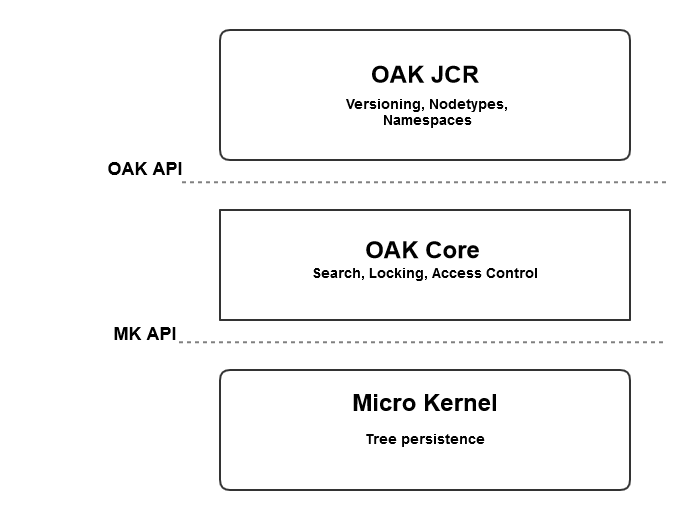

# Introduzione alla piattaforma AEM{#introduction-to-the-aem-platform}

La piattaforma AEM in AEM 6 è basata su Apache Jackrabbit Oak.

Apache Jackrabbit Oak si impegna a implementare un archivio di contenuti gerarchici scalabile e performante da utilizzare come base per siti web moderni e altre applicazioni di contenuti impegnative.

È il successore di Jackrabbit 2 ed è utilizzato da AEM 6 come backend predefinito per il suo archivio di contenuti, CRX.

## Principi e obiettivi di progettazione {#design-principles-and-goals}

Oak implementa le specifiche [JSR-283](https://jcp.org/en/jsr/detail?id=283) (JCR 2.0). I suoi principali obiettivi sono:

* Supporto migliore per archivi di grandi dimensioni
* Più nodi cluster distribuiti per un&#39;elevata disponibilità
* Prestazioni migliori
* Supporto per molti nodi figlio e livelli di controllo degli accessi

## Concetto di architettura {#architecture-concept}

### Archiviazione {#storage}

Lo scopo del livello di storage è:

* Implementare un modello ad albero
* Rendi lo storage collegabile
* Meccanismo di clustering

### Oak Core {#oak-core}

Oak Core aggiunge diversi livelli al livello di storage:

* Controlli del livello di accesso
* Ricerca e indicizzazione
* Osservazione

### OAK JCR {#oak-jcr}

L’obiettivo principale di Oak JCR è trasformare la semantica JCR in operazioni ad albero. È inoltre responsabile di:

* Implementazione dell’API JCR
* Contenente hook di commit che implementano vincoli JCR

Inoltre, le implementazioni non Java sono ora possibili e fanno parte del concetto JCR di Oak.

## Panoramica sull’archiviazione {#storage-overview}

Il livello di archiviazione Oak fornisce un livello di astrazione per l’archiviazione effettiva del contenuto.

Attualmente, in AEM6 sono disponibili due implementazioni di archiviazione: **Archiviazione Tar** e **Archiviazione MongoDB**.

### Archiviazione Tar {#tar-storage}

L’archiviazione Tar utilizza file tar. Memorizza il contenuto come vari tipi di record all’interno di segmenti più grandi. I giornali vengono utilizzati per tenere traccia dello stato più recente dell’archivio.

Sono diversi i principi chiave di progettazione su cui è stato costruito:

* **Segmenti immutabili**

Il contenuto viene archiviato in segmenti che possono essere fino a 256 KB. Sono immutabili, il che semplifica la memorizzazione nella cache dei segmenti a cui si accede di frequente e riduce gli errori di sistema che possono danneggiare l’archivio.

Ogni segmento è identificato da un identificatore univoco (UUID) e contiene un sottoinsieme continuo della struttura del contenuto. Inoltre, i segmenti possono fare riferimento ad altri contenuti. Ogni segmento mantiene un elenco di UUID degli altri segmenti a cui si fa riferimento.

* **Località**

I record correlati come un nodo e i relativi elementi secondari immediati vengono memorizzati nello stesso segmento. In questo modo la ricerca nell’archivio diventa rapida ed evita la maggior parte dei problemi di cache per i client tipici che accedono a più di un nodo correlato per sessione.

* **Compattezza**

La formattazione dei record è ottimizzata in base alle dimensioni per ridurre i costi di I/O e adattare il maggior numero possibile di contenuti nelle cache.

### Archiviazione Mongo {#mongo-storage}

Lo storage MongoDB utilizza MongoDB per il partizionamento e il clustering. La struttura dell’archivio è contenuta in un unico database MongoDB in cui ogni nodo è un documento separato.

Presenta diverse particolarità:

* Revisione

Per ogni aggiornamento (commit) del contenuto, viene creata una nuova revisione. Una revisione è fondamentalmente una stringa composta da tre elementi:

1. Una marca temporale derivata dall&#39;ora di sistema della macchina su cui è stata generata
1. Un contatore per distinguere le revisioni create con la stessa marca temporale
1. ID nodo cluster in cui è stata creata la revisione

* Rami

I rami sono supportati e consentono al client di posizionare nell’area intermedia più modifiche e renderle visibili con una singola chiamata di unione.

* Documenti precedenti

L’archiviazione MongoDB aggiunge dati a un documento con ogni modifica. Tuttavia, elimina i dati solo se viene attivata esplicitamente una pulizia. I dati obsoleti vengono spostati quando viene raggiunta una determinata soglia. I documenti precedenti contengono solo dati immutabili, ovvero contengono solo revisioni salvate e unite.

* Metadati nodo cluster

I dati relativi ai nodi cluster attivi e inattivi vengono conservati nel database per facilitare le operazioni del cluster.

Una tipica configurazione cluster di AEM con archiviazione MongoDB:

## Quali sono le differenze rispetto a Jackrabbit 2? {#what-is-different-from-jackrabbit}

Poiché Oak è compatibile con le versioni precedenti dello standard JCR 1.0, non vi sono quasi modifiche a livello di utente. Tuttavia, esistono alcune differenze notevoli di cui devi tenere conto durante la configurazione di un’installazione di AEM basata su Oak:

* Oak non crea gli indici automaticamente. Di conseguenza, se necessario, è necessario creare indici personalizzati.
* A differenza di Jackrabbit 2, in cui le sessioni riflettono sempre lo stato più recente dell’archivio, con Oak una sessione riflette una visualizzazione stabile dell’archivio dal momento in cui è stata acquisita. Il motivo è dovuto al modello MVCC su cui si basa Oak.
* Gli elementi di pari livello con lo stesso nome (SNS) non sono supportati in Oak.

## Altra documentazione correlata alla piattaforma {#other-platform-related-documentation}

Per ulteriori informazioni sulla piattaforma AEM, consulta anche gli articoli seguenti:

* [Configurazione degli archivi di nodi e degli archivi di dati in AEM 6](/help/sites-deploying/data-store-config.md)
* [Query e indicizzazione Oak](/help/sites-deploying/queries-and-indexing.md)
* [Elementi di archiviazione in AEM 6](/help/sites-deploying/storage-elements-in-aem-6.md)
* [AEM con MongoDB](/help/sites-deploying/aem-with-mongodb.md)
