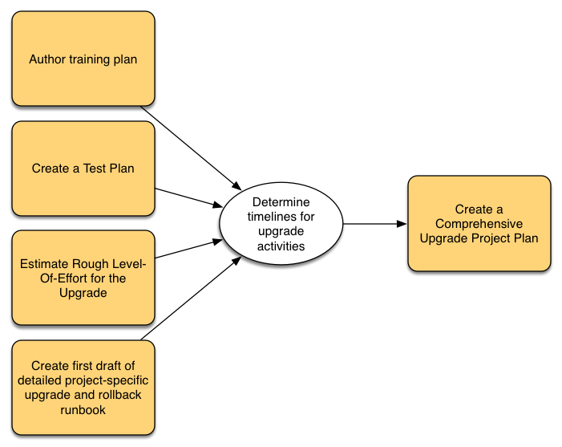

# Pianificazione dell&#39;aggiornamento {#planning-your-upgrade}

## Panoramica dell’aggiornamento ad AEM {#aem-upgrade-overview}

AEM viene spesso utilizzato in implementazioni ad alto impatto che potrebbero servire milioni di utenti. In genere, nelle istanze vengono distribuite applicazioni personalizzate che aumentano la complessità. Qualsiasi sforzo per aggiornare tale implementazione deve essere gestito in modo metodologico.

Questa guida aiuta a stabilire chiari obiettivi, fasi e risultati finali durante la pianificazione dell’aggiornamento. Si concentra sull’esecuzione complessiva dell’aggiornamento e sulle linee guida. Pur fornendo una panoramica dei passaggi effettivi di aggiornamento, fa riferimento alle risorse tecniche disponibili, ove opportuno. Esso dovrebbe essere utilizzato con le risorse tecniche disponibili di cui al documento.

Il processo di aggiornamento di AEM richiede una gestione accurata delle fasi di pianificazione, analisi ed esecuzione, con la definizione dei principali risultati finali per ogni fase.

>[!NOTE]
>
>L&#39;aggiornamento a AEM 6.5 LTS è supportato dagli ultimi 6 Service Pack

È importante assicurarsi di eseguire un sistema operativo supportato, Java™ Runtime, httpd e la versione Dispatcher. Per ulteriori informazioni, fare riferimento ai [requisiti tecnici per AEM 6.5 LTS](/help/sites-deploying/technical-requirements.md). L’aggiornamento di questi componenti deve essere considerato nel piano di aggiornamento e deve avvenire prima dell’aggiornamento di AEM.

<!-- Alexandru: drafting for now

## Upgrade Scope and Requirements {#upgrade-scope-requirements}

Below you will find a list of areas that are impacted in a typical AEM Upgrade project:

<table>
 <tbody>
  <tr>
   <td><strong>Component</strong></td>
   <td><strong>Impact</strong></td>
   <td><strong>Description</strong></td>
  </tr>
  <tr>
   <td>Operating System</td>
   <td>Uncertain, but subtle effects</td>
   <td>At the time of the AEM upgrade, it may be time to upgrade the operating system as well and this might have some impact.</td>
  </tr>
  <tr>
   <td>Java&trade; Runtime</td>
   <td>Moderate Impact</td>
   <td>AEM 6.3 requires JRE 1.7.x (64 bit) or later. JRE 1.8 is the only version currently supported by Oracle.</td>
  </tr>
  <tr>
   <td>Hardware</td>
   <td>Moderate Impact</td>
   <td>Online Revision Cleanup requires free  disk space equal to 25% of the repository's size and 15% free heap space  to complete successfully. You may need to upgrade your hardware to  ensure sufficient resources for Online Revision Cleanup to fully  run. Also, if upgrading from a version prior to AEM 6, there  may be additional storage requirements.</td>
  </tr>
  <tr>
   <td>Content Repository (CRX or Oak)</td>
   <td>High Impact</td>
   <td>Starting from version 6.1, AEM does not support CRX2, so a migration to  Oak (CRX3) is required if upgrading from an older version. AEM 6.3 has  implemented a new Segment Node Store that also requires a migration. The  crx2oak tool is used for this purpose.</td>
  </tr>
  <tr>
   <td>AEM Components/Content</td>
   <td>Moderate Impact</td>
   <td><code>/libs</code> and <code>/apps</code> are easily handled through the upgrade, but <code>/etc</code> usually requires some manual reapplication of customizations.</td>
  </tr>
  <tr>
   <td>AEM Services</td>
   <td>Low Impact</td>
   <td>Most AEM core services are tested for upgrade. This is an area of low impact.</td>
  </tr>
  <tr>
   <td>Custom Application Services</td>
   <td>Low to High Impact</td>
   <td>Depending on the application and customization, there may be  dependencies on JVM, operating system versions, and some indexing related  changes, as indexes are not generated automatically in Oak.</td>
  </tr>
  <tr>
   <td>Custom Application Content</td>
   <td>Low to High Impact</td>
   <td>Content that will not be handled through the upgrade can be backed up  before the upgrade takes place and then moved back into the repository.  Most content can be handled through the migration tool.</td>
  </tr>
 </tbody>
</table>

It is important to ensure that you are running a supported operating system, Java&trade; runtime, httpd, and Dispatcher version. For more information, see the [AEM 6.5 Technical Requirements page](/help/sites-deploying/technical-requirements.md). Upgrading these components must be accounted for in your project plan and should take place before upgrading AEM. -->

## Fasi di aggiornamento {#upgrade-phases}

Molto lavoro viene dedicato alla pianificazione e all’esecuzione di un aggiornamento AEM. Per chiarire i diversi sforzi che entrano in questo processo, Adobe ha suddiviso gli esercizi di pianificazione ed esecuzione in fasi separate. Nelle sezioni seguenti, ogni fase determina un risultato finale che viene spesso utilizzato in una fase futura dell’aggiornamento.

<!-- Alexandru:drafting for now

### Planning for Author Training {#planning-for-author-training}

With any new release, there are potential changes to the UI and user workflows that may be introduced. Also, new releases introduce new features that may be beneficial for the business to use. Adobe recommends reviewing the functional changes that have been introduced and organizing a plan to train your users on using them effectively.

New features in AEM 6.5 can be found in [the AEM section of adobe.com](/help/release-notes/release-notes.md). Make sure to note any changes to UIs or product features that are commonly used in your organization. As you look through the new features, also take note of any that can be of value to your organization. After looking through what has changed in AEM 6.5, develop a training plan for your authors. This could involve using freely available resources like the help feature videos or formal training offered through [Adobe Digital Learning Services](https://learning.adobe.com/). -->

### Creazione di un piano di test {#creating-a-test-plan}

Ogni cliente ha implementato AEM in modo univoco ed è stato personalizzato per soddisfare i propri requisiti aziendali. Di conseguenza, è importante determinare tutte le personalizzazioni apportate al sistema in modo che possano essere incluse in un piano di test.

È necessario duplicare l’ambiente di produzione esatto e sottoporlo a test dopo l’aggiornamento per assicurarsi che tutte le applicazioni e il codice personalizzato vengano ancora eseguiti come desiderato. Ripristina tutte le tue personalizzazioni ed esegui test di prestazioni, carico e sicurezza. Quando organizzi il piano di test, assicurati di coprire tutte le personalizzazioni apportate al sistema, oltre alle interfacce utente e ai flussi di lavoro predefiniti utilizzati nelle operazioni quotidiane. Questi possono includere servizi e servlet OSGI personalizzati, integrazioni a Adobe Experience Cloud, integrazioni con terze parti tramite connettori AEM, integrazioni personalizzate di terze parti, componenti e modelli personalizzati, sovrapposizioni di interfacce personalizzate in AEM e flussi di lavoro personalizzati. Inoltre, le query personalizzate devono ancora essere testate per garantire che i loro indici continuino a funzionare in modo efficace dopo l’aggiornamento.

### Valutazione della complessità dell&#39;aggiornamento {#assessing-upgrade-complexity}

A causa dell’ampia varietà di personalizzazioni applicate dai clienti di Adobe ai loro ambienti AEM, è importante trascorrere del tempo prima di determinare il livello generale di impegno che dovrebbe essere richiesto per l’aggiornamento. [AEM Analyzer per AEM 6.5 LTS](/help/sites-deploying/aem-analyzer.md) può aiutarti a valutare la complessità dell&#39;aggiornamento.

L&#39;[AEM Analyyer per AEM 6.5 LTS](/help/sites-deploying/pattern-detector.md) dovrebbe fornire una stima abbastanza accurata di ciò che ci si aspetta durante un aggiornamento per la maggior parte dei casi. Tuttavia, per personalizzazioni e implementazioni più complesse in cui sono presenti modifiche non compatibili, è possibile aggiornare un&#39;istanza di sviluppo ad AEM 6.5 LTS seguendo le istruzioni riportate in [Esecuzione di un aggiornamento sul posto](/help/sites-deploying/in-place-upgrade.md). Una volta completato, eseguire alcune prove di fumo di alto livello in questo ambiente. L&#39;obiettivo di questo esercizio non è quello di completare in modo esaustivo l&#39;inventario dei test case e produrre un inventario formale dei difetti, ma di fornire una stima approssimativa della quantità di lavoro che sarà necessario per aggiornare il codice per la compatibilità con AEM 6.5 LTS. In combinazione con [AEM Analyzer](/help/sites-deploying/aem-analyzer.md) e le modifiche dell&#39;architettura determinate nella sezione precedente, è possibile fornire una stima approssimativa al team di gestione del progetto per pianificare l&#39;aggiornamento.

### Creazione del Runbook di aggiornamento e ripristino {#building-the-upgrade-and-rollback-runbook}

Sebbene Adobe abbia documentato il processo di aggiornamento di un’istanza AEM, il layout di rete, l’architettura di distribuzione e le personalizzazioni di ogni cliente richiedono di perfezionare e personalizzare questo approccio. Per questo motivo, Adobe ti incoraggia a rivedere tutta la documentazione fornita e a utilizzarla per informare un runbook specifico per l’aggiornamento che delinea le procedure specifiche di aggiornamento e rollback che seguirai nel tuo ambiente.

<!--Alexandru:drafting for now

 -->

Adobe ha fornito procedure di aggiornamento e rollback in [Procedura di aggiornamento](/help/sites-deploying/upgrade-procedure.md) e istruzioni dettagliate per l&#39;applicazione dell&#39;aggiornamento in Esecuzione di un [aggiornamento sul posto](/help/sites-deploying/in-place-upgrade.md). Queste istruzioni devono essere esaminate e prese in considerazione insieme all&#39;architettura del sistema, alle personalizzazioni e alla tolleranza ai tempi di inattività per determinare le procedure di switch-over e rollback appropriate che verranno eseguite durante l&#39;aggiornamento. Eventuali modifiche all’architettura o alle dimensioni dei server devono essere incluse durante la creazione del runbook personalizzato.

### Sviluppo di un piano di aggiornamento {#developing-an-upgrade-plan}

L’output degli esercizi precedenti può essere utilizzato per creare un piano di aggiornamento che copre le tempistiche previste per le attività di test o sviluppo e l’esecuzione effettiva dell’aggiornamento.

<!--Alexandru: drafting for now

 -->

Un piano di progetto completo dovrebbe includere:

* Completamento dei piani di sviluppo e di prova
* Aggiornamento degli ambienti di sviluppo e controllo qualità
* Aggiornamento della base di codice personalizzata per AEM 6.5 LTS
* Un test di controllo qualità e un ciclo di correzione
* Aggiornamento dell’ambiente di staging
* Integrazione, prestazioni e test di carico
* Certificazione dell’ambiente
* Pubblicazione

### Esecuzione di attività di sviluppo e controllo qualità {#performing-development-and-qa}

Adobe ha fornito procedure per [l&#39;aggiornamento del codice e delle personalizzazioni](/help/sites-deploying/upgrading-code-and-customizations.md) affinché siano compatibili con AEM 6.5 LTS. Durante l’esecuzione di questo processo iterativo, è necessario apportare le modifiche necessarie al runbook.

<!--Alexandru: drafting for now

 -->

Il processo di sviluppo e test è solitamente iterativo. Quando vengono rilevati problemi che richiedono modifiche al processo di aggiornamento, assicurati di aggiungerli al runbook di aggiornamento personalizzato. Dopo diverse iterazioni di test e correzione, la base di codice deve essere completamente convalidata e pronta per la distribuzione nell’ambiente di staging.

### Test finale {#final-testing}

Adobe consiglia di eseguire un ultimo ciclo di test dopo che il codebase è stato certificato dal team di controllo qualità della tua organizzazione. Questo ciclo di test prevede la convalida del runbook in un ambiente di staging, seguita da cicli di test di accettazione, prestazioni e sicurezza da parte dell’utente.

<!--Alexandru: drafting for now

 -->

Questo passaggio è fondamentale in quanto è l’unico momento in cui puoi convalidare i passaggi nel runbook rispetto a un ambiente di produzione. Dopo l’aggiornamento dell’ambiente, è importante concedere agli utenti finali un po’ di tempo per accedere e svolgere le attività che svolgono quando utilizzano il sistema nelle attività quotidiane. L’individuazione e la correzione dei problemi in queste aree prima della pubblicazione possono contribuire a evitare costose interruzioni della produzione.

### Esecuzione dell&#39;aggiornamento {#performing-the-upgrade}

Una volta ricevuto l’approvazione finale da tutte le parti interessate, è ora di eseguire le procedure del runbook definite. Adobe ha fornito i passaggi per l&#39;aggiornamento e il rollback in [Procedura di aggiornamento](/help/sites-deploying/upgrade-procedure.md) e i passaggi di installazione in Esecuzione di un [aggiornamento sul posto](/help/sites-deploying/in-place-upgrade.md) come punto di riferimento.

Adobe ha fornito alcuni passaggi nelle istruzioni di aggiornamento per la convalida dell’ambiente. Questi includono controlli di base come la scansione dei registri di aggiornamento e la verifica che tutti i bundle OSGi siano stati avviati correttamente, ma Adobe consiglia anche di eseguire la convalida con test case personalizzati in base ai processi aziendali. Adobe consiglia inoltre di controllare la pianificazione di AEM Online Revision Cleanup e delle relative routine per assicurarsi che vengano eseguite durante un periodo di inattività per la società. Queste routine sono essenziali per le prestazioni a lungo termine di AEM.
