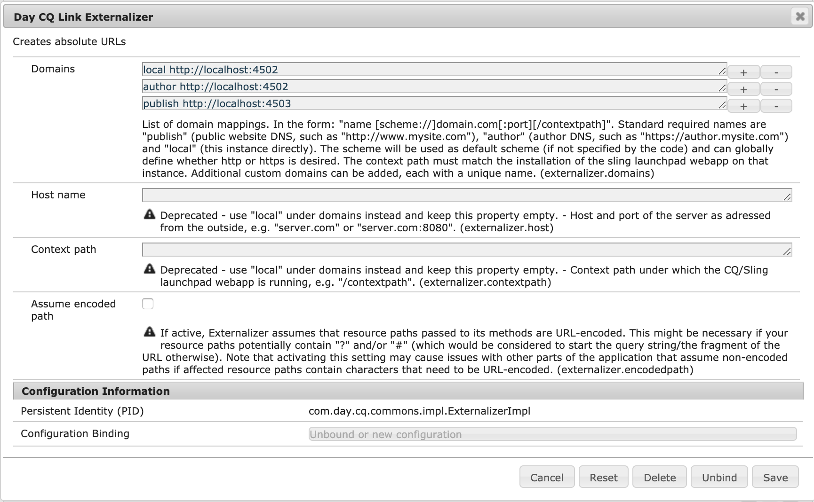

# Esternalizzazione degli URL{#externalizing-urls}

In Adobe Experience Manager (AEM), **Externalizer** è un servizio OSGI che consente di trasformare in modo programmatico un percorso di risorsa (ad esempio, `/path/to/my/page`) in un URL esterno e assoluto (ad esempio, `https://www.mycompany.com/path/to/my/page`) prefissando il percorso con un DNS preconfigurato.

Poiché un’istanza non può conoscere il proprio URL visibile esternamente se è in esecuzione dietro un livello web e poiché a volte è necessario creare un collegamento al di fuori dell’ambito della richiesta, questo servizio fornisce una posizione centrale per configurare tali URL esterni e generarli.

In questa pagina viene illustrato come configurare e utilizzare il servizio **Externalizer**. Per ulteriori dettagli, vedi [Javadocs](https://developer.adobe.com/experience-manager/reference-materials/6-5-lts/javadoc/com/day/cq/commons/Externalizer.html).

## Configurazione del servizio Externalizer {#configuring-the-externalizer-service}

Il servizio **Externalizer** consente di definire centralmente più domini che possono essere utilizzati per prefissare in modo programmatico i percorsi delle risorse. Ogni dominio è identificato da un nome univoco utilizzato per fare riferimento al dominio a livello di programmazione.

Per definire un mapping di dominio per il servizio **Externalizer**:

1. Passa alla gestione della configurazione tramite **Strumenti**, quindi **Console Web**, oppure immetti:

   `https://<host>:<port>/system/console/configMgr`

1. Fai clic su **Day CQ Link Externalizer** per aprire la finestra di dialogo di configurazione.

   >[!NOTE]
   >
   >Il collegamento diretto alla configurazione è `https://<host>:<port>/system/console/configMgr/com.day.cq.commons.impl.ExternalizerImpl`

   

1. Definisci una mappatura **Domini**: una mappatura è costituita da un nome univoco che può essere utilizzato nel codice per fare riferimento al dominio, a uno spazio e al dominio:

   `<unique-name> [scheme://]server[:port][/contextpath]`

   Dove:

   * **lo schema** è http o https, ma può anche essere ftp e così via.

     * se necessario, utilizza https per applicare i collegamenti https
     * viene utilizzato se il codice client non sostituisce lo schema quando viene richiesta l’esternalizzazione di un URL.

   * **server** è il nome host (può essere un nome di dominio o un indirizzo ip).
   * **porta** (facoltativo) è il numero di porta.
   * **contextpath** (facoltativo) è impostato solo se AEM è installato come app Web in un percorso di contesto diverso.

   Esempio: `production https://my.production.instance`

   I seguenti nomi di mappatura sono predefiniti e devono essere impostati perché AEM si basa su di essi:

   * `local` - l&#39;istanza locale
   * `author` - DNS del sistema di authoring
   * `publish` - DNS del sito Web pubblico

   >[!NOTE]
   >
   >Una configurazione personalizzata consente di aggiungere una categoria, ad esempio `production`, `staging` o anche sistemi esterni non AEM come `my-internal-webservice`. È utile evitare di codificare tali URL in posizioni diverse nella base di codice di un progetto.

1. Fai clic su **Salva** per salvare le modifiche.

>[!NOTE]
>
>Adobe consiglia di [aggiungere la configurazione all&#39;archivio](/help/sites-deploying/configuring.md#addinganewconfigurationtotherepository).

### Utilizzo del servizio Externalizer {#using-the-externalizer-service}

In questa sezione vengono illustrati alcuni esempi di utilizzo del servizio **Externalizer**:

1. **Per ottenere il servizio Externalizer in una JSP:**

   ```java
   Externalizer externalizer = resourceResolver.adaptTo(Externalizer.class);
   ```

1. **Per esternalizzare un percorso con il dominio &#39;publish&#39;:**

   ```java
   String myExternalizedUrl = externalizer.publishLink(resolver, "/my/page") + ".html";
   ```

   Supponendo il mapping del dominio:

   * `publish https://www.website.com`

   `myExternalizedUrl` termina con il valore:

   * `https://www.website.com/contextpath/my/page.html`

1. **Per esternalizzare un percorso con il dominio &#39;author&#39;:**

   ```java
   String myExternalizedUrl = externalizer.authorLink(resolver, "/my/page") + ".html";
   ```

   Supponendo il mapping del dominio:

   * `author https://author.website.com`

   `myExternalizedUrl` termina con il valore:

   * `https://author.website.com/contextpath/my/page.html`

1. **Per esternalizzare un percorso con il dominio &#39;locale&#39;:**

   ```java
   String myExternalizedUrl = externalizer.externalLink(resolver, Externalizer.LOCAL, "/my/page") + ".html";
   ```

   Supponendo il mapping del dominio:

   * `local https://publish-3.internal`

   `myExternalizedUrl` termina con il valore:

   * `https://publish-3.internal/contextpath/my/page.html`

1. Puoi trovare altri esempi nei [JavaScript](https://developer.adobe.com/experience-manager/reference-materials/6-5-lts/javadoc/com/day/cq/commons/Externalizer.html).
