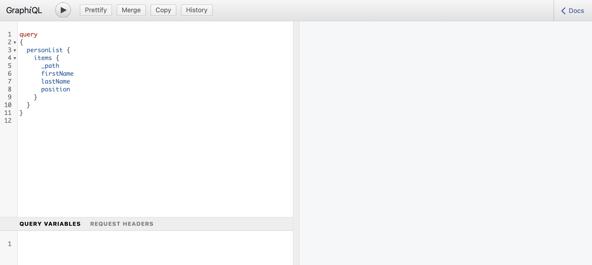

# Guida rapida all’accesso e alla distribuzione di frammenti di contenuto headless {#accessing-delivering-content-fragments}

Scopri come utilizzare l’API REST di AEM Assets per gestire i frammenti di contenuto e l’API di GraphQL per la distribuzione headless dei contenuti dei frammenti di contenuto.

## Cosa sono le API REST di GraphQL e Assets? {#what-are-the-apis}

[Dopo aver creato alcuni frammenti di contenuto,](create-content-fragment.md) puoi utilizzare le API AEM per distribuirle senza problemi.

* L’[API GraphQL](/help/sites-developing/headless/graphql-api/graphql-api-content-fragments.md) consente di creare richieste per accedere e distribuire frammenti di contenuto.
  * Per utilizzare questo, è necessario che [endpoint siano definiti e abilitati in AEM](/help/sites-developing/headless/graphql-api/graphql-endpoint.md#enabling-graphql-endpoint) e, se necessario, che sia installata l&#39;interfaccia [GraphiQL](/help/sites-developing/headless/graphql-api/graphql-api-content-fragments.md#installing-graphiql-interface).
* [L&#39;API REST di Assets](/help/assets/assets-api-content-fragments.md) consente di creare e modificare frammenti di contenuto (e altre risorse).

Il resto di questa guida è incentrato sull’accesso a GraphQL e sulla distribuzione di frammenti di contenuto.

## Come distribuire un frammento di contenuto con GraphQL {#how-to-deliver-a-content-fragment}

Gli architetti di informazioni devono progettare query per gli endpoint di canale per distribuire i contenuti. Considera queste query solo una volta per endpoint, per modello. Per questa guida introduttiva, creane una sola.

1. Accedi ad AEM e accedi all&#39;[interfaccia GraphiQL](/help/sites-developing/headless/graphql-api/graphiql-ide.md):
   * Ad esempio: `http://<host>:<port>/aem/graphiql.html`.

1. GraphiQL è un editor di query interno al browser per GraphQL. Puoi utilizzarlo per creare query per recuperare frammenti di contenuto e distribuirli senza problemi come JSON.
   * Il pannello a sinistra consente di creare la query.
   * Nel pannello a destra vengono visualizzati i risultati.
   * L’editor di query offre la funzione di completamento del codice e tasti di scelta rapida per agevolare l’esecuzione della query.
     

1. Supponendo che il modello che hai creato si chiama `person` con campi `firstName`, `lastName` e `position`, puoi creare una semplice query per recuperare il contenuto del frammento di contenuto.

   ```text
   query 
   {
     personList {
       items {
         _path
         firstName
         lastName
         position
       }
     }
   }
   ```

1. Inserisci la query nel pannello a sinistra.
<!--
   
-->

1. Fai clic sull&#39;icona **Esegui query** (freccia destra) oppure utilizza il tasto di scelta rapida `Ctrl-Enter` e i risultati vengono visualizzati come JSON nel pannello di destra.
   

1. Fai clic su:
   * **Documenti** in alto a destra della pagina per visualizzare la documentazione contestuale per aiutarti a creare le query che si adattano ai tuoi modelli.
   * **Cronologia** nella barra degli strumenti superiore per visualizzare le query precedenti.
   * **Salva con nome** e **Salva** per salvare le query, dopodiché potrai elencarle e recuperarle dal pannello **Query persistenti** e da **Pubblica**.
     

GraphQL consente query strutturate in grado di eseguire il targeting non solo di set di dati specifici o di singoli oggetti di dati, ma anche di fornire elementi specifici degli oggetti, risultati nidificati, offerte di supporto per variabili di query e molto altro.

GraphQL può evitare richieste API iterative e consegne eccessive. Al contrario, consente la distribuzione in blocco di ciò che è esattamente necessario per il rendering come risposta a una singola query API. Il JSON risultante può essere utilizzato per inviare dati ad altri siti o app.

## Passaggi successivi {#next-steps}

Tutto qui. Ora hai una conoscenza di base della gestione dei contenuti headless in AEM. Sono disponibili molte altre risorse da approfondire per una comprensione completa delle funzioni disponibili.

* **[Browser configurazioni](create-configuration.md)** - Per informazioni dettagliate sul Browser configurazioni di AEM
* **[Frammenti di contenuto](/help/assets/content-fragments/content-fragments.md)**: per informazioni dettagliate sulla creazione e la gestione dei frammenti di contenuto
* **[IDE GraphiQL](/help/sites-developing/headless/graphql-api/graphiql-ide.md)** per ulteriori dettagli sull&#39;utilizzo dell&#39;IDE GraphiQL
* **[Query persistenti](/help/sites-developing/headless/graphql-api/persisted-queries.md)** per ulteriori dettagli sulle query persistenti
* **[Supporto per frammenti di contenuto nell’API HTTP di AEM Assets](/help/assets/assets-api-content-fragments.md)**: per informazioni dettagliate sull’accesso diretto ai contenuti AEM tramite l’API HTTP, mediante operazioni CRUD (Crea, Leggi, Aggiorna, Elimina)
* **[API di GraphQL](/help/sites-developing/headless/graphql-api/graphql-api-content-fragments.md)**: per informazioni dettagliate su come distribuire i frammenti di contenuto in modo corretto
