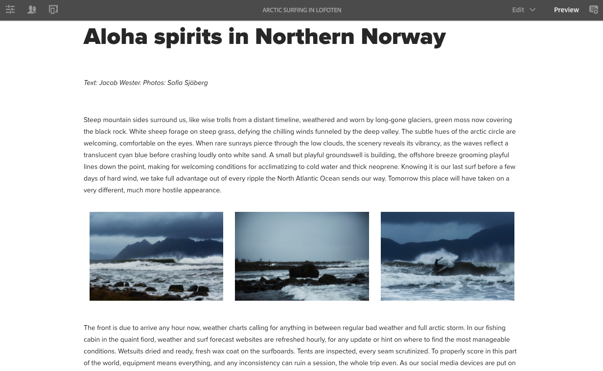
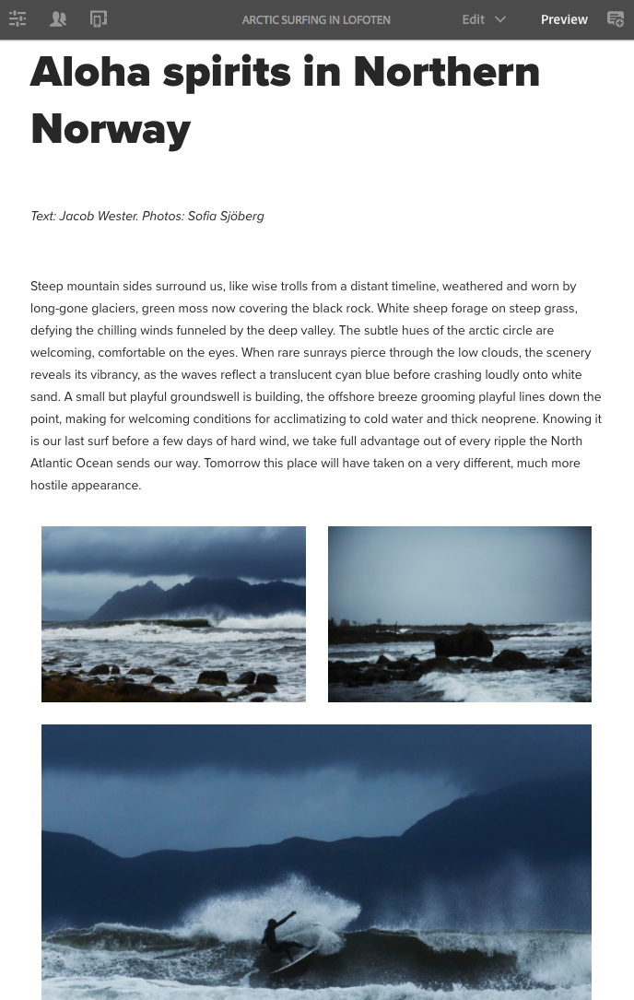

# Prova del layout responsive in We.Retail{#trying-out-responsive-layout-in-we-retail}

Tutte le pagine We.Retail utilizzano il componente Contenitore di layout per implementare una progettazione reattiva. Il contenitore layout fornisce un sistema paragrafo che consente di posizionare i componenti all’interno di una griglia reattiva. Questa griglia può ridisporre il layout in base alle dimensioni e al formato del dispositivo o della finestra. Il componente viene utilizzato insieme alla modalità **Layout** nell&#39;editor pagina, che consente di creare e modificare il layout dinamico in base al dispositivo.

## Prova {#trying-it-out}

1. Modifica la pagina Arctic Surfing nella sezione Esperienze del ramo principale lingua.

   http://localhost:4502/editor.html/content/we-retail/language-masters/en/experience/arctic-surfing-in-lofoten.html

1. Passa a **Anteprima** per visualizzare la pagina così come verrebbe visualizzata da un visitatore del sito Web. Scorri verso il basso fino al contenuto dell&#39;articolo *Aloha spirits in Norther Norway*.

   

1. Ridimensiona la finestra del browser e osserva come il layout si adatta dinamicamente al ridimensionamento.

   

1. Passa alla modalità Layout. La barra degli strumenti dell’emulatore viene visualizzata automaticamente e consente di pianificare il layout per dispositivo di destinazione.

   Selezionando un componente vengono visualizzate le opzioni mobile e nascosta nel menu Modifica insieme alle maniglie di ridimensionamento del componente.

   

1. Se si trascina il quadratino di ridimensionamento del componente, viene visualizzata automaticamente la griglia di layout che consente di ridimensionarlo.

   

## Ulteriori informazioni {#further-information}

Per ulteriori informazioni, vedere il documento di creazione [Layout reattivo](/help/sites-authoring/responsive-layout.md) o il documento dell&#39;amministratore [Configurazione del contenitore di layout e della modalità di layout](/help/sites-administering/configuring-responsive-layout.md) per informazioni tecniche complete.
